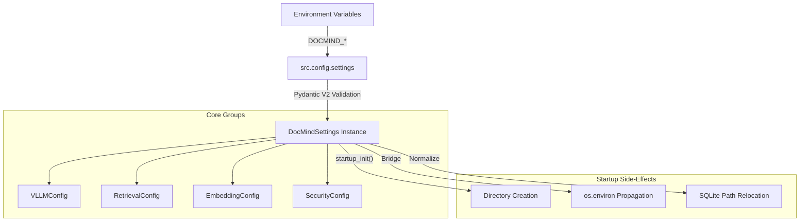

# DocMind AI Configuration Guide (2026)

DocMind AI uses a centralized, type-safe configuration system powered by **Pydantic Settings v2**. This architecture ensures that every runtime knob is validated at startup, providing a single source of truth for developers and operators.

---

## Navigation Hub

Choose your path based on your current intent:

- **[Quick Start](#quick-start)**: Set up your local environment in 60 seconds.
- **[Usage Guide](#usage-guide)**: How to use settings in your code and environment.
- **[Architecture & Side-Effects](#architecture--side-effects)**: Technical details on mapping and relocation.
- **[Complete Variable Reference](#complete-variable-reference)**: Exhaustive list of all environment variables.
- **[Hardware Profiles](#hardware-configuration-scenarios)**: Validated profiles for common hardware.
- **[Validation & Troubleshooting](#validating-your-configuration)**: Fixing common errors.

---

## Configuration Architecture



### Key Principles

- **Zero `os.getenv` Sprawl**: Core logic consumes `src.config.settings`, never raw environment variables (ADR-050).
- **Nested Schema**: Configuration is organized into logical groups (e.g., `vllm`, `retrieval`, `security`).
- **Convention-Over-Configuration**:
  - **Prefix**: `DOCMIND_`
  - **Separator**: `__` (double underscore) for nested fields (e.g., `DOCMIND_RETRIEVAL__TOP_K`).
- **Ergonomic Aliases**: High-traffic settings have top-level aliases (e.g., `DOCMIND_MODEL` -> `settings.vllm.model`).
- **Validation**: All inputs are validated for range, type, and security constraints.

---

## Quick Start

1. **Copy the example environment file**:

   ```bash
   cp .env.example .env
   ```

2. **Edit `.env` values** as needed for your backend (Ollama, vLLM, etc).
3. **Run the app**. The settings will auto-load:

   ```bash
   streamlit run src/app.py
   ```

---

## Usage Guide

### Programmatic Access Patterns

Import the global `settings` instance to access configuration values in your code:

```python
from src.config import settings

# Access nested fields
model_name = settings.vllm.model
sqlite_path = settings.database.sqlite_db_path
use_kg = settings.graphrag_cfg.enabled

# Helper methods for common consumers
model_cfg = settings.get_model_config()      # {model_name, context_window, max_tokens, etc}
embed_cfg = settings.get_embedding_config()  # {model_name, device, batch_size, etc}
vllm_vars = settings.get_vllm_env_vars()     # env vars for vLLM launchers
```

### Environment Variable Mapping

The system automatically maps environment variables to the Pydantic model using the `DOCMIND_` prefix and `__` delimiter.

**Examples:**

- `DOCMIND_EMBEDDING__MODEL_NAME=BAAI/bge-m3` → `settings.embedding.model_name`
- `DOCMIND_VLLM__CONTEXT_WINDOW=131072` → `settings.vllm.context_window`
- `DOCMIND_GRAPHRAG_CFG__ENABLED=true` → `settings.graphrag_cfg.enabled`

### Settings Source Precedence

DocMind relies on Pydantic Settings defaults for settings-source priority:

1. **Init kwargs** (explicit constructor arguments)
2. **Environment variables** (`DOCMIND_*`)
3. **Dotenv** (`.env`, when explicitly loaded via `bootstrap_settings()` or `_env_file=...`)
4. **Defaults** (model field defaults)

This means `.env` does **not** override already-exported environment variables.

Dotenv policy:

- The process-global `src.config.settings.settings` singleton does **not** read `.env` at import time.
- The Streamlit entrypoint (`src/app.py`) calls `bootstrap_settings()` once at startup to opt into loading `.env`.

### Advanced: Dotenv Override Modes and Env Masking

By default, DocMind follows the 12-factor convention: exported environment
variables win over `.env`.

For local development, you can opt into "dotenv-first" behavior **for DocMind
settings only** (does not change third-party libraries that read `os.environ`
directly):

- `DOCMIND_CONFIG__DOTENV_PRIORITY=env_first|dotenv_first` (default: `env_first`)

Safety guardrail:

- Even when `dotenv_first` is enabled, `settings.security.*` remains **env-first**
  so a local `.env` cannot accidentally weaken the offline-first / allowlist posture.

If you need to prevent accidental use of global machine env vars (e.g.
`OPENAI_API_KEY`) by dependencies, use an explicit allowlist:

- `DOCMIND_CONFIG__ENV_MASK_KEYS=OPENAI_API_KEY,ANTHROPIC_API_KEY`
  - Removes the listed keys from `os.environ` at startup (before most imports).
- `DOCMIND_CONFIG__ENV_OVERLAY=OPENAI_API_KEY:openai.api_key`
  - After settings are validated, sets `os.environ[OPENAI_API_KEY]` from
    `settings.openai.api_key`.

Do not use these override modes in production environments.

### Top-Level Aliases

For convenience, the following top-level overrides are supported:

| Alias Variable                | Nested Target               | Constraint          |
| :---------------------------- | :-------------------------- | :------------------ |
| `DOCMIND_MODEL`               | `vllm.model`                | string              |
| `DOCMIND_CONTEXT_WINDOW`      | `vllm.context_window`       | int (ge=8192)       |
| `DOCMIND_CONTEXT_WINDOW_SIZE` | `vllm.context_window`       | int                 |
| `DOCMIND_CHUNK_SIZE`          | `processing.chunk_size`     | int (ge=100)        |
| `DOCMIND_CHUNK_OVERLAP`       | `processing.chunk_overlap`  | int (le=chunk_size) |
| `DOCMIND_ENABLE_MULTI_AGENT`  | `agents.enable_multi_agent` | boolean             |

---

## Architecture & Side-Effects

### SQLite Path Relocation

To simplify container volume mounting, DocMind AI automatically relocates bare SQLite filenames to live under the `DOCMIND_DATA_DIR`.

**Logic**:

1. If a path is **absolute**, it is preserved.
2. If a path includes a **parent directory** (e.g., `./custom/db.sqlite`), it is preserved.
3. If a path is a **bare filename** (e.g., `docmind.db`), it is rewritten to `<DOCMIND_DATA_DIR>/docmind.db`.

Affected settings:

- `DOCMIND_DATABASE__SQLITE_DB_PATH`
- `DOCMIND_CHAT__SQLITE_PATH`

### Environment Bridge Mode

During `startup_init()`, specific settings are propagated back to `os.environ`. This maintains compatibility with decoupled libraries (like OpenTelemetry or HuggingFace) that rely on traditional environment variables.

---

## Complete Variable Reference

### 1. Global & Core Settings

| Variable            | Type    | Default              | Description                                                     |
| :------------------ | :------ | :------------------- | :-------------------------------------------------------------- |
| `DOCMIND_APP_NAME`  | string  | `DocMind AI`         | Application identifier.                                         |
| `DOCMIND_DEBUG`     | boolean | `false`              | Enables verbose debug logging.                                  |
| `DOCMIND_LOG_LEVEL` | string  | `INFO`               | Standard Python log level (DEBUG, INFO, etc).                   |
| `DOCMIND_DATA_DIR`  | path    | `./data`             | **Master Data Root**. All bare SQLite paths are relocated here. |
| `DOCMIND_CACHE_DIR` | path    | `./cache`            | Storage for temporary processing artifacts.                     |
| `DOCMIND_LOG_FILE`  | path    | `./logs/docmind.log` | Target file for structured logs.                                |

### 2. LLM Backend Selection

| Variable                           | Type    | Default                  | Description                                                                                       |
| :--------------------------------- | :------ | :----------------------- | :------------------------------------------------------------------------------------------------ |
| `DOCMIND_LLM_BACKEND`              | enum    | `ollama`                 | Options: `vllm`, `ollama`, `lmstudio`, `llamacpp`.                                                |
| `DOCMIND_MODEL`                    | string  | `None`                   | **Alias Override** for `vllm.model`.                                                              |
| `DOCMIND_CONTEXT_WINDOW`           | int     | `None`                   | **Alias Override** for `vllm.context_window`.                                                     |
| `DOCMIND_OLLAMA_BASE_URL`          | string  | `http://localhost:11434` | Endpoint for Ollama backend.                                                                      |
| `DOCMIND_OLLAMA_API_KEY`           | string  | `None`                   | Optional Ollama Cloud API key (Bearer token) for <https://ollama.com>.                            |
| `DOCMIND_OLLAMA_ENABLE_WEB_SEARCH` | boolean | `false`                  | Enable Ollama Cloud `web_search`/`web_fetch` tools (requires API key + remote endpoints allowed). |
| `DOCMIND_OLLAMA_EMBED_DIMENSIONS`  | int     | `None`                   | Optional `/api/embed` dimensions truncation for supported models.                                 |
| `DOCMIND_OLLAMA_ENABLE_LOGPROBS`   | boolean | `false`                  | Enable token logprobs for Ollama chat/generate (default off).                                     |
| `DOCMIND_OLLAMA_TOP_LOGPROBS`      | int     | `0`                      | Include top-k alternative tokens per position (0-20) when logprobs enabled.                       |
| `DOCMIND_VLLM_BASE_URL`            | string  | `None`                   | Direct endpoint for vLLM (native or OpenAI-compatible).                                           |
| `DOCMIND_ENABLE_GPU_ACCELERATION`  | boolean | `true`                   | Controls hardware offloading for LlamaCPP/Embeddings.                                             |

> [!IMPORTANT] > **Backend URL Normalization**: All OpenAI-compatible endpoints are automatically normalized to include a single `/v1` suffix (e.g., `http://localhost:1234` -> `http://localhost:1234/v1`).

**App config vs provider env vars:** DocMind uses a single `DOCMIND_*` config surface for the application (routing, security policy, and backend selection). Provider/daemon variables (e.g., `OLLAMA_*`, `OPENAI_*`, `VLLM_*`) configure those services directly and are intentionally not reused here to avoid collisions and ambiguity. Use `DOCMIND_OLLAMA_API_KEY` for Ollama Cloud access; reserve `OLLAMA_*` for the Ollama server/CLI.

### 3. vLLM Optimization (RTX 4090 / 2026 Profile)

| Variable                               | Type    | Default                           | Description                                    |
| :------------------------------------- | :------ | :-------------------------------- | :--------------------------------------------- |
| `DOCMIND_VLLM__MODEL`                  | string  | `Qwen/Qwen3-4B-Instruct-2507-FP8` | Default production model.                      |
| `DOCMIND_VLLM__CONTEXT_WINDOW`         | int     | `131072`                          | Target KV cache capacity (tokens).             |
| `DOCMIND_VLLM__GPU_MEMORY_UTILIZATION` | float   | `0.85`                            | Fraction of VRAM reserved for KV cache.        |
| `DOCMIND_VLLM__KV_CACHE_DTYPE`         | string  | `fp8_e5m2`                        | Enables FP8 quantization for massive contexts. |
| `DOCMIND_VLLM__ATTENTION_BACKEND`      | string  | `FLASHINFER`                      | Performance-critical attention provider.       |
| `DOCMIND_VLLM__ENABLE_CHUNKED_PREFILL` | boolean | `true`                            | Optimizes throughput for long documents.       |

### 4. Retrieval & Reranking

| Variable                                    | Type    | Default   | Description                                                    |
| :------------------------------------------ | :------ | :-------- | :------------------------------------------------------------- |
| `DOCMIND_RETRIEVAL__STRATEGY`               | string  | `hybrid`  | Retrieval mode.                                                |
| `DOCMIND_RETRIEVAL__TOP_K`                  | int     | `10`      | Final candidates delivered to the LLM.                         |
| `DOCMIND_RETRIEVAL__FUSION_MODE`            | enum    | `rrf`     | `rrf` (Reciprocal Rank Fusion) or `dbsf`.                      |
| `DOCMIND_RETRIEVAL__RRF_K`                  | int     | `60`      | RRF constant ($k$).                                            |
| `DOCMIND_RETRIEVAL__FUSED_TOP_K`            | int     | `60`      | Candidates kept after fusion.                                  |
| `DOCMIND_RETRIEVAL__PREFETCH_DENSE_LIMIT`   | int     | `200`     | Dense branch prefetch limit.                                   |
| `DOCMIND_RETRIEVAL__PREFETCH_SPARSE_LIMIT`  | int     | `400`     | Sparse branch prefetch limit.                                  |
| `DOCMIND_RETRIEVAL__DEDUP_KEY`              | enum    | `page_id` | Field used for results de-duplication (`page_id` or `doc_id`). |
| `DOCMIND_RETRIEVAL__ENABLE_SERVER_HYBRID`   | boolean | `false`   | Offloads fusion to Qdrant (requires Qdrant 1.11+).             |
| `DOCMIND_RETRIEVAL__ENABLE_COLPALI`         | boolean | `false`   | Enable heavy visual-semantic reranker (requires ~8-12GB VRAM). |
| `DOCMIND_RETRIEVAL__USE_RERANKING`          | boolean | `true`    | Enables Cross-Encoder post-processing.                         |
| `DOCMIND_RETRIEVAL__TEXT_RERANK_TIMEOUT_MS` | int     | `250`     | Hard deadline for text reranking stage.                        |
| `DOCMIND_RETRIEVAL__TOTAL_RERANK_BUDGET_MS` | int     | `800`     | Global budget across all reranker stages.                      |

### NLP Enrichment (spaCy)

DocMind supports optional NLP enrichment during ingestion using spaCy (sentences + entities).
This is centralized under `src/nlp/` and wired into ingestion as a transform (see SPEC-015 and ADR-061).

Canonical settings (preferred):

```bash
DOCMIND_SPACY__ENABLED=true
DOCMIND_SPACY__MODEL=en_core_web_sm
DOCMIND_SPACY__DEVICE=auto          # cpu|cuda|apple|auto
DOCMIND_SPACY__GPU_ID=0
DOCMIND_SPACY__DISABLE_PIPES='["parser"]'  # JSON array (CSV also supported)
DOCMIND_SPACY__BATCH_SIZE=32
DOCMIND_SPACY__N_PROCESS=1
```

Operator-friendly aliases (supported; bridged at startup):

```bash
SPACY_ENABLED=true
SPACY_MODEL=en_core_web_sm
SPACY_DEVICE=auto
SPACY_GPU_ID=0
SPACY_DISABLE_PIPES=parser,lemmatizer
SPACY_BATCH_SIZE=32
SPACY_N_PROCESS=1
```

Device selection MUST occur before any `spacy.load()` call to avoid device allocation hazards. See spaCy top-level API docs for `prefer_gpu()` / `require_gpu()` / `require_cpu()`.

### 5. Security & Guardrails

|Variable|Type|Default|Description|
|---|---|---|---|
|`DOCMIND_SECURITY__ALLOW_REMOTE_ENDPOINTS`|boolean|`false`|If `false`, enforce strict endpoint checks (loopback allowed; non-loopback must be allowlisted and resolve to public IPs). If `true`, private/internal endpoints are permitted (use when Docker service hostnames or RFC1918 addresses are required).|
|`DOCMIND_SECURITY__ENDPOINT_ALLOWLIST`|list|`[localhost, 127.0.0.1]`|Allowed hosts (or URLs) when strict checks are active (`ALLOW_REMOTE_ENDPOINTS=false`).|
|`DOCMIND_SECURITY__TRUST_REMOTE_CODE`|boolean|`false`|Controls `trust_remote_code` for library imports.|
|`DOCMIND_HASHING__HMAC_SECRET`|secret|`[hidden]`|**Critical**: Secret key for PII redacting and log fingerprints.|

### 6. Observability & Telemetry

| Variable                                | Type    | Default                  | Description                                                  |
| :-------------------------------------- | :------ | :----------------------- | :----------------------------------------------------------- |
| `DOCMIND_OBSERVABILITY__ENABLED`        | boolean | `false`                  | Enables OpenTelemetry exporters.                             |
| `DOCMIND_OBSERVABILITY__PROTOCOL`       | enum    | `http/protobuf`          | `grpc` or `http/protobuf`.                                   |
| `DOCMIND_OBSERVABILITY__SAMPLING_RATIO` | float   | `1.0`                    | Trace sampling (0.0 to 1.0).                                 |
| `DOCMIND_TELEMETRY_DISABLED`            | boolean | `false`                  | Disables local JSONL telemetry sink.                         |
| `DOCMIND_TELEMETRY_SAMPLE`              | float   | `1.0`                    | Sampling rate for local JSONL events (0.0 to 1.0).           |
| `DOCMIND_TELEMETRY_ROTATE_BYTES`        | int     | `0`                      | Rotate telemetry log when file reaches N bytes (0 disables). |
| `DOCMIND_TELEMETRY__JSONL_PATH`         | path    | `./logs/telemetry.jsonl` | Advanced: override JSONL destination path.                   |

### 7. Embedding & Vision

| Variable                                 | Type    | Default       | Description                                     |
| :--------------------------------------- | :------ | :------------ | :---------------------------------------------- |
| `DOCMIND_EMBEDDING__MODEL_NAME`          | string  | `BAAI/bge-m3` | Text embedding model.                           |
| `DOCMIND_EMBEDDING__DIMENSION`           | int     | `1024`        | Resulting vector dimension.                     |
| `DOCMIND_EMBEDDING__ENABLE_SPARSE`       | boolean | `true`        | Computes Lexical/BM25-style weights via BGE-M3. |
| `DOCMIND_EMBEDDING__IMAGE_BACKBONE`      | string  | `auto`        | Preferred SigLIP backbone or `auto`.            |
| `DOCMIND_EMBEDDING__BATCH_SIZE_TEXT_GPU` | int     | `12`          | Optimization for CUDA.                          |
| `DOCMIND_EMBEDDING__BATCH_SIZE_TEXT_CPU` | int     | `4`           | Optimization for RAM-constrained systems.       |

### 8. Document Processing

| Variable                                  | Type    | Default | Description                                 |
| :---------------------------------------- | :------ | :------ | :------------------------------------------ |
| `DOCMIND_PROCESSING__CHUNK_SIZE`          | int     | `1500`  | Tokens per document segment.                |
| `DOCMIND_PROCESSING__CHUNK_OVERLAP`       | int     | `150`   | Buffer between segments.                    |
| `DOCMIND_PROCESSING__NEW_AFTER_N_CHARS`   | int     | `1200`  | Soft character limit for segment splitting. |
| `DOCMIND_PROCESSING__ENCRYPT_PAGE_IMAGES` | boolean | `false` | When true, renders PII-safe `*.enc` images. |

### 9. Image Encryption (Advanced)

| Variable                              | Type    | Default | Description                                                 |
| :------------------------------------ | :------ | :------ | :---------------------------------------------------------- |
| `DOCMIND_IMG_AES_KEY_BASE64`          | secret  | `None`  | AES-256 key (32 bytes) in base64 for page image encryption. |
| `DOCMIND_IMG_KID`                     | string  | `None`  | Key identifier for rotating encryption keys.                |
| `DOCMIND_IMG_DELETE_PLAINTEXT`        | boolean | `false` | Delete original images after successful encryption.         |

### 10. Database & Persistence

| Variable                              | Type    | Default                 | Description                                       |
| :------------------------------------ | :------ | :---------------------- | :------------------------------------------------ |
| `DOCMIND_DATABASE__VECTOR_STORE_TYPE` | string  | `qdrant`                | Default vector backend.                           |
| `DOCMIND_DATABASE__QDRANT_URL`        | string  | `http://localhost:6333` | Service endpoint.                                 |
| `DOCMIND_DATABASE__QDRANT_COLLECTION` | string  | `docmind_docs`          | Target collection for text vectors.               |
| `DOCMIND_DATABASE__SQLITE_DB_PATH`    | path    | `docmind.db`            | Primary relational store (relocated to data_dir). |
| `DOCMIND_DATABASE__ENABLE_WAL_MODE`   | boolean | `true`                  | Recommended for concurrent SQLite access.         |

### 11. UI & Monitoring

| Variable                            | Type    | Default | Description                               |
| :---------------------------------- | :------ | :------ | :---------------------------------------- |
| `DOCMIND_UI__STREAMLIT_PORT`        | int     | `8501`  | Service port for the web dashboard.       |
| `DOCMIND_UI__RESPONSE_STREAMING`    | boolean | `true`  | Interactive tty-style response rendering. |
| `DOCMIND_MONITORING__MAX_MEMORY_GB` | float   | `4.0`   | System RAM safety threshold for alerts.   |
| `DOCMIND_MONITORING__MAX_VRAM_GB`   | float   | `14.0`  | GPU VRAM safety threshold for alerts.     |

### 12. Feature Flags

| Variable                                | Type    | Default | Description                                   |
| :-------------------------------------- | :------ | :------ | :-------------------------------------------- |
| `DOCMIND_ENABLE_GRAPHRAG`               | boolean | `true`  | Globally enable/disable GraphRAG features.    |
| `DOCMIND_ENABLE_DSPY_OPTIMIZATION`      | boolean | `false` | Enable query rewriting/optimization via DSPy. |
| `DOCMIND_ENABLE_MULTIMODAL`             | boolean | `false` | Enable multimodal (ColPali/Vision) support.   |
| `DOCMIND_ARTIFACTS__MAX_TOTAL_MB`       | int     | `4096`  | GC threshold for image artifact store.        |
| `DOCMIND_ARTIFACTS__GC_MIN_AGE_SECONDS` | int     | `3600`  | Minimum age before artifact collection.       |

---

## Hardware Configuration Scenarios

Below are validated environment profiles for common hardware targets.

### Gaming Laptop (8-12GB VRAM)

**Target**: Responsive RAG with moderate document sizes.

```env
DOCMIND_LLM_BACKEND=ollama
DOCMIND_ENABLE_GPU_ACCELERATION=true
DOCMIND_VLLM__GPU_MEMORY_UTILIZATION=0.7
DOCMIND_CONTEXT_WINDOW=16384
DOCMIND_EMBEDDING__BATCH_SIZE_TEXT_CPU=4
```

### Workstation (RTX 3090/4090)

**Target**: Production-grade throughput with 128K context.

```env
DOCMIND_LLM_BACKEND=vllm
DOCMIND_VLLM__GPU_MEMORY_UTILIZATION=0.85
DOCMIND_VLLM__KV_CACHE_DTYPE=fp8_e5m2
DOCMIND_VLLM__ATTENTION_BACKEND=FLASHINFER
DOCMIND_RETRIEVAL__USE_RERANKING=true
```

### Air-Gapped / CPU-Only

**Target**: Maximum privacy, zero network required.

```env
DOCMIND_LLM_BACKEND=llamacpp
DOCMIND_ENABLE_GPU_ACCELERATION=false
DOCMIND_EMBEDDING__EMBED_DEVICE=cpu
DOCMIND_SECURITY__ALLOW_REMOTE_ENDPOINTS=false
DOCMIND_HF_HUB_OFFLINE=1
```

---

## Validating Your Configuration

### Verification Snippet

You can verify the final resolved state of the system using a short Python snippet:

```python
# Verify model resolution
from src.config import settings
print(f"Active Model: {settings.model or settings.vllm.model}")

# Verify path relocation
from src.config.integrations import startup_init
startup_init(settings)
print(f"Resolved DB Path: {settings.database.sqlite_db_path}")
```

### Common Errors

|Error Message|Cause|Resolution|
|---|---|---|
|`ValueError: … must be at least 32 bytes`|Weak secret key.|Provide a longer random string.|
|`ValueError: Remote endpoints are disabled.`|Non-loopback base URL is not allowlisted, cannot be DNS-resolved, or resolves to private/link-local/reserved ranges.|Use `localhost`, allowlist a public host, or set `DOCMIND_SECURITY__ALLOW_REMOTE_ENDPOINTS=true` for private/internal endpoints (e.g., Docker service hostnames).|
|`ValueError: chunk_overlap cannot exceed chunk_size`|Invalid overlap ratio.|Adjust overlap/size ratio in processing config.|

---

## Best Practices

- **Prefer Nested Variables**: Use clearest mapping (`DOCMIND_SECTION__FIELD`).
- **Keep `.env` Minimal**: Default values in `settings.py` cover typical local runs.
- **Use Provided Helpers**: Use `settings.get_*_config()` to wire client libraries instead of manual parsing.
- **Do Not Add Test Flags**: Keep tests isolated in code; do not pollute production config with test-only toggles.
