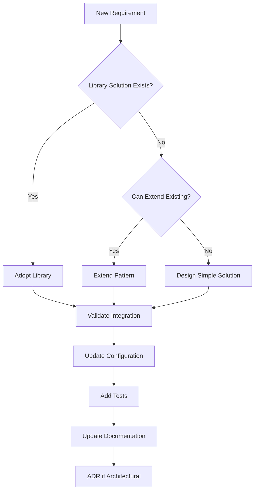

# Future Development Guidelines

## Overview

This document provides guidelines for extending and evolving the DocMind AI unified architecture. These guidelines ensure that future development maintains the architectural integrity, code quality, and simplicity achieved through the successful refactoring while enabling innovation and growth.

## Table of Contents

1. [Architectural Evolution Principles](#architectural-evolution-principles)
2. [Configuration Management](#configuration-management)
3. [Feature Development Patterns](#feature-development-patterns)
4. [Performance Optimization Guidelines](#performance-optimization-guidelines)
5. [Testing and Quality Assurance](#testing-and-quality-assurance)
6. [Documentation Standards](#documentation-standards)
7. [Integration Guidelines](#integration-guidelines)
8. [Scalability Considerations](#scalability-considerations)

## Architectural Evolution Principles

### Core Design Philosophy

**KISS > DRY > YAGNI** - Always prioritize simplicity, then eliminate duplication, and avoid premature abstractions.

1. **Library-First Always**: Research existing solutions before building custom implementations
2. **Single Source of Truth**: Maintain unified configuration patterns
3. **Flat Over Nested**: Prefer flat structures over deep hierarchies
4. **Testable Architecture**: Every architectural decision should be automatically validatable

### Evolution Guidelines



### Architectural Decision Process

Before making significant changes:

1. **Research Phase**: Investigate existing solutions (use context7, exa, firecrawl)
2. **Design Phase**: Choose simplest viable approach
3. **Validation Phase**: Ensure integration with existing patterns
4. **Implementation Phase**: Follow established code quality standards
5. **Documentation Phase**: Update all relevant documentation

## Configuration Management

### Adding New Configuration

**Always follow the established pattern:**

```python
# 1. Add to appropriate nested model in src/config/settings.py
class ProcessingConfig(BaseModel):
    """Document processing configuration."""
    
    # Existing configuration...
    chunk_size: int = Field(default=1500, ge=100, le=10000)
    
    # NEW CONFIGURATION - Always add with validation
    new_feature_enabled: bool = Field(default=False)
    new_parameter: int = Field(default=100, ge=1, le=1000, 
                              description="Description of parameter purpose")
    
    @field_validator('new_parameter')
    @classmethod
    def validate_new_parameter(cls, v: int) -> int:
        """Add custom validation if needed."""
        if v % 10 != 0:
            raise ValueError("Parameter must be multiple of 10")
        return v
```

```bash
# 2. Add environment variable mapping
DOCMIND_PROCESSING__NEW_FEATURE_ENABLED=true
DOCMIND_PROCESSING__NEW_PARAMETER=200
```

```python
# 3. Use in application code (always through settings)
from src.config import settings

class NewFeatureProcessor:
    def __init__(self):
        self.enabled = settings.processing.new_feature_enabled
        self.parameter = settings.processing.new_parameter
        
    def process(self, data):
        if not self.enabled:
            return self.default_processing(data)
        return self.enhanced_processing(data, self.parameter)
```

### Configuration Best Practices

**DO:**
- Use descriptive names with clear purpose
- Add validation constraints with Field()
- Provide sensible defaults
- Document parameters with descriptions
- Group related settings in nested models

**DON'T:**
- Create deep nested hierarchies (max 2 levels: settings.category.parameter)
- Add configuration for every possible option (YAGNI principle)
- Use different naming conventions
- Skip validation or documentation

### Environment Variable Guidelines

**Naming Convention:**
```bash
DOCMIND_{CATEGORY}__{PARAMETER}=value

# Examples:
DOCMIND_VLLM__MODEL=custom-model              # settings.vllm.model
DOCMIND_EMBEDDING__MODEL_NAME=custom-embed    # settings.embedding.model_name
DOCMIND_AGENTS__DECISION_TIMEOUT=300          # settings.agents.decision_timeout
```

**Type Handling:**
```bash
# Booleans (all acceptable formats)
DOCMIND_DEBUG=true|false|1|0|yes|no

# Numbers
DOCMIND_PORT=8501                    # int
DOCMIND_THRESHOLD=0.85               # float

# Strings
DOCMIND_MODEL_NAME=model-name        # str

# Lists (comma-separated)
DOCMIND_FORMATS=pdf,docx,txt         # list[str]
```

## Feature Development Patterns

### Adding New Agent Types

When extending the multi-agent system:

```python
# 1. Create agent in src/agents/
class SpecializedAgent:
    """Agent for specialized processing tasks."""
    
    def __init__(self, settings: DocMindSettings):
        self.settings = settings
        self.timeout = settings.agents.decision_timeout
        
    async def process(self, query: str, context: dict) -> dict:
        """Process query with specialized logic."""
        # Implementation following existing agent patterns
```

```python
# 2. Register with supervisor in src/agents/coordinator.py
from src.agents.specialized_agent import SpecializedAgent

def get_agent_system(index, settings):
    """Get configured agent system."""
    agents = {
        'router': QueryRouter(settings),
        'planner': PlanningAgent(settings), 
        'retrieval': RetrievalAgent(settings),
        'synthesis': SynthesisAgent(settings),
        'validation': ValidationAgent(settings),
        'specialized': SpecializedAgent(settings),  # NEW AGENT
    }
    return SupervisorSystem(agents, settings)
```

### Adding New Document Formats

Follow the processing pipeline pattern:

```python
# 1. Create processor in src/processing/
class NewFormatProcessor:
    """Processor for new document format."""
    
    def __init__(self, settings: DocMindSettings):
        self.settings = settings
        self.chunk_size = settings.processing.chunk_size
        
    def process(self, file_path: str) -> list[Document]:
        """Process new format documents."""
        # Implementation using established patterns
```

```python
# 2. Register in main processor
# In src/processing/document_processor.py
from src.processing.new_format_processor import NewFormatProcessor

class DocumentProcessor:
    def __init__(self, settings: DocMindSettings):
        self.processors = {
            '.pdf': UnstructuredProcessor(settings),
            '.docx': UnstructuredProcessor(settings),
            '.newformat': NewFormatProcessor(settings),  # NEW FORMAT
        }
```

### Adding New Embedding Models

Extend the embedding system:

```python
# 1. Create embedder in src/retrieval/
class NewEmbeddingModel:
    """New embedding model implementation."""
    
    def __init__(self, settings: DocMindSettings):
        self.model_name = settings.embedding.model_name
        self.device = "cuda" if settings.enable_gpu_acceleration else "cpu"
        
    def embed_documents(self, texts: list[str]) -> list[list[float]]:
        """Embed documents with new model."""
        # Follow BGE-M3 patterns for consistency
```

```python
# 2. Add configuration support
class EmbeddingConfig(BaseModel):
    """Embedding configuration."""
    
    model_name: str = Field(default="BAAI/bge-m3")
    model_type: str = Field(default="sentence-transformers", 
                           description="Model type: sentence-transformers, openai, custom")
    # Add configuration for new model types
```

## Performance Optimization Guidelines

### GPU Memory Management

**Guidelines for GPU-intensive features:**

```python
# Always check GPU availability and manage memory
import torch

class GPUOptimizedProcessor:
    def __init__(self, settings: DocMindSettings):
        self.device = "cuda" if settings.enable_gpu_acceleration else "cpu" 
        self.max_memory = settings.vllm.gpu_memory_utilization
        
    def process_batch(self, batch: list) -> list:
        """Process with memory management."""
        if self.device == "cuda":
            # Monitor memory usage
            memory_used = torch.cuda.memory_allocated() / 1e9
            memory_total = torch.cuda.get_device_properties(0).total_memory / 1e9
            
            if memory_used / memory_total > self.max_memory:
                # Implement batch size reduction or memory clearing
                torch.cuda.empty_cache()
                
        return self.actual_processing(batch)
```

### Caching Strategy

**Extend the caching system appropriately:**

```python
# For document-level caching
from src.cache.simple_cache import SimpleCache

class FeatureProcessor:
    def __init__(self, settings: DocMindSettings):
        self.cache = SimpleCache() if settings.cache.enable_document_caching else None
        
    def process_with_cache(self, input_data):
        cache_key = self.generate_cache_key(input_data)
        
        if self.cache:
            result = self.cache.get(cache_key)
            if result:
                return result
                
        result = self.expensive_processing(input_data)
        
        if self.cache:
            self.cache.set(cache_key, result, ttl=settings.cache.ttl_seconds)
            
        return result
```

### Performance Monitoring

**Add monitoring for new features:**

```python
from src.utils.monitoring import log_performance
import time

class MonitoredProcessor:
    def process(self, data):
        start_time = time.time()
        
        try:
            result = self.actual_processing(data)
            
            # Log successful processing
            log_performance(
                operation="new_feature_processing",
                duration=time.time() - start_time,
                status="success",
                metadata={"data_size": len(data)}
            )
            
            return result
            
        except Exception as e:
            # Log failed processing
            log_performance(
                operation="new_feature_processing", 
                duration=time.time() - start_time,
                status="error",
                metadata={"error": str(e)}
            )
            raise
```

## Testing and Quality Assurance

### Test Structure for New Features

**Always implement all test levels:**

```python
# 1. Unit tests (tests/unit/test_new_feature.py)
def test_new_feature_configuration():
    """Test feature configuration loads correctly."""
    from src.config import settings
    assert settings.new_feature.enabled is not None
    
def test_new_feature_functionality():
    """Test feature core functionality."""
    from src.new_module import NewFeature
    feature = NewFeature()
    result = feature.process("test_input")
    assert result.status == "success"

# 2. Integration tests (tests/integration/test_new_feature_integration.py) 
def test_new_feature_integration():
    """Test feature integrates with existing system."""
    from src.config import settings
    from src.new_module import NewFeature
    
    feature = NewFeature()
    # Test with real configuration and existing components
    result = feature.integrate_with_system(settings)
    assert result.integrates_properly

# 3. Performance tests (tests/performance/test_new_feature_performance.py)
def test_new_feature_performance():
    """Test feature meets performance requirements."""
    import time
    from src.new_module import NewFeature
    
    feature = NewFeature()
    start = time.time()
    result = feature.process(large_test_input)
    duration = time.time() - start
    
    assert duration < expected_max_duration
    assert result.meets_quality_standards
```

### ADR Compliance Testing

**Make new architectural decisions testable:**

```python
def test_new_feature_adr_compliance():
    """Test new feature follows architectural decisions."""
    from src.config import settings
    from src.new_module import NewFeature
    
    feature = NewFeature()
    
    # Test specific ADR requirements
    if hasattr(settings, 'new_feature'):
        # Verify configuration follows established patterns
        assert isinstance(settings.new_feature.timeout, int)
        assert settings.new_feature.timeout <= 200  # Agent timeout limit
        
    # Test implementation follows architectural patterns
    assert hasattr(feature, 'process'), "Must implement process method"
    assert feature.uses_unified_config(), "Must use unified configuration"
```

### Quality Gates for New Code

**Mandatory checks for all new features:**

```bash
#!/bin/bash
# Pre-commit quality gate for new features

# 1. Code formatting
ruff format src tests

# 2. Linting (zero tolerance)
ruff check src tests --fix
ruff check src tests  # Must pass with no errors

# 3. Type checking
mypy src/new_module.py

# 4. Configuration validation
python -c "from src.config import settings; print('✅ Configuration OK')"

# 5. Unit tests
pytest tests/unit/test_new_feature.py -v

# 6. Integration tests  
pytest tests/integration/test_new_feature_integration.py -v

# 7. ADR compliance
python scripts/validate_adr_compliance.py

echo "✅ All quality gates passed for new feature"
```

## Documentation Standards

### Documentation Requirements

**For every new feature, provide:**

1. **Code Documentation**: Docstrings following Google/NumPy style
2. **Configuration Documentation**: Update relevant ADRs or create new ones
3. **Usage Examples**: Executable examples in documentation
4. **Integration Guide**: How feature integrates with existing system

### ADR Creation Guidelines

**Create new ADR when adding:**

- New architectural patterns or frameworks
- Significant configuration changes
- New external dependencies
- Performance-critical optimizations
- Security-related features

**ADR Template Usage:**

```markdown
# ADR-XXX: Feature Name

## Status
Proposed | Accepted | Deprecated | Superseded

## Context  
What problem does this solve? What are the constraints?

## Decision
What solution did we choose and why?

## Consequences
What are the positive and negative outcomes?
```

### Code Documentation Standards

**Required for all public functions:**

```python
def process_documents(
    file_paths: list[str], 
    settings: DocMindSettings,
    batch_size: int = 10
) -> list[ProcessingResult]:
    """Process multiple documents with batch optimization.
    
    Args:
        file_paths: List of absolute file paths to process
        settings: Unified configuration settings
        batch_size: Number of documents to process per batch
        
    Returns:
        List of processing results with metadata and embeddings
        
    Raises:
        DocumentProcessingError: When document cannot be processed
        ConfigurationError: When settings are invalid
        
    Example:
        >>> from src.config import settings
        >>> results = process_documents(['doc1.pdf'], settings)
        >>> assert len(results) == 1
    """
```

## Integration Guidelines

### External Service Integration

**Pattern for adding external services:**

```python
# 1. Add configuration
class IntegrationConfig(BaseModel):
    """External service integration configuration."""
    
    service_enabled: bool = Field(default=False)
    service_url: str = Field(default="http://localhost:8080")
    api_key: str = Field(default="", description="API key for service")
    timeout_seconds: int = Field(default=30, ge=1, le=300)

# 2. Add to main settings
class DocMindSettings(BaseSettings):
    # Existing configuration...
    integration: IntegrationConfig = Field(default_factory=IntegrationConfig)

# 3. Create integration client
class ExternalServiceClient:
    def __init__(self, settings: DocMindSettings):
        self.config = settings.integration
        self.enabled = self.config.service_enabled
        
    async def call_service(self, data):
        if not self.enabled:
            return self.local_fallback(data)
            
        # Implement with proper error handling and timeouts
```

### API Integration Patterns

**For REST API integrations:**

```python
import httpx
from src.config import settings

class APIIntegration:
    def __init__(self):
        self.base_url = settings.integration.service_url
        self.timeout = settings.integration.timeout_seconds
        
    async def make_request(self, endpoint: str, data: dict):
        async with httpx.AsyncClient(timeout=self.timeout) as client:
            try:
                response = await client.post(f"{self.base_url}/{endpoint}", json=data)
                response.raise_for_status()
                return response.json()
            except httpx.RequestError as e:
                # Log and handle network errors
                logger.error("API request failed: %s", e)
                raise IntegrationError(f"Service unavailable: {e}")
            except httpx.HTTPStatusError as e:
                # Log and handle HTTP errors
                logger.error("API returned error: %s", e.response.status_code)
                raise IntegrationError(f"Service error: {e.response.status_code}")
```

### Database Integration

**For new database requirements:**

```python
# Extend existing storage patterns
from src.storage.hybrid_persistence import HybridPersistence

class NewDataStorage(HybridPersistence):
    """Extended storage for new data types."""
    
    def __init__(self, settings: DocMindSettings):
        super().__init__(settings)
        self.new_table_name = "new_feature_data"
        self.initialize_new_tables()
        
    def initialize_new_tables(self):
        """Initialize tables for new feature."""
        with self.get_connection() as conn:
            conn.execute("""
                CREATE TABLE IF NOT EXISTS new_feature_data (
                    id INTEGER PRIMARY KEY,
                    data_type TEXT NOT NULL,
                    content TEXT NOT NULL,
                    metadata TEXT,
                    created_at TIMESTAMP DEFAULT CURRENT_TIMESTAMP
                )
            """)
```

## Scalability Considerations

### Horizontal Scaling Patterns

**Preparing for multi-instance deployment:**

```python
# 1. Stateless component design
class StatelessProcessor:
    """Processor with no internal state for horizontal scaling."""
    
    def __init__(self, settings: DocMindSettings):
        self.settings = settings
        # No instance variables that persist state
        
    def process(self, input_data, context: dict = None):
        # All state passed as parameters or retrieved from external stores
        return self.stateless_processing(input_data, context)

# 2. External state management
class ExternalStateManager:
    """Manage state in external systems for scalability."""
    
    def __init__(self, settings: DocMindSettings):
        self.redis_client = self.init_redis() if settings.cache.use_redis else None
        self.database = self.init_database()
        
    def get_processing_state(self, request_id: str):
        # Retrieve from external store
        pass
        
    def update_processing_state(self, request_id: str, state: dict):
        # Update external store
        pass
```

### Performance Scaling Guidelines

**Optimize for increased load:**

1. **Batch Processing**: Process multiple items together
2. **Async Operations**: Use async/await for I/O operations
3. **Connection Pooling**: Reuse database and HTTP connections
4. **Caching**: Cache expensive operations aggressively
5. **Memory Management**: Monitor and control memory usage

```python
import asyncio
from typing import AsyncIterator

async def process_documents_batch(
    file_paths: list[str],
    settings: DocMindSettings,
    batch_size: int = 10
) -> AsyncIterator[ProcessingResult]:
    """Process documents in batches for scalability."""
    
    for i in range(0, len(file_paths), batch_size):
        batch = file_paths[i:i + batch_size]
        
        # Process batch concurrently
        tasks = [process_single_document(path, settings) for path in batch]
        results = await asyncio.gather(*tasks, return_exceptions=True)
        
        for result in results:
            if isinstance(result, Exception):
                logger.error("Document processing failed: %s", result)
                continue
            yield result
```

### Resource Management

**Monitor and manage resources:**

```python
import psutil
import torch

class ResourceMonitor:
    """Monitor system resources for scaling decisions."""
    
    def __init__(self, settings: DocMindSettings):
        self.settings = settings
        self.max_memory_percent = 80.0
        self.max_gpu_percent = settings.vllm.gpu_memory_utilization * 100
        
    def check_resource_availability(self) -> dict:
        """Check if resources are available for processing."""
        # CPU and memory check
        cpu_percent = psutil.cpu_percent(interval=1)
        memory_percent = psutil.virtual_memory().percent
        
        # GPU check if available
        gpu_percent = 0
        if torch.cuda.is_available():
            gpu_memory = torch.cuda.memory_allocated() / torch.cuda.max_memory_allocated() * 100
            gpu_percent = gpu_memory
            
        return {
            "cpu_available": cpu_percent < 80.0,
            "memory_available": memory_percent < self.max_memory_percent,
            "gpu_available": gpu_percent < self.max_gpu_percent,
            "can_process": all([
                cpu_percent < 80.0,
                memory_percent < self.max_memory_percent,
                gpu_percent < self.max_gpu_percent
            ])
        }
```

---

## Key Principles for Future Development

1. **Maintain Simplicity**: Every addition should make the system simpler or provide clear value
2. **Library-First**: Always research existing solutions before building custom
3. **Configuration Unity**: All configuration through `settings`, following established patterns
4. **Quality Gates**: Never compromise on code quality, testing, or documentation
5. **ADR Compliance**: Maintain architectural consistency and document decisions
6. **Performance Awareness**: Consider scalability and resource usage in all designs
7. **Local-First**: Maintain ability to run completely offline
8. **Testable Architecture**: Every feature must be comprehensively testable

## Future Enhancement Areas

### Planned Architecture Extensions

1. **Multi-Modal Support**: Image and table processing capabilities
2. **Advanced GraphRAG**: Enhanced relationship extraction and reasoning
3. **Distributed Processing**: Multi-GPU and multi-node support
4. **Advanced Caching**: Redis integration for enterprise deployments
5. **Real-time Collaboration**: Multi-user document analysis
6. **Enhanced Security**: Enterprise-grade authentication and authorization

### Technology Evolution

Stay current with:
- LlamaIndex framework updates
- New embedding models (beyond BGE-M3)
- Advanced quantization techniques (beyond FP8)
- New document processing libraries
- Performance optimization frameworks

The unified architecture provides a solid foundation for these enhancements while maintaining the simplicity and quality achieved through the refactoring process.

---

These guidelines ensure that DocMind AI can evolve and grow while preserving the architectural integrity, code quality, and simplicity that make it maintainable and reliable.