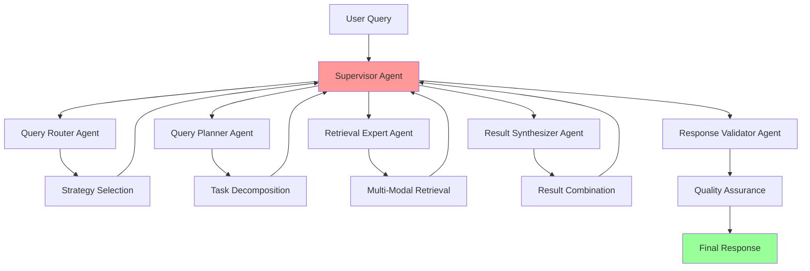

# LangGraph Supervisor Architecture

## Overview

DocMind AI employs a sophisticated 5-agent coordination system built on LangGraph's supervisor pattern to provide intelligent document analysis with enhanced quality, reliability, and performance. The system leverages the `langgraph-supervisor` library to orchestrate specialized agents while maintaining local-first operation and optimizing for the 128K context capability of Qwen3-4B-Instruct-2507-FP8.

## Architecture Components

### Agent Hierarchy



### Core Agent Definitions

#### 1. Supervisor Agent (Central Coordinator)

- **Role**: Central orchestrator managing agent workflow and state
- **Implementation**: Uses `create_supervisor()` from `langgraph-supervisor`
- **Responsibilities**:
  - Route queries to appropriate specialized agents
  - Manage conversation state and context
  - Handle agent handoffs and parallel execution
  - Implement fallback strategies for failed operations
- **Performance**: <500ms coordination overhead per query

#### 2. Query Router Agent

- **Role**: Analyzes incoming queries and determines optimal retrieval strategy
- **Capabilities**:
  - Query complexity assessment
  - Retrieval strategy selection (semantic, hybrid, keyword)
  - Context window optimization decisions
  - Multi-modal content detection
- **Output**: Structured routing decision with confidence scores

#### 3. Query Planner Agent

- **Role**: Decomposes complex queries into manageable sub-tasks
- **Capabilities**:
  - Query decomposition for multi-part questions
  - Sequential task planning with dependencies
  - Context preservation across sub-queries
  - Resource allocation optimization
- **Output**: Structured execution plan with task prioritization

#### 4. Retrieval Expert Agent

- **Role**: Executes optimized retrieval operations using the full system capability
- **Capabilities**:
  - Multi-stage hybrid search execution
  - DSPy-optimized query rewriting
  - 128K context window utilization
  - Multi-modal embedding coordination
  - Reranking and relevance scoring
- **Performance**: Leverages FP8 optimization for 12-14GB VRAM usage

#### 5. Result Synthesizer Agent

- **Role**: Combines and reconciles results from multiple retrieval passes
- **Capabilities**:
  - Multi-source result integration
  - Conflict resolution between sources
  - Evidence ranking and citation generation
  - Response coherence optimization
- **Output**: Unified, coherent response with source attribution

#### 6. Response Validator Agent

- **Role**: Ensures accuracy and quality of final responses
- **Capabilities**:
  - Factual consistency checking
  - Response completeness validation
  - Source citation verification
  - Quality scoring and confidence assessment
- **Output**: Validated response with quality metrics

## Technical Implementation

### LangGraph Supervisor Configuration

```python
from langgraph_supervisor import create_supervisor, Agent
from langgraph.graph import StateGraph
from typing import Dict, Any, List

# Agent definitions
agents = [
    Agent(
        name="query_router",
        description="Analyzes queries and determines retrieval strategy",
        system_prompt=QUERY_ROUTER_PROMPT,
        tools=[strategy_selector, complexity_analyzer]
    ),
    Agent(
        name="query_planner", 
        description="Decomposes complex queries into sub-tasks",
        system_prompt=QUERY_PLANNER_PROMPT,
        tools=[task_decomposer, dependency_mapper]
    ),
    Agent(
        name="retrieval_expert",
        description="Executes optimized multi-modal retrieval",
        system_prompt=RETRIEVAL_EXPERT_PROMPT,
        tools=[hybrid_search, reranker, context_optimizer]
    ),
    Agent(
        name="result_synthesizer",
        description="Combines results from multiple sources",
        system_prompt=SYNTHESIS_PROMPT,
        tools=[result_combiner, conflict_resolver]
    ),
    Agent(
        name="response_validator",
        description="Validates response quality and accuracy",
        system_prompt=VALIDATOR_PROMPT,
        tools=[consistency_checker, quality_scorer]
    )
]

# Create supervisor graph
supervisor = create_supervisor(
    agents=agents,
    system_message="Coordinate document analysis agents for optimal results",
    max_iterations=10,
    parallel_execution=True
)
```

### State Management

The system maintains comprehensive state across agent interactions:

```python
from typing import TypedDict, Optional, List
from pydantic import BaseModel

class AgentState(TypedDict):
    """Shared state between all agents"""
    query: str
    routing_decision: Optional[Dict[str, Any]]
    execution_plan: Optional[List[Dict[str, Any]]]
    retrieval_results: Optional[List[Dict[str, Any]]]
    synthesized_response: Optional[str]
    validation_results: Optional[Dict[str, Any]]
    conversation_history: List[Dict[str, Any]]
    context_window_usage: int
    performance_metrics: Dict[str, float]
```

### Agent Communication Patterns

#### Handoff Mechanisms

```python
# Sequential handoff for dependent operations
routing_result = await query_router.process(state)
state["routing_decision"] = routing_result

planning_result = await query_planner.process(state)
state["execution_plan"] = planning_result

# Parallel execution for independent operations
retrieval_tasks = []
for subtask in state["execution_plan"]:
    task = retrieval_expert.process_subtask(subtask, state)
    retrieval_tasks.append(task)

results = await asyncio.gather(*retrieval_tasks)
state["retrieval_results"] = results
```

#### Context Preservation

```python
# Context trimming for 128K window optimization
def optimize_context_window(state: AgentState) -> AgentState:
    """Optimize context usage for 128K token limit"""
    current_tokens = count_tokens(state)
    
    if current_tokens > 120000:  # Leave buffer for response
        # Prioritize recent conversation and most relevant results
        state = trim_conversation_history(state, max_tokens=20000)
        state = trim_retrieval_results(state, max_tokens=80000)
    
    return state
```

## Performance Optimization

### Token Efficiency

- **50-87% Token Reduction**: Achieved through parallel tool execution
- **Context Window Optimization**: Dynamic trimming for 128K limit
- **Agent Specialization**: Reduces redundant processing across agents

### Memory Management

- **FP8 KV Cache**: 12-14GB VRAM usage for full 128K context
- **Agent State Compression**: Efficient state serialization
- **Result Caching**: Prevents redundant retrieval operations

### Parallel Execution

```python
async def execute_parallel_agents(state: AgentState) -> AgentState:
    """Execute independent agents in parallel"""
    tasks = []
    
    # Independent analysis tasks
    if state.get("requires_routing"):
        tasks.append(query_router.process(state))
    
    if state.get("requires_planning"):
        tasks.append(query_planner.process(state))
    
    # Execute in parallel
    results = await asyncio.gather(*tasks, return_exceptions=True)
    
    # Merge results back to state
    for result in results:
        if not isinstance(result, Exception):
            state.update(result)
    
    return state
```

## Error Handling & Resilience

### Graceful Degradation

```python
class AgentErrorHandler:
    """Handles agent failures with graceful degradation"""
    
    async def handle_agent_failure(
        self, 
        agent_name: str, 
        error: Exception, 
        state: AgentState
    ) -> AgentState:
        """Implement fallback strategies for agent failures"""
        
        if agent_name == "query_router":
            # Fallback to default hybrid search strategy
            state["routing_decision"] = self.default_routing_strategy()
            
        elif agent_name == "retrieval_expert":
            # Fallback to simpler retrieval without reranking
            state["retrieval_results"] = await self.simple_retrieval(state)
            
        elif agent_name == "response_validator":
            # Skip validation but add warning
            state["validation_results"] = {"validated": False, "warning": str(error)}
        
        # Log error for monitoring
        logger.warning(f"Agent {agent_name} failed: {error}, using fallback")
        
        return state
```

### Retry Mechanisms

```python
from tenacity import retry, stop_after_attempt, wait_exponential

@retry(
    stop=stop_after_attempt(3),
    wait=wait_exponential(multiplier=1, min=4, max=10)
)
async def execute_agent_with_retry(agent: Agent, state: AgentState) -> Dict[str, Any]:
    """Execute agent with exponential backoff retry"""
    try:
        result = await agent.process(state)
        return result
    except Exception as e:
        logger.warning(f"Agent execution failed: {e}, retrying...")
        raise
```

## Integration Points

### vLLM Backend Integration

```python
# Configure agents to use vLLM backend
from llama_index.llms.vllm import VllmLLM

vllm_llm = VllmLLM(
    model="Qwen3-4B-Instruct-2507-FP8",
    tensor_parallel_size=1,
    gpu_memory_utilization=0.85,
    max_model_len=131072,  # 128K context
    quantization="fp8",
    kv_cache_dtype="fp8_e5m2",
    attention_backend="FLASHINFER"
)

# Configure agents to use vLLM
for agent in agents:
    agent.llm = vllm_llm
```

### Qdrant Vector Store Integration

```python
# Configure retrieval expert with Qdrant
from qdrant_client import QdrantClient
from llama_index.vector_stores.qdrant import QdrantVectorStore

qdrant_client = QdrantClient(host="localhost", port=6333)
vector_store = QdrantVectorStore(client=qdrant_client, collection_name="docmind")

# Configure retrieval expert
retrieval_expert.vector_store = vector_store
retrieval_expert.reranker = BGERerank(model="BAAI/bge-reranker-v2-m3")
```

## Monitoring & Observability

### Performance Metrics

```python
class SupervisorMetrics:
    """Track supervisor and agent performance"""
    
    def __init__(self):
        self.agent_execution_times = {}
        self.handoff_counts = {}
        self.error_counts = {}
        self.token_usage = {}
    
    def record_agent_execution(self, agent_name: str, duration: float):
        """Record agent execution time"""
        if agent_name not in self.agent_execution_times:
            self.agent_execution_times[agent_name] = []
        self.agent_execution_times[agent_name].append(duration)
    
    def get_performance_summary(self) -> Dict[str, Any]:
        """Get performance summary for all agents"""
        return {
            "avg_execution_times": {
                agent: sum(times) / len(times) 
                for agent, times in self.agent_execution_times.items()
            },
            "total_handoffs": sum(self.handoff_counts.values()),
            "error_rate": sum(self.error_counts.values()) / sum(
                len(times) for times in self.agent_execution_times.values()
            ),
            "total_token_usage": sum(self.token_usage.values())
        }
```

### Logging Integration

```python
from loguru import logger
import structlog

# Configure structured logging for agents
structlog.configure(
    processors=[
        structlog.stdlib.filter_by_level,
        structlog.stdlib.add_logger_name,
        structlog.stdlib.add_log_level,
        structlog.stdlib.PositionalArgumentsFormatter(),
        structlog.processors.TimeStamper(fmt="iso"),
        structlog.processors.StackInfoRenderer(),
        structlog.processors.format_exc_info,
        structlog.processors.JSONRenderer()
    ]
)

# Agent-specific logging
async def log_agent_execution(agent_name: str, state: AgentState, result: Any):
    """Log agent execution with structured data"""
    logger.info(
        "Agent execution completed",
        agent_name=agent_name,
        token_usage=count_tokens(state),
        execution_time=result.get("execution_time", 0),
        success=result.get("success", True)
    )
```

## Testing & Validation

### Unit Testing for Agents

```python
import pytest
from unittest.mock import AsyncMock, MagicMock

@pytest.mark.asyncio
async def test_query_router_strategy_selection():
    """Test query router selects appropriate strategy"""
    router = QueryRouterAgent()
    state = {"query": "What are the key findings in document X?"}
    
    result = await router.process(state)
    
    assert result["routing_decision"]["strategy"] == "hybrid_search"
    assert result["routing_decision"]["confidence"] > 0.8

@pytest.mark.asyncio
async def test_supervisor_agent_handoff():
    """Test supervisor coordinates agent handoffs"""
    supervisor = create_test_supervisor()
    state = {"query": "Complex multi-part question"}
    
    result = await supervisor.execute(state)
    
    assert result["execution_plan"] is not None
    assert result["retrieval_results"] is not None
    assert result["synthesized_response"] is not None
```

### Integration Testing

```python
@pytest.mark.integration
async def test_full_agent_pipeline():
    """Test complete agent pipeline with real models"""
    supervisor = create_production_supervisor()
    
    state = {
        "query": "Analyze the performance metrics in the quarterly report",
        "conversation_history": []
    }
    
    result = await supervisor.execute(state)
    
    assert result["final_response"] is not None
    assert result["validation_results"]["validated"] is True
    assert len(result["retrieval_results"]) > 0
```

## Best Practices

### Agent Design Principles

1. **Single Responsibility**: Each agent has a clear, focused purpose
2. **Loose Coupling**: Agents communicate through structured state
3. **Error Resilience**: Graceful degradation with fallback strategies
4. **Performance Optimization**: Parallel execution where possible
5. **Observability**: Comprehensive logging and metrics

### Context Management

1. **Token Budgeting**: Allocate tokens efficiently across agents
2. **Priority-Based Trimming**: Keep most relevant information
3. **State Compression**: Minimize state size between handoffs
4. **Context Preservation**: Maintain conversation coherence

### Performance Tuning

1. **Parallel Execution**: Execute independent agents concurrently
2. **Caching Strategies**: Cache results to avoid redundant processing
3. **Batch Operations**: Process multiple items together when possible
4. **Resource Monitoring**: Track VRAM and token usage continuously

## Configuration Reference

### Environment Variables

```bash
# LangGraph Configuration
LANGGRAPH_SUPERVISOR_ENABLED=true
LANGGRAPH_MAX_ITERATIONS=10
LANGGRAPH_PARALLEL_EXECUTION=true

# Agent Configuration
QUERY_ROUTER_TEMPERATURE=0.1
RETRIEVAL_EXPERT_TOP_K=20
RESPONSE_VALIDATOR_THRESHOLD=0.85

# Performance Settings
AGENT_TIMEOUT_SECONDS=30
MAX_PARALLEL_AGENTS=3
CONTEXT_WINDOW_BUFFER=8192
```

### Agent Prompt Templates

Agent-specific prompts are defined in `src/agents/prompts/` with versioning and optimization tracking through DSPy integration.

## Troubleshooting

### Common Issues

#### Agent Coordination Failures

**Symptoms**: Agents not receiving proper handoffs, incomplete responses
**Solutions**:

- Check state serialization/deserialization
- Verify agent tool configurations
- Review handoff conditions in supervisor

#### Context Window Overflow

**Symptoms**: Token limit exceeded errors, truncated responses  
**Solutions**:

- Implement context trimming before agent execution
- Optimize retrieval result sizes
- Use conversation history compression

#### Performance Degradation

**Symptoms**: Slow response times, high VRAM usage
**Solutions**:

- Enable parallel execution for independent agents
- Optimize agent prompt lengths  
- Monitor and tune FP8 quantization settings

For additional troubleshooting, see [troubleshooting.md](../user/troubleshooting.md).
