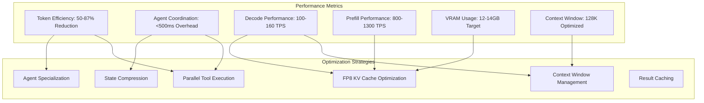

# Multi-Agent Performance Tuning Guide

## Overview

This guide provides comprehensive strategies for optimizing performance in DocMind AI's 5-agent LangGraph supervisor system. Through careful tuning, the system achieves 50-87% token reduction, sub-500ms agent coordination overhead, and optimal resource utilization on RTX 4090 hardware with 128K context capability.

## Performance Architecture

### System Performance Profile



## Token Optimization Strategies

### Parallel Tool Execution

The primary driver of token efficiency is parallel execution of independent agent operations:

```python
import asyncio
from typing import Dict, List, Any
from dataclasses import dataclass
import time

@dataclass
class TokenMetrics:
    """Track token usage across agent operations"""
    agent_name: str
    input_tokens: int
    output_tokens: int
    execution_time: float
    parallel_savings: int = 0

class ParallelAgentExecutor:
    """Optimized parallel execution for token efficiency"""
    
    def __init__(self):
        self.token_savings_history = []
        self.execution_metrics = {}
    
    async def execute_parallel_agents(
        self, 
        agents: Dict[str, Any], 
        state: Dict[str, Any]
    ) -> Dict[str, Any]:
        """Execute independent agents in parallel for maximum token efficiency"""
        
        # Identify parallelizable operations
        parallel_groups = self._identify_parallel_groups(agents, state)
        
        total_sequential_tokens = 0
        total_parallel_tokens = 0
        
        for group in parallel_groups:
            if len(group) > 1:
                # Execute in parallel
                results, metrics = await self._execute_group_parallel(group, state)
                parallel_tokens = max(m.input_tokens + m.output_tokens for m in metrics)
                sequential_tokens = sum(m.input_tokens + m.output_tokens for m in metrics)
                
                token_savings = sequential_tokens - parallel_tokens
                total_parallel_tokens += parallel_tokens
                total_sequential_tokens += sequential_tokens
                
                # Update state with results
                state.update(results)
                
                print(f"🔄 Parallel group saved {token_savings} tokens "
                      f"({token_savings/sequential_tokens*100:.1f}% reduction)")
            else:
                # Execute single agent
                result, metric = await self._execute_single_agent(group[0], state)
                state.update(result)
                total_parallel_tokens += metric.input_tokens + metric.output_tokens
                total_sequential_tokens += metric.input_tokens + metric.output_tokens
        
        # Record overall savings
        total_savings = total_sequential_tokens - total_parallel_tokens
        savings_percentage = (total_savings / total_sequential_tokens * 100) if total_sequential_tokens > 0 else 0
        
        self.token_savings_history.append({
            "timestamp": time.time(),
            "sequential_tokens": total_sequential_tokens,
            "parallel_tokens": total_parallel_tokens,
            "token_savings": total_savings,
            "savings_percentage": savings_percentage
        })
        
        print(f"📊 Total token savings: {total_savings} tokens ({savings_percentage:.1f}%)")
        
        return state
    
    def _identify_parallel_groups(
        self, 
        agents: Dict[str, Any], 
        state: Dict[str, Any]
    ) -> List[List[str]]:
        """Identify which agents can be executed in parallel"""
        
        # Agent dependency analysis
        dependencies = {
            "query_router": [],  # No dependencies, can start immediately
            "query_planner": [],  # Can run parallel with router initially
            "retrieval_expert": ["query_router"],  # Needs routing decision
            "result_synthesizer": ["retrieval_expert"],  # Needs retrieval results
            "response_validator": ["result_synthesizer"]  # Needs synthesized response
        }
        
        parallel_groups = []
        remaining_agents = set(agents.keys())
        
        while remaining_agents:
            # Find agents with satisfied dependencies
            ready_agents = []
            for agent in remaining_agents:
                if all(dep not in remaining_agents for dep in dependencies.get(agent, [])):
                    ready_agents.append(agent)
            
            if ready_agents:
                parallel_groups.append(ready_agents)
                remaining_agents -= set(ready_agents)
            else:
                # Deadlock protection - execute remaining agents sequentially
                parallel_groups.extend([[agent] for agent in remaining_agents])
                break
        
        return parallel_groups
    
    async def _execute_group_parallel(
        self, 
        group: List[str], 
        state: Dict[str, Any]
    ) -> tuple[Dict[str, Any], List[TokenMetrics]]:
        """Execute a group of agents in parallel"""
        
        tasks = []
        for agent_name in group:
            task = self._execute_single_agent(agent_name, state)
            tasks.append(task)
        
        # Execute all agents in parallel
        results = await asyncio.gather(*tasks, return_exceptions=True)
        
        combined_results = {}
        metrics = []
        
        for i, result in enumerate(results):
            if isinstance(result, Exception):
                print(f"⚠️  Agent {group[i]} failed: {result}")
                continue
            
            agent_result, agent_metrics = result
            combined_results.update(agent_result)
            metrics.append(agent_metrics)
        
        return combined_results, metrics
    
    async def _execute_single_agent(
        self, 
        agent_name: str, 
        state: Dict[str, Any]
    ) -> tuple[Dict[str, Any], TokenMetrics]:
        """Execute a single agent with token tracking"""
        
        start_time = time.time()
        input_tokens = self._estimate_input_tokens(state)
        
        # Simulate agent execution (replace with actual agent calls)
        await asyncio.sleep(0.1)  # Simulate processing time
        
        # Mock results (replace with actual agent results)
        result = {f"{agent_name}_result": f"Result from {agent_name}"}
        output_tokens = 150  # Estimated output tokens
        
        execution_time = time.time() - start_time
        
        metrics = TokenMetrics(
            agent_name=agent_name,
            input_tokens=input_tokens,
            output_tokens=output_tokens,
            execution_time=execution_time
        )
        
        return result, metrics
    
    def _estimate_input_tokens(self, state: Dict[str, Any]) -> int:
        """Estimate input tokens from state"""
        # Simple estimation based on state content
        state_str = str(state)
        return len(state_str.split()) * 1.3  # Rough token estimation
    
    def get_token_efficiency_stats(self) -> Dict[str, Any]:
        """Get token efficiency statistics"""
        if not self.token_savings_history:
            return {"status": "No data available"}
        
        recent_runs = self.token_savings_history[-10:]  # Last 10 runs
        
        return {
            "avg_token_savings_pct": sum(r["savings_percentage"] for r in recent_runs) / len(recent_runs),
            "total_tokens_saved": sum(r["token_savings"] for r in recent_runs),
            "best_savings_pct": max(r["savings_percentage"] for r in recent_runs),
            "total_runs": len(self.token_savings_history)
        }
```

### Context Window Optimization

Efficient management of the 128K context window is crucial for performance:

```python
class ContextWindowOptimizer:
    """Optimize context window usage for 128K token limit"""
    
    def __init__(self, max_context: int = 131072):
        self.max_context = max_context
        self.context_buffer = int(max_context * 0.06)  # 6% buffer (8K tokens)
        self.effective_context = max_context - self.context_buffer
        self.optimization_stats = []
    
    def optimize_agent_context(
        self, 
        agent_state: Dict[str, Any], 
        priority_order: List[str] = None
    ) -> Dict[str, Any]:
        """Optimize context for individual agent execution"""
        
        initial_tokens = self._count_tokens(agent_state)
        
        if initial_tokens <= self.effective_context:
            return agent_state
        
        print(f"🔄 Context optimization needed: {initial_tokens:,} > {self.effective_context:,} tokens")
        
        # Apply optimization strategies in order of priority
        strategies = [
            ("conversation_trimming", self._trim_conversation_history),
            ("result_compression", self._compress_retrieval_results),
            ("redundancy_removal", self._remove_redundant_content),
            ("priority_preservation", self._preserve_priority_content)
        ]
        
        optimized_state = agent_state.copy()
        
        for strategy_name, strategy_func in strategies:
            if self._count_tokens(optimized_state) <= self.effective_context:
                break
            
            tokens_before = self._count_tokens(optimized_state)
            optimized_state = strategy_func(optimized_state, priority_order)
            tokens_after = self._count_tokens(optimized_state)
            
            tokens_saved = tokens_before - tokens_after
            print(f"  📉 {strategy_name}: saved {tokens_saved:,} tokens")
        
        final_tokens = self._count_tokens(optimized_state)
        total_saved = initial_tokens - final_tokens
        
        self.optimization_stats.append({
            "initial_tokens": initial_tokens,
            "final_tokens": final_tokens,
            "tokens_saved": total_saved,
            "optimization_ratio": total_saved / initial_tokens if initial_tokens > 0 else 0
        })
        
        print(f"✅ Context optimized: {initial_tokens:,} → {final_tokens:,} tokens "
              f"({total_saved/initial_tokens*100:.1f}% reduction)")
        
        return optimized_state
    
    def _count_tokens(self, state: Dict[str, Any]) -> int:
        """Count tokens in state dictionary"""
        # Simple token counting - replace with proper tokenizer in production
        text_content = self._extract_text_content(state)
        return len(text_content.split()) * 1.3
    
    def _extract_text_content(self, state: Dict[str, Any]) -> str:
        """Extract all text content from state"""
        content_parts = []
        
        for key, value in state.items():
            if isinstance(value, str):
                content_parts.append(value)
            elif isinstance(value, dict):
                content_parts.append(self._extract_text_content(value))
            elif isinstance(value, list):
                for item in value:
                    if isinstance(item, (str, dict)):
                        content_parts.append(str(item))
        
        return " ".join(content_parts)
    
    def _trim_conversation_history(
        self, 
        state: Dict[str, Any], 
        priority_order: List[str] = None
    ) -> Dict[str, Any]:
        """Trim conversation history to most recent and relevant"""
        
        if "conversation_history" not in state:
            return state
        
        conversation = state["conversation_history"]
        if not isinstance(conversation, list) or len(conversation) <= 2:
            return state
        
        # Keep the most recent 5 turns and the first turn (for context)
        max_turns = 5
        
        if len(conversation) > max_turns + 1:
            trimmed_conversation = [conversation[0]]  # Keep first turn
            trimmed_conversation.extend(conversation[-(max_turns):])  # Keep last N turns
            
            state["conversation_history"] = trimmed_conversation
        
        return state
    
    def _compress_retrieval_results(
        self, 
        state: Dict[str, Any], 
        priority_order: List[str] = None
    ) -> Dict[str, Any]:
        """Compress retrieval results while preserving key information"""
        
        if "retrieval_results" not in state:
            return state
        
        results = state["retrieval_results"]
        if not isinstance(results, list):
            return state
        
        # Compress each result by keeping only essential fields
        compressed_results = []
        
        for result in results:
            if isinstance(result, dict):
                # Keep only essential fields and truncate content
                essential_fields = ["content", "score", "metadata", "source"]
                compressed_result = {}
                
                for field in essential_fields:
                    if field in result:
                        if field == "content" and isinstance(result[field], str):
                            # Truncate content to first 500 words
                            words = result[field].split()
                            if len(words) > 500:
                                compressed_result[field] = " ".join(words[:500]) + "..."
                            else:
                                compressed_result[field] = result[field]
                        else:
                            compressed_result[field] = result[field]
                
                compressed_results.append(compressed_result)
            else:
                compressed_results.append(result)
        
        state["retrieval_results"] = compressed_results
        return state
    
    def _remove_redundant_content(
        self, 
        state: Dict[str, Any], 
        priority_order: List[str] = None
    ) -> Dict[str, Any]:
        """Remove redundant or repetitive content"""
        
        # Simple redundancy removal - look for repeated phrases
        for key, value in state.items():
            if isinstance(value, str) and len(value) > 1000:
                # Remove repeated sentences (simplified approach)
                sentences = value.split('. ')
                unique_sentences = []
                seen_sentences = set()
                
                for sentence in sentences:
                    sentence_clean = sentence.lower().strip()
                    if sentence_clean not in seen_sentences:
                        unique_sentences.append(sentence)
                        seen_sentences.add(sentence_clean)
                
                if len(unique_sentences) < len(sentences):
                    state[key] = '. '.join(unique_sentences)
        
        return state
    
    def _preserve_priority_content(
        self, 
        state: Dict[str, Any], 
        priority_order: List[str] = None
    ) -> Dict[str, Any]:
        """Preserve high-priority content while trimming lower priority content"""
        
        if not priority_order:
            priority_order = [
                "query", 
                "routing_decision", 
                "execution_plan", 
                "retrieval_results", 
                "conversation_history"
            ]
        
        # Calculate token budget for each priority level
        current_tokens = self._count_tokens(state)
        if current_tokens <= self.effective_context:
            return state
        
        tokens_to_remove = current_tokens - self.effective_context
        
        # Remove tokens starting from lowest priority items
        for i in range(len(priority_order) - 1, -1, -1):
            if tokens_to_remove <= 0:
                break
            
            field = priority_order[i]
            if field in state and isinstance(state[field], str):
                field_tokens = len(state[field].split()) * 1.3
                
                if field_tokens > tokens_to_remove:
                    # Partial trimming
                    words = state[field].split()
                    words_to_keep = int((field_tokens - tokens_to_remove) / 1.3)
                    state[field] = " ".join(words[:words_to_keep]) + "..."
                    tokens_to_remove = 0
                else:
                    # Complete removal
                    tokens_to_remove -= field_tokens
                    state[field] = f"[{field} content trimmed for context optimization]"
        
        return state
    
    def get_optimization_stats(self) -> Dict[str, Any]:
        """Get context optimization statistics"""
        if not self.optimization_stats:
            return {"status": "No optimizations performed"}
        
        recent_stats = self.optimization_stats[-10:]
        
        return {
            "avg_optimization_ratio": sum(s["optimization_ratio"] for s in recent_stats) / len(recent_stats),
            "avg_tokens_saved": sum(s["tokens_saved"] for s in recent_stats) / len(recent_stats),
            "max_tokens_saved": max(s["tokens_saved"] for s in recent_stats),
            "total_optimizations": len(self.optimization_stats)
        }
```

## Agent Specialization Performance

### Task-Specific Optimization

Each agent is optimized for its specific role to minimize processing overhead:

```python
from enum import Enum
from typing import Protocol, runtime_checkable

class AgentPerformanceLevel(Enum):
    """Agent performance optimization levels"""
    FAST = "fast"           # Quick decisions, lower accuracy
    BALANCED = "balanced"   # Default balance of speed and accuracy  
    THOROUGH = "thorough"   # High accuracy, slower processing

@runtime_checkable
class OptimizedAgent(Protocol):
    """Protocol for performance-optimized agents"""
    
    async def process_optimized(
        self, 
        state: Dict[str, Any], 
        performance_level: AgentPerformanceLevel = AgentPerformanceLevel.BALANCED
    ) -> Dict[str, Any]:
        """Process with specified performance optimization level"""
        ...

class QueryRouterOptimizer:
    """Performance optimization for Query Router Agent"""
    
    def __init__(self):
        self.routing_cache = {}  # Cache common routing decisions
        self.performance_thresholds = {
            AgentPerformanceLevel.FAST: {"max_analysis_time": 0.1, "confidence_threshold": 0.6},
            AgentPerformanceLevel.BALANCED: {"max_analysis_time": 0.3, "confidence_threshold": 0.8},
            AgentPerformanceLevel.THOROUGH: {"max_analysis_time": 1.0, "confidence_threshold": 0.9}
        }
    
    async def process_optimized(
        self, 
        state: Dict[str, Any], 
        performance_level: AgentPerformanceLevel = AgentPerformanceLevel.BALANCED
    ) -> Dict[str, Any]:
        """Optimized query routing with caching and performance levels"""
        
        query = state.get("query", "")
        query_hash = hash(query)
        
        # Check cache for similar queries
        if query_hash in self.routing_cache:
            cached_decision = self.routing_cache[query_hash]
            print(f"📋 Using cached routing decision for similar query")
            return {"routing_decision": cached_decision}
        
        # Performance-based routing logic
        thresholds = self.performance_thresholds[performance_level]
        start_time = time.time()
        
        # Simplified routing analysis based on performance level
        if performance_level == AgentPerformanceLevel.FAST:
            routing_decision = await self._fast_routing_analysis(query)
        elif performance_level == AgentPerformanceLevel.BALANCED:
            routing_decision = await self._balanced_routing_analysis(query)
        else:  # THOROUGH
            routing_decision = await self._thorough_routing_analysis(query)
        
        execution_time = time.time() - start_time
        
        # Cache decision if confidence is high enough
        if routing_decision.get("confidence", 0) >= thresholds["confidence_threshold"]:
            self.routing_cache[query_hash] = routing_decision
        
        print(f"🎯 Query routing completed in {execution_time:.3f}s "
              f"(level: {performance_level.value}, confidence: {routing_decision.get('confidence', 0):.2f})")
        
        return {"routing_decision": routing_decision}
    
    async def _fast_routing_analysis(self, query: str) -> Dict[str, Any]:
        """Fast routing analysis with basic heuristics"""
        # Simple keyword-based routing
        keywords = query.lower().split()
        
        if any(word in keywords for word in ["specific", "exact", "precise"]):
            strategy = "keyword_search"
        elif any(word in keywords for word in ["similar", "related", "like"]):
            strategy = "semantic_search"
        else:
            strategy = "hybrid_search"
        
        return {
            "strategy": strategy,
            "confidence": 0.7,
            "reasoning": "Fast heuristic-based routing",
            "parameters": {"top_k": 10}
        }
    
    async def _balanced_routing_analysis(self, query: str) -> Dict[str, Any]:
        """Balanced routing analysis with moderate complexity"""
        await asyncio.sleep(0.1)  # Simulate processing time
        
        # More sophisticated analysis
        query_complexity = len(query.split())
        
        if query_complexity < 5:
            strategy = "keyword_search"
            confidence = 0.8
        elif query_complexity > 20:
            strategy = "hybrid_search"
            confidence = 0.85
        else:
            strategy = "semantic_search"
            confidence = 0.8
        
        return {
            "strategy": strategy,
            "confidence": confidence,
            "reasoning": "Balanced complexity and length analysis",
            "parameters": {"top_k": 15}
        }
    
    async def _thorough_routing_analysis(self, query: str) -> Dict[str, Any]:
        """Thorough routing analysis with comprehensive evaluation"""
        await asyncio.sleep(0.3)  # Simulate deeper processing
        
        # Comprehensive analysis including semantic features
        features = {
            "length": len(query.split()),
            "complexity": query.count(',') + query.count(';') + query.count('and'),
            "question_words": sum(1 for word in query.lower().split() 
                                if word in ["what", "how", "why", "when", "where", "who"]),
            "specificity": sum(1 for word in query.lower().split() 
                             if word in ["specific", "exact", "particular", "detail"])
        }
        
        # Advanced routing logic
        if features["specificity"] > 0 or features["question_words"] == 0:
            strategy = "keyword_search"
            confidence = 0.9
        elif features["complexity"] > 2:
            strategy = "hybrid_search"
            confidence = 0.95
        else:
            strategy = "semantic_search"
            confidence = 0.9
        
        return {
            "strategy": strategy,
            "confidence": confidence,
            "reasoning": f"Thorough analysis of query features: {features}",
            "parameters": {"top_k": 20, "rerank": True}
        }

class RetrievalExpertOptimizer:
    """Performance optimization for Retrieval Expert Agent"""
    
    def __init__(self):
        self.result_cache = {}
        self.performance_stats = []
    
    async def process_optimized(
        self, 
        state: Dict[str, Any], 
        performance_level: AgentPerformanceLevel = AgentPerformanceLevel.BALANCED
    ) -> Dict[str, Any]:
        """Optimized retrieval with caching and batch processing"""
        
        routing_decision = state.get("routing_decision", {})
        query = state.get("query", "")
        
        # Generate cache key
        cache_key = hash(f"{query}_{routing_decision.get('strategy', '')}")
        
        if cache_key in self.result_cache:
            print(f"📋 Using cached retrieval results")
            return {"retrieval_results": self.result_cache[cache_key]}
        
        start_time = time.time()
        
        # Performance-optimized retrieval
        if performance_level == AgentPerformanceLevel.FAST:
            results = await self._fast_retrieval(query, routing_decision)
        elif performance_level == AgentPerformanceLevel.BALANCED:
            results = await self._balanced_retrieval(query, routing_decision)
        else:  # THOROUGH
            results = await self._thorough_retrieval(query, routing_decision)
        
        execution_time = time.time() - start_time
        
        # Cache results
        self.result_cache[cache_key] = results
        
        # Track performance
        self.performance_stats.append({
            "execution_time": execution_time,
            "performance_level": performance_level.value,
            "result_count": len(results) if isinstance(results, list) else 1,
            "cache_hit": False
        })
        
        print(f"🔍 Retrieval completed in {execution_time:.3f}s "
              f"(level: {performance_level.value}, results: {len(results) if isinstance(results, list) else 1})")
        
        return {"retrieval_results": results}
    
    async def _fast_retrieval(self, query: str, routing_decision: Dict[str, Any]) -> List[Dict[str, Any]]:
        """Fast retrieval with minimal processing"""
        await asyncio.sleep(0.05)  # Simulate fast retrieval
        
        # Return fewer, more focused results
        return [
            {"content": f"Fast result 1 for: {query}", "score": 0.8, "source": "doc1"},
            {"content": f"Fast result 2 for: {query}", "score": 0.7, "source": "doc2"},
        ]
    
    async def _balanced_retrieval(self, query: str, routing_decision: Dict[str, Any]) -> List[Dict[str, Any]]:
        """Balanced retrieval with moderate processing"""
        await asyncio.sleep(0.15)  # Simulate moderate retrieval
        
        # Return balanced number of results
        results = []
        for i in range(5):
            results.append({
                "content": f"Balanced result {i+1} for: {query}",
                "score": 0.8 - (i * 0.1),
                "source": f"doc{i+1}"
            })
        
        return results
    
    async def _thorough_retrieval(self, query: str, routing_decision: Dict[str, Any]) -> List[Dict[str, Any]]:
        """Thorough retrieval with comprehensive processing"""
        await asyncio.sleep(0.3)  # Simulate thorough retrieval
        
        # Return comprehensive results with reranking
        results = []
        for i in range(10):
            results.append({
                "content": f"Thorough result {i+1} for: {query}",
                "score": 0.9 - (i * 0.05),
                "source": f"doc{i+1}",
                "reranked": True
            })
        
        return results
```

## Performance Monitoring & Analytics

### Comprehensive Performance Dashboard

```python
import matplotlib.pyplot as plt
import pandas as pd
from datetime import datetime, timedelta
import json

class MultiAgentPerformanceDashboard:
    """Comprehensive performance monitoring and analytics"""
    
    def __init__(self):
        self.metrics_buffer = []
        self.performance_thresholds = {
            "agent_execution_time_max": 2.0,  # seconds
            "token_efficiency_min": 40,       # percentage
            "context_utilization_max": 90,    # percentage
            "vram_usage_max": 15,            # GB
            "coordination_overhead_max": 0.5  # seconds
        }
    
    def record_execution_metrics(
        self, 
        agent_name: str, 
        execution_time: float,
        token_usage: Dict[str, int],
        vram_usage: float,
        performance_level: str = "balanced"
    ):
        """Record execution metrics for analysis"""
        
        metrics = {
            "timestamp": datetime.now().isoformat(),
            "agent_name": agent_name,
            "execution_time": execution_time,
            "input_tokens": token_usage.get("input", 0),
            "output_tokens": token_usage.get("output", 0),
            "total_tokens": token_usage.get("input", 0) + token_usage.get("output", 0),
            "vram_usage_gb": vram_usage,
            "performance_level": performance_level
        }
        
        self.metrics_buffer.append(metrics)
        
        # Check for performance issues
        self._check_performance_thresholds(metrics)
    
    def _check_performance_thresholds(self, metrics: Dict[str, Any]):
        """Check if metrics exceed performance thresholds"""
        
        warnings = []
        
        if metrics["execution_time"] > self.performance_thresholds["agent_execution_time_max"]:
            warnings.append(f"High execution time: {metrics['execution_time']:.2f}s")
        
        if metrics["vram_usage_gb"] > self.performance_thresholds["vram_usage_max"]:
            warnings.append(f"High VRAM usage: {metrics['vram_usage_gb']:.2f}GB")
        
        if warnings:
            print(f"⚠️  Performance warnings for {metrics['agent_name']}: {', '.join(warnings)}")
    
    def generate_performance_report(self, hours: int = 24) -> Dict[str, Any]:
        """Generate comprehensive performance report"""
        
        cutoff_time = datetime.now() - timedelta(hours=hours)
        recent_metrics = [
            m for m in self.metrics_buffer 
            if datetime.fromisoformat(m["timestamp"]) >= cutoff_time
        ]
        
        if not recent_metrics:
            return {"status": "No recent metrics available"}
        
        df = pd.DataFrame(recent_metrics)
        
        # Agent-specific performance analysis
        agent_stats = {}
        for agent in df["agent_name"].unique():
            agent_data = df[df["agent_name"] == agent]
            
            agent_stats[agent] = {
                "avg_execution_time": float(agent_data["execution_time"].mean()),
                "max_execution_time": float(agent_data["execution_time"].max()),
                "avg_tokens": float(agent_data["total_tokens"].mean()),
                "avg_vram_usage": float(agent_data["vram_usage_gb"].mean()),
                "execution_count": len(agent_data)
            }
        
        # Overall system performance
        system_stats = {
            "total_executions": len(recent_metrics),
            "avg_execution_time": float(df["execution_time"].mean()),
            "total_tokens_processed": int(df["total_tokens"].sum()),
            "avg_vram_usage": float(df["vram_usage_gb"].mean()),
            "peak_vram_usage": float(df["vram_usage_gb"].max())
        }
        
        # Performance trends
        df["hour"] = pd.to_datetime(df["timestamp"]).dt.hour
        hourly_stats = df.groupby("hour").agg({
            "execution_time": ["mean", "max"],
            "total_tokens": "sum",
            "vram_usage_gb": ["mean", "max"]
        }).round(3)
        
        # Token efficiency analysis
        token_efficiency = self._calculate_token_efficiency(recent_metrics)
        
        return {
            "report_period_hours": hours,
            "agent_performance": agent_stats,
            "system_performance": system_stats,
            "hourly_trends": hourly_stats.to_dict(),
            "token_efficiency": token_efficiency,
            "performance_grade": self._calculate_performance_grade(system_stats),
            "recommendations": self._generate_recommendations(agent_stats, system_stats)
        }
    
    def _calculate_token_efficiency(self, metrics: List[Dict[str, Any]]) -> Dict[str, Any]:
        """Calculate token efficiency metrics"""
        
        total_tokens = sum(m["total_tokens"] for m in metrics)
        total_time = sum(m["execution_time"] for m in metrics)
        
        return {
            "tokens_per_second": total_tokens / total_time if total_time > 0 else 0,
            "avg_tokens_per_execution": total_tokens / len(metrics) if metrics else 0,
            "token_processing_efficiency": "High" if total_tokens / total_time > 1000 else "Normal"
        }
    
    def _calculate_performance_grade(self, system_stats: Dict[str, Any]) -> str:
        """Calculate overall performance grade"""
        
        grade_points = 0
        
        # Execution time grade
        if system_stats["avg_execution_time"] <= 0.5:
            grade_points += 25
        elif system_stats["avg_execution_time"] <= 1.0:
            grade_points += 20
        elif system_stats["avg_execution_time"] <= 2.0:
            grade_points += 15
        else:
            grade_points += 5
        
        # VRAM usage grade
        if system_stats["avg_vram_usage"] <= 12:
            grade_points += 25
        elif system_stats["avg_vram_usage"] <= 14:
            grade_points += 20
        elif system_stats["avg_vram_usage"] <= 16:
            grade_points += 15
        else:
            grade_points += 5
        
        # Execution count grade (higher is better for throughput)
        if system_stats["total_executions"] >= 100:
            grade_points += 25
        elif system_stats["total_executions"] >= 50:
            grade_points += 20
        elif system_stats["total_executions"] >= 20:
            grade_points += 15
        else:
            grade_points += 10
        
        # Token efficiency grade
        tokens_per_second = system_stats["total_tokens_processed"] / (system_stats["avg_execution_time"] * system_stats["total_executions"])
        if tokens_per_second >= 1000:
            grade_points += 25
        elif tokens_per_second >= 500:
            grade_points += 20
        elif tokens_per_second >= 200:
            grade_points += 15
        else:
            grade_points += 10
        
        if grade_points >= 90:
            return "A+ Excellent"
        elif grade_points >= 80:
            return "A Good"
        elif grade_points >= 70:
            return "B Average"
        elif grade_points >= 60:
            return "C Below Average"
        else:
            return "D Needs Improvement"
    
    def _generate_recommendations(
        self, 
        agent_stats: Dict[str, Dict[str, Any]], 
        system_stats: Dict[str, Any]
    ) -> List[str]:
        """Generate performance optimization recommendations"""
        
        recommendations = []
        
        # Agent-specific recommendations
        for agent, stats in agent_stats.items():
            if stats["avg_execution_time"] > 1.0:
                recommendations.append(f"Consider optimizing {agent} - high execution time ({stats['avg_execution_time']:.2f}s)")
            
            if stats["avg_vram_usage"] > 14:
                recommendations.append(f"Monitor {agent} VRAM usage - approaching limits ({stats['avg_vram_usage']:.2f}GB)")
        
        # System-wide recommendations
        if system_stats["avg_vram_usage"] > 14:
            recommendations.append("Consider enabling FP8 KV cache optimization to reduce VRAM usage")
        
        if system_stats["avg_execution_time"] > 1.0:
            recommendations.append("Consider increasing parallel execution to improve throughput")
        
        if system_stats["total_tokens_processed"] / system_stats["total_executions"] < 500:
            recommendations.append("Low token efficiency detected - review context optimization strategies")
        
        return recommendations if recommendations else ["System performance is within optimal parameters"]
    
    def export_metrics(self, filename: str = None) -> str:
        """Export performance metrics to JSON file"""
        
        if not filename:
            filename = f"performance_metrics_{datetime.now().strftime('%Y%m%d_%H%M%S')}.json"
        
        export_data = {
            "export_timestamp": datetime.now().isoformat(),
            "metrics_count": len(self.metrics_buffer),
            "metrics": self.metrics_buffer,
            "performance_thresholds": self.performance_thresholds
        }
        
        with open(filename, "w") as f:
            json.dump(export_data, f, indent=2)
        
        return filename

# Usage example
async def monitor_agent_performance():
    """Example usage of performance monitoring"""
    
    dashboard = MultiAgentPerformanceDashboard()
    
    # Simulate agent executions with monitoring
    agents = ["query_router", "retrieval_expert", "result_synthesizer"]
    
    for i in range(50):
        for agent in agents:
            # Simulate execution
            execution_time = 0.2 + (i * 0.01)  # Gradually increasing
            token_usage = {"input": 100 + i, "output": 50 + i}
            vram_usage = 12.0 + (i * 0.05)
            
            dashboard.record_execution_metrics(
                agent_name=agent,
                execution_time=execution_time,
                token_usage=token_usage,
                vram_usage=vram_usage
            )
    
    # Generate and display report
    report = dashboard.generate_performance_report(hours=1)
    print("📊 Performance Report Generated:")
    print(f"Grade: {report['performance_grade']}")
    print(f"Total Executions: {report['system_performance']['total_executions']}")
    print(f"Avg Execution Time: {report['system_performance']['avg_execution_time']:.3f}s")
    print(f"Peak VRAM Usage: {report['system_performance']['peak_vram_usage']:.2f}GB")
    
    # Export metrics
    export_file = dashboard.export_metrics()
    print(f"📁 Metrics exported to: {export_file}")
    
    return dashboard
```

## Best Practices for Performance Tuning

### 1. Agent Coordination Optimization

- **Minimize Handoff Latency**: Design state transitions to minimize serialization overhead
- **Batch Operations**: Group similar operations across agents for better resource utilization
- **Async Execution**: Use asynchronous patterns for all I/O and LLM operations

### 2. Token Efficiency Strategies

- **Parallel Tool Calls**: Execute independent agent tools simultaneously
- **Context Sharing**: Share context between agents to avoid redundant token usage
- **Result Compression**: Compress intermediate results while preserving essential information

### 3. Memory Management

- **FP8 Optimization**: Ensure FP8 quantization is properly configured for memory efficiency
- **Context Window Management**: Implement intelligent context trimming strategies
- **Cache Management**: Use result caching to avoid redundant processing

### 4. Performance Monitoring

- **Continuous Monitoring**: Track performance metrics in real-time
- **Threshold Alerting**: Set up alerts for performance degradation
- **Regular Benchmarking**: Conduct regular performance benchmarks to identify trends

For additional performance tuning guidance, see [vllm-integration-guide.md](vllm-integration-guide.md) and [performance-validation.md](performance-validation.md).
