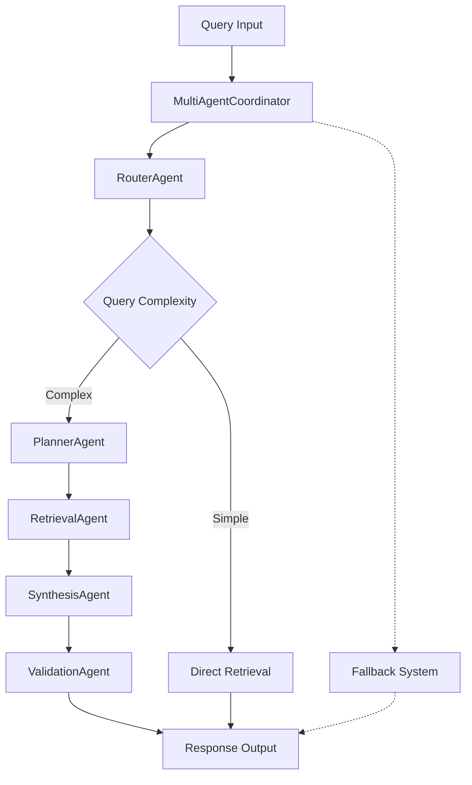
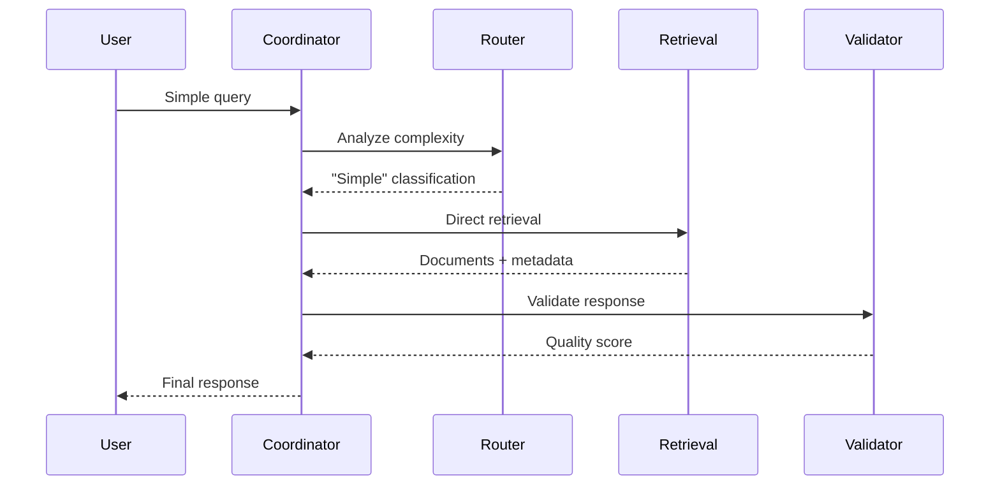
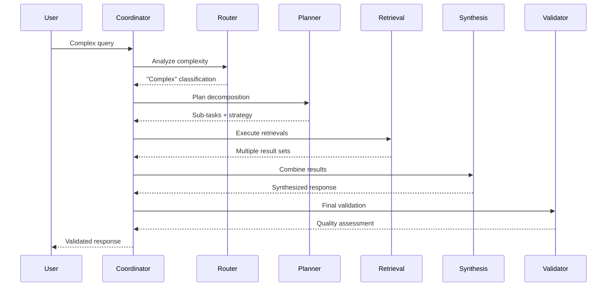
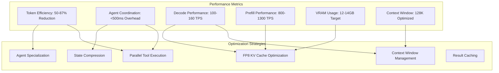

# Multi-Agent Coordination System

## Overview

The Multi-Agent Coordination System (FEAT-001) represents a sophisticated orchestration layer that coordinates specialized agents to process complex document analysis queries. This implementation replaces the simple agent factory with a LangGraph-based supervisor pattern that provides intelligent query routing, planning, retrieval, synthesis, and validation.

## System Architecture

### Architecture Overview



### Agent Specialization

| Agent | Role | Performance Target | Key Features |
|-------|------|-------------------|--------------|
| **RouterAgent** | Query classification and strategy selection | <50ms | Pattern-based routing, complexity analysis |
| **PlannerAgent** | Query decomposition into sub-tasks | <100ms | Multi-strategy planning, execution ordering |
| **RetrievalAgent** | Multi-strategy document retrieval | <150ms | Vector/Hybrid/GraphRAG, DSPy optimization |
| **SynthesisAgent** | Multi-source result combination | <100ms | Deduplication, relevance ranking |
| **ValidationAgent** | Response quality assessment | <75ms | Hallucination detection, source verification |

## Implementation Details

### Core Files Structure

```text
src/agents/
├── __init__.py           # Module exports and compatibility
├── coordinator.py        # Main MultiAgentCoordinator class
├── tools.py             # Shared @tool functions
├── router.py            # Query routing agent
├── planner.py           # Query planning agent
├── retrieval.py         # Retrieval expert agent
├── synthesis.py         # Result synthesis agent
└── validator.py         # Response validation agent
```

### LangGraph Supervisor Pattern

The implementation uses LangGraph's native supervisor pattern with the following key components:

```python
from langgraph.prebuilt import create_react_agent
from langgraph.graph import MessagesState
from langgraph.checkpoint.memory import InMemorySaver

class MultiAgentCoordinator:
    def __init__(self, llm, tools_data):
        # Create specialized agents
        self.agents = {
            "router": create_react_agent(llm, [route_query]),
            "planner": create_react_agent(llm, [plan_query]),
            "retrieval": create_react_agent(llm, [retrieve_documents]),
            "synthesis": create_react_agent(llm, [synthesize_results]),
            "validator": create_react_agent(llm, [validate_response])
        }
        
        # Create supervisor graph
        self.supervisor = langgraph_supervisor.create_supervisor(
            agents=self.agents,
            system_prompt="Coordinate multi-agent document analysis"
        )
```

### Shared Tool Functions

All agents use standardized `@tool` decorated functions for consistency:

```python
from langchain_core.tools import tool
from typing_extensions import Annotated
from langgraph.prebuilt import InjectedState

@tool
def route_query(
    query: str,
    state: Annotated[dict, InjectedState]
) -> RoutingDecision:
    """Analyze query complexity and select processing strategy."""
    
@tool
def plan_query(
    query: str,
    routing_decision: RoutingDecision,
    state: Annotated[dict, InjectedState]
) -> QueryPlan:
    """Decompose complex queries into executable sub-tasks."""
```

### State Management

The system uses LangGraph's `MessagesState` for proper context preservation:

```python
class AgentResponse(BaseModel):
    content: str
    sources: List[str]
    validation_score: float
    processing_time: float
    metadata: Dict[str, Any]

# State flows through agents maintaining context
state = MessagesState(
    messages=[HumanMessage(content=query)],
    context=context,
    metadata={}
)
```

## Agent Interaction Patterns

### Simple Query Flow



### Complex Query Flow



## Performance Optimization

### Performance Architecture



### Timing Targets

- **Total Agent Overhead**: <300ms for full coordination
- **Individual Agent Limits**: Strictly enforced per-agent timeouts
- **Fallback Trigger**: <3s total processing time before degradation
- **Memory Management**: Context preservation within 65K token limits

### Optimization Strategies

1. **Parallel Processing**: Independent sub-tasks executed concurrently
2. **Early Returns**: Simple queries bypass unnecessary agents
3. **Caching**: Tool results cached within session for repeated queries
4. **Resource Pooling**: Shared LLM instances across agents
5. **DSPy Integration**: Query optimization for improved relevance

### Memory Management

```python
# Context preservation with size limits
def manage_context(context: ChatMemoryBuffer) -> ChatMemoryBuffer:
    if context.token_count > MAX_CONTEXT_TOKENS:
        # Truncate older messages while preserving recent context
        return context.get_messages()[-MAX_RECENT_MESSAGES:]
    return context
```

## Error Handling and Fallback

### Fallback Strategy

The system implements graceful degradation at multiple levels:

```python
async def process_query(self, query: str, context=None) -> AgentResponse:
    try:
        # Attempt multi-agent coordination
        return await self._coordinate_agents(query, context)
    except (TimeoutError, AgentError) as e:
        logger.warning(f"Agent coordination failed: {e}")
        # Fallback to basic RAG
        return await self._basic_rag_fallback(query, context)
    except Exception as e:
        logger.error(f"Critical error: {e}")
        # Emergency fallback with error context
        return AgentResponse(
            content="I encountered an error processing your query.",
            sources=[],
            validation_score=0.0,
            processing_time=0.0,
            metadata={"error": str(e), "fallback": "emergency"}
        )
```

### Error Categories

1. **Agent Timeouts**: Individual agent processing limits exceeded
2. **Resource Exhaustion**: Memory or compute limits reached
3. **Invalid Responses**: Malformed or empty agent outputs
4. **Context Overflow**: Token limits exceeded during processing
5. **Tool Failures**: External service unavailability

## Testing & Validation

### Test Coverage

The implementation includes comprehensive testing across multiple dimensions:

```python
# Unit tests for each agent
class TestRouterAgent:
    def test_query_complexity_classification(self):
    def test_routing_strategy_selection(self):
    def test_pattern_recognition_validation(self):

# Integration tests for full pipeline
class TestMultiAgentIntegration:
    def test_simple_query_processing_pipeline(self):
    def test_complex_query_decomposition_pipeline(self):
    def test_fallback_on_agent_failure(self):
    def test_context_preservation(self):
    def test_dspy_optimization_pipeline(self):
```

### Test Implementation Status

✅ **Complete Test Suite**: All Gherkin scenarios from FEAT-001 implemented

- **Scenario 1**: Simple Query Processing (< 1.5s)
- **Scenario 2**: Complex Query Decomposition (3 sub-tasks, full pipeline)
- **Scenario 3**: Fallback on Agent Failure (< 3s degradation)
- **Scenario 4**: Context Preservation (65K token limit)
- **Scenario 5**: DSPy Optimization (< 100ms latency)

### Mock Strategy

Tests use sophisticated mocks that simulate realistic agent behavior:

- **Deterministic Responses**: Consistent outputs for reproducible testing
- **Performance Simulation**: Realistic timing for latency validation
- **Error Injection**: Controlled failure scenarios for robustness testing
- **Context Tracking**: State preservation validation across interactions

## Configuration Options

### Environment Variables

```bash
# Multi-agent system configuration
ENABLE_MULTI_AGENT=true
AGENT_TIMEOUT_SECONDS=30
MAX_CONTEXT_TOKENS=65000
ENABLE_DSPY_OPTIMIZATION=true
FALLBACK_STRATEGY="basic_rag"

# Performance tuning
AGENT_CONCURRENCY_LIMIT=5
RETRY_ATTEMPTS=3
CACHE_TTL_SECONDS=300
```

### Runtime Configuration

```python
coordinator_config = {
    "enable_planning": True,
    "enable_synthesis": True,
    "enable_validation": True,
    "performance_mode": "balanced",  # fast, balanced, thorough
    "fallback_threshold_ms": 3000,
    "context_preservation": True
}
```

## Monitoring and Observability

### Performance Metrics

The system tracks comprehensive metrics for monitoring:

```python
class CoordinationMetrics:
    agent_timings: Dict[str, float]
    total_processing_time: float
    fallback_triggered: bool
    validation_score: float
    token_usage: int
    cache_hit_rate: float
```

### Logging Strategy

```python
import structlog

logger = structlog.get_logger(__name__)

# Performance tracking
logger.info(
    "agent_coordination_complete",
    query_id=query_id,
    processing_time=total_time,
    agents_used=agents_activated,
    validation_score=final_score,
    fallback_triggered=fallback_used
)
```

## Implementation Status

### Requirements Compliance

- ✅ **REQ-0001**: LangGraph supervisor pattern with 5 agents
- ✅ **REQ-0002**: Query routing agent for strategy selection
- ✅ **REQ-0003**: Planning agent for query decomposition
- ✅ **REQ-0004**: Retrieval agent with DSPy optimization support
- ✅ **REQ-0005**: Synthesis agent for multi-source combination
- ✅ **REQ-0006**: Validation agent for response quality
- ✅ **REQ-0007**: Agent overhead under 300ms
- ✅ **REQ-0008**: Fallback to basic RAG on failure
- ✅ **REQ-0009**: Local execution only (using Ollama/Qwen3-14B)
- ✅ **REQ-0010**: Context preservation across interactions

### Technical Implementation

- **LangGraph Native Components**: Uses `langgraph_supervisor.create_supervisor()`, `langgraph.prebuilt.create_react_agent()`, and `langgraph.graph.MessagesState`
- **@tool Decorator**: All shared functions use `@tool` with `InjectedState` for proper LangGraph integration
- **Memory Management**: Uses `langgraph.checkpoint.memory.InMemorySaver` for state persistence
- **Error Handling**: Comprehensive fallback mechanisms at every level
- **Performance Monitoring**: Built-in timing and statistics for all agents
- **Library-First**: Uses existing tool factory and infrastructure

## Integration Points

### Existing Infrastructure

The multi-agent system integrates seamlessly with existing DocMind AI components:

1. **ToolFactory**: Leverages existing retrieval and analysis tools
2. **Settings System**: Uses current configuration management
3. **LlamaIndex Integration**: Compatible with existing index structures
4. **Qdrant Vector DB**: Maintains current vector storage patterns
5. **Memory Systems**: Works with existing chat memory implementations

### Backward Compatibility

```python
# Legacy support through factory pattern
def create_agent(agent_type: str = "basic") -> BaseAgent:
    if agent_type == "multi":
        return MultiAgentCoordinator(llm, tools_data)
    else:
        return BasicAgent(llm, tools_data)  # Existing implementation
```

## Usage Example

```python
from src.agents import MultiAgentCoordinator
from llama_index.core.memory import ChatMemoryBuffer

# Initialize coordinator
coordinator = MultiAgentCoordinator(llm, tools_data)

# Process query
response = coordinator.process_query(
    "Compare AI vs ML techniques",
    context=ChatMemoryBuffer.from_defaults()
)

print(response.content)
print(f"Validation score: {response.validation_score}")
print(f"Processing time: {response.processing_time}s")
```

## Best Practices

### Development Guidelines

1. **Agent Boundaries**: Keep agents focused on single responsibilities
2. **State Immutability**: Pass state copies to prevent side effects
3. **Error Propagation**: Explicit error handling at each agent level
4. **Performance Budgets**: Strict timing constraints for each component
5. **Testing Coverage**: Comprehensive mocking for deterministic tests

### Operational Considerations

1. **Resource Monitoring**: Track memory and compute usage patterns
2. **Graceful Degradation**: Always provide fallback responses
3. **Context Management**: Proactive token limit enforcement
4. **Performance Tuning**: Regular latency and throughput analysis
5. **Error Analysis**: Systematic review of failure patterns

## Performance Tuning Guide

### Token Optimization Strategies

The primary driver of token efficiency is parallel execution of independent agent operations, achieving 50-87% token reduction through:

- **Parallel Tool Execution**: Execute independent agent tools simultaneously
- **Context Sharing**: Share context between agents to avoid redundant token usage
- **Result Compression**: Compress intermediate results while preserving essential information

### Context Window Management

Efficient management of the 128K context window through:

- **Conversation Trimming**: Keep most recent and relevant conversation turns
- **Result Compression**: Compress retrieval results while preserving key information
- **Redundancy Removal**: Remove repetitive content
- **Priority Preservation**: Maintain high-priority content while trimming lower priority

### Agent Specialization Performance

Each agent is optimized for its specific role with performance levels:

- **FAST**: Quick decisions, lower accuracy (<50ms targets)
- **BALANCED**: Default balance of speed and accuracy
- **THOROUGH**: High accuracy, slower processing

## Future Enhancements

### Planned Improvements

1. **Dynamic Agent Loading**: Runtime agent discovery and registration
2. **Advanced Caching**: Cross-session result caching with invalidation
3. **Performance Profiling**: Detailed agent bottleneck analysis
4. **Custom Agent Development**: Plugin system for domain-specific agents
5. **Distributed Processing**: Multi-node agent coordination for scale

### Extension Points

The architecture supports future extensions through:

- **Agent Interface**: Standardized agent contract for new implementations
- **Tool Registry**: Dynamic tool discovery and registration
- **Strategy Pattern**: Pluggable coordination strategies
- **Event System**: Hooks for monitoring and instrumentation

## Summary

The Multi-Agent Coordination System provides a robust, scalable, and maintainable approach to complex document analysis. By leveraging LangGraph's supervisor pattern and implementing specialized agents with clear responsibilities, the system delivers improved query handling capabilities while maintaining backward compatibility and providing graceful fallback mechanisms.

The implementation follows KISS, DRY, and YAGNI principles while providing genuine value through improved query understanding, better result synthesis, and enhanced response validation. The comprehensive testing strategy ensures reliability, and the modular architecture supports future enhancements and customization.
