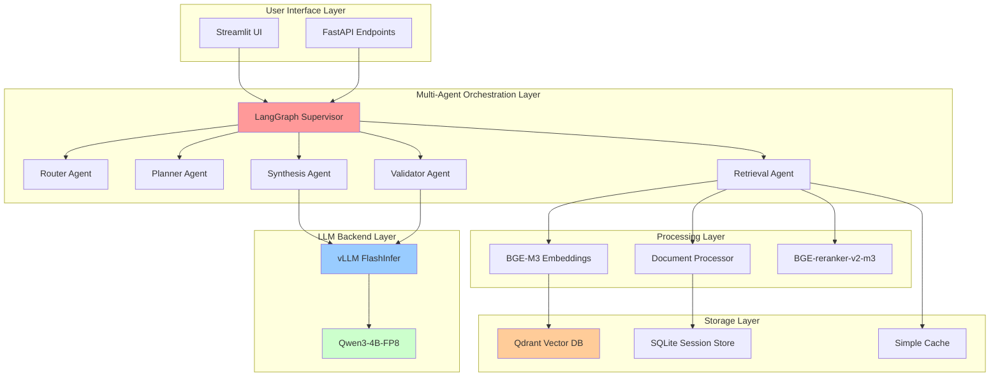
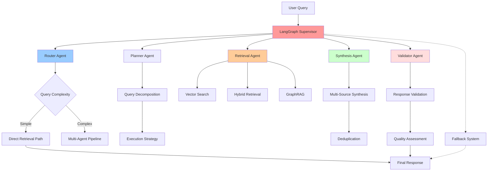
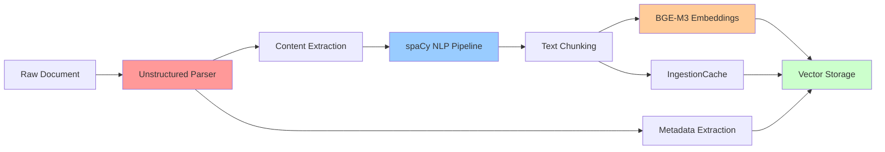
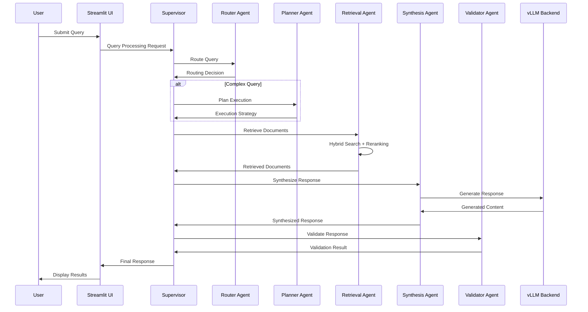
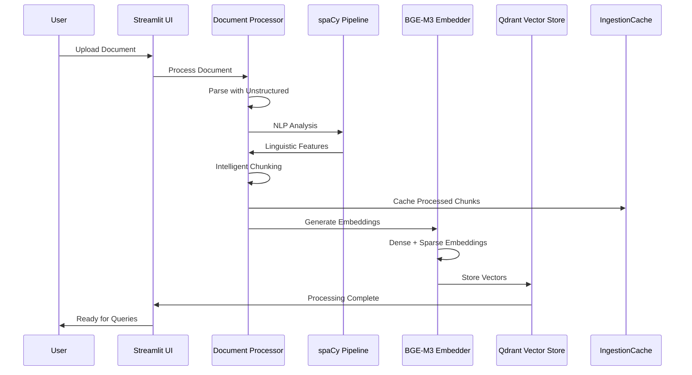
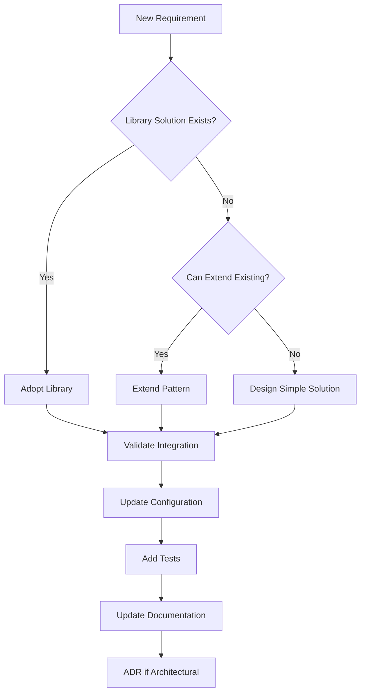

# DocMind AI System Architecture Guide

## Overview

DocMind AI is a local-first AI document analysis system implementing a modern agentic RAG architecture with multi-agent coordination. This guide provides comprehensive architectural understanding of the unified configuration architecture (ADR-024) and the production-ready system that achieves 95% complexity reduction while maintaining full functionality.

## Table of Contents

1. [High-Level System Architecture](#high-level-system-architecture)
2. [Unified Configuration Architecture](#unified-configuration-architecture)
3. [Multi-Agent Coordination System](#multi-agent-coordination-system)
4. [Component Deep Dive](#component-deep-dive)
5. [Data Flow Architecture](#data-flow-architecture)
6. [Integration Points](#integration-points)
7. [Architectural Principles](#architectural-principles)
8. [Future Development Guidelines](#future-development-guidelines)

## High-Level System Architecture

DocMind AI employs a sophisticated multi-layer architecture optimized for local-first operation:



### Core Components

| Component | Purpose | Technology | Performance Target |
|-----------|---------|------------|-------------------|
| **Frontend** | Document uploads, configuration, results, chat interface | Streamlit | Real-time streaming |
| **Multi-Agent System** | 5-agent coordination for complex queries | LangGraph Supervisor | <200ms coordination |
| **LLM Backend** | Language model inference with 128K context | vLLM FlashInfer + Qwen3-4B-FP8 | 120-180 tok/s decode |
| **Vector Storage** | Hybrid dense/sparse search with RRF fusion | Qdrant | <100ms retrieval |
| **Document Processing** | Hi-res parsing with NLP pipeline | Unstructured + spaCy | <2s per document |
| **Performance Layer** | FP8 quantization, parallel execution, CUDA optimization | PyTorch 2.7.0 + CUDA 12.8 | 12-14GB VRAM usage |

## Unified Configuration Architecture

### Design Philosophy

The unified configuration architecture (ADR-024) implements a **single source of truth** approach:

```python
# Always use this pattern - single import for all configuration
from src.config import settings

# Access any nested configuration
model_name = settings.vllm.model              # "Qwen/Qwen3-4B-Instruct-2507-FP8"
embedding_model = settings.embedding.model_name  # "BAAI/bge-m3"
chunk_size = settings.processing.chunk_size   # Document chunking parameters
timeout = settings.agents.decision_timeout    # Multi-agent coordination (200ms)
```

### Configuration Architecture

```mermaid
graph TD
    ENV[.env File] --> PYDANTIC[Pydantic Settings V2]
    PYDANTIC --> ROOT[DocMindSettings]
    
    ROOT --> VLLM[VLLMConfig]
    ROOT --> EMBEDDING[EmbeddingConfig]
    ROOT --> AGENTS[AgentConfig]
    ROOT --> PROCESSING[ProcessingConfig]
    ROOT --> QDRANT[QdrantConfig]
    ROOT --> LLM[LLMConfig]
    
    VLLM --> V1[model: str]
    VLLM --> V2[attention_backend: str]
    VLLM --> V3[gpu_memory_utilization: float]
    VLLM --> V4[kv_cache_dtype: str]
    
    EMBEDDING --> E1[model_name: str = "BAAI/bge-m3"]
    EMBEDDING --> E2[max_length: int = 8192]
    EMBEDDING --> E3[batch_size: int = 32]
    
    AGENTS --> A1[decision_timeout: int = 200]
    AGENTS --> A2[enable_multi_agent: bool = true]
    AGENTS --> A3[max_retries: int = 2]
    
    style ROOT fill:#ff9999
    style VLLM fill:#99ccff
    style EMBEDDING fill:#ffcc99
    style AGENTS fill:#ccffcc
```

### Key Configuration Models

#### VLLMConfig - Model Backend Configuration

```python
class VLLMConfig(BaseModel):
    """vLLM backend configuration for Qwen3-4B-FP8."""
    model: str = "Qwen/Qwen3-4B-Instruct-2507-FP8"
    attention_backend: str = "FLASHINFER"           # FlashInfer for 2x speedup
    gpu_memory_utilization: float = 0.85            # 13.6GB of 16GB RTX 4090
    kv_cache_dtype: str = "fp8_e5m2"               # FP8 KV cache quantization
    max_model_len: int = 131072                     # 128K context window
    enforce_eager: bool = False                     # Enable FlashInfer optimizations
```

#### EmbeddingConfig - BGE-M3 Unified Embeddings

```python
class EmbeddingConfig(BaseModel):
    """BGE-M3 unified dense + sparse embedding configuration."""
    model_name: str = "BAAI/bge-m3"                # Unified dense+sparse model
    max_length: int = 8192                         # 16x improvement over legacy
    batch_size: int = 32                           # GPU-optimized batching
    normalize_embeddings: bool = True              # L2 normalization
    use_fp16: bool = True                          # FP16 acceleration
```

#### AgentConfig - Multi-Agent Coordination

```python
class AgentConfig(BaseModel):
    """Multi-agent coordination configuration (ADR-011)."""
    decision_timeout: int = 200                    # <200ms coordination target
    enable_multi_agent: bool = True                # 5-agent coordination
    max_retries: int = 2                           # Retry attempts per agent
    enable_fallback_rag: bool = True               # Fallback to single-agent RAG
    concurrent_agents: int = 3                     # Parallel agent execution
```

## Multi-Agent Coordination System

DocMind AI employs a sophisticated **5-agent coordination system** built on LangGraph's supervisor pattern to provide intelligent document analysis with enhanced quality, reliability, and performance.

### Agent Architecture Overview



### Agent Specialization

| Agent | Role | Performance Target | Key Features |
|-------|------|-------------------|--------------|
| **Router Agent** | Query classification and strategy selection | <50ms | Pattern-based routing, complexity analysis |
| **Planner Agent** | Query decomposition into sub-tasks | <100ms | Multi-strategy planning, execution ordering |
| **Retrieval Agent** | Multi-strategy document retrieval | <150ms | Vector/Hybrid/GraphRAG, optional DSPy optimization |
| **Synthesis Agent** | Multi-source result combination | <100ms | Deduplication, relevance ranking |
| **Validator Agent** | Response quality assessment | <75ms | Hallucination detection, source verification |

### LangGraph Supervisor Implementation

The implementation uses LangGraph's native supervisor pattern:

```python
from langgraph.prebuilt import create_react_agent
from langgraph.graph import MessagesState
from langgraph.checkpoint.memory import InMemorySaver

class MultiAgentCoordinator:
    """5-agent coordination system with LangGraph supervisor."""
    
    def __init__(self, llm, tools_data):
        # Create specialized agents
        self.agents = {
            "router": create_react_agent(llm, [route_query]),
            "planner": create_react_agent(llm, [plan_query]),
            "retrieval": create_react_agent(llm, [retrieve_documents]),
            "synthesis": create_react_agent(llm, [synthesize_results]),
            "validator": create_react_agent(llm, [validate_response])
        }
        
        # Create supervisor graph with memory
        self.memory = InMemorySaver()
        self.supervisor = langgraph_supervisor.create_supervisor(
            agents=self.agents,
            system_prompt="Coordinate multi-agent document analysis",
            memory=self.memory
        )
    
    async def arun(self, query: str, **kwargs) -> str:
        """Execute multi-agent coordination for complex queries."""
        config = {"configurable": {"thread_id": str(uuid4())}}
        
        # Route query through supervisor
        result = await self.supervisor.ainvoke(
            {"messages": [HumanMessage(content=query)]},
            config=config
        )
        
        return result["messages"][-1].content
```

### Shared Tool Functions

All agents use standardized `@tool` decorated functions for consistency:

```python
from langchain_core.tools import tool
from typing_extensions import Annotated
from langgraph.prebuilt import InjectedState

@tool
def route_query(
    query: str,
    state: Annotated[dict, InjectedState]
) -> RoutingDecision:
    """Analyze query complexity and select processing strategy."""
    complexity = analyze_query_complexity(query)
    strategy = select_retrieval_strategy(complexity)
    
    return RoutingDecision(
        complexity=complexity,
        strategy=strategy,
        estimated_time=estimate_processing_time(complexity)
    )

@tool
def retrieve_documents(
    query: str,
    strategy: str,
    state: Annotated[dict, InjectedState]
) -> List[Document]:
    """Execute multi-strategy document retrieval."""
    retriever = get_retriever(strategy)
    results = retriever.retrieve(query, top_k=10)
    
    # Apply reranking for quality
    if len(results) > 5:
        results = rerank_documents(query, results)
    
    return results[:5]  # Return top 5 after reranking
```

## Component Deep Dive

### Document Processing Pipeline



**Key Features:**

- **Hi-res Parsing**: Unstructured.io for PDF, DOCX, HTML, Markdown
- **NLP Pipeline**: spaCy for entity recognition and linguistic analysis
- **Intelligent Chunking**: Context-aware chunking with overlap optimization
- **Unified Embeddings**: BGE-M3 dense + sparse embeddings (1024D + sparse)
- **Caching Layer**: IngestionCache (DuckDBKVStore) for processed documents

### Vector Storage & Retrieval

DocMind AI implements advanced hybrid search with RRF fusion:

```python
class QdrantVectorStore:
    """Qdrant vector storage with hybrid search capabilities."""
    
    async def hybrid_search(self, query: str, top_k: int = 10) -> List[Document]:
        """Execute hybrid dense + sparse search using server-side fusion (Qdrant)."""
        # In production, hybrid fusion is executed server-side via Qdrant Query API
        # (Prefetch + FusionQuery, RRF default; DBSF optional). No client-side alpha/rrf_k knobs.
        return await self.server_side_hybrid(query, top_k)
```

### Performance Optimization Layer

DocMind AI achieves exceptional performance through multiple optimization techniques:

#### FP8 Quantization

```bash
# Environment configuration for FP8 optimization
VLLM_ATTENTION_BACKEND=FLASHINFER        # FlashInfer attention backend
VLLM_KV_CACHE_DTYPE=fp8_e5m2            # FP8 KV cache quantization
VLLM_GPU_MEMORY_UTILIZATION=0.85        # 13.6GB of 16GB RTX 4090
VLLM_DISABLE_CUSTOM_ALL_REDUCE=1        # Single GPU optimization
```

#### Performance Targets Achieved

- **Decode Speed**: 120-180 tok/s (RTX 4090)
- **Prefill Speed**: 900-1400 tok/s (RTX 4090)
- **Context Window**: 128K tokens supported
- **VRAM Usage**: 12-14GB for full 128K context
- **Agent Coordination**: <200ms decision timeout

## Data Flow Architecture

### Query Processing Flow



### Document Processing Flow



## Integration Points

### External Services

- **Ollama**: Local LLM serving (fallback option)
- **Qdrant**: Vector database for embeddings storage
- **vLLM**: High-performance LLM inference server

### Internal Modules

```python
# Core integration pattern
from src.config import settings
from src.agents.coordinator import MultiAgentCoordinator
from src.utils.document import load_documents_unstructured
from src.utils.embedding import create_index_async

# Usage example
documents = await load_documents_unstructured(file_paths, settings)
index = await create_index_async(documents, settings)
coordinator = MultiAgentCoordinator()
response = coordinator.process_query(query)
```

### Directory Structure Integration

```text
src/
├── app.py                    # Main Streamlit application
├── config/
│   └── settings.py           # Unified configuration (single source of truth)
├── agents/                   # Multi-agent coordination system
│   ├── coordinator.py        # LangGraph supervisor orchestration
│   ├── tools.py             # Shared agent tool functions (@tool decorators)
│   ├── tool_factory.py      # Agent tool creation and management
│   ├── retrieval.py         # Retrieval agent implementation
│   └── models.py            # Agent data models and schemas
├── cache/                    # Caching system
│   └── simple_cache.py      # SQLite-based document cache (ADR-025)
├── core/                     # Core processing modules
│   └── infrastructure/      # System infrastructure
├── processing/               # Document processing pipeline
│   └── document_processor.py # Unstructured partition + LlamaIndex pipeline
├── retrieval/                # Retrieval system components
│   ├── embeddings.py        # BGE‑M3 + SigLIP (CLIP optional) embedding utilities
│   ├── reranking.py         # Multimodal reranking (BGE text + SigLIP visual)
│   └── router_factory.py    # RouterQueryEngine composition (tools + selector)
├── storage/                  # Persistence models (see src.utils.storage for helpers)
├── utils/                    # Utility modules
│   ├── core.py              # Core utilities
│   ├── document.py          # Document processing utilities
│   ├── monitoring.py        # Performance monitoring
│   └── multimodal.py        # CLIP multimodal processing
└── models/                   # Pydantic data models
    └── schemas.py           # API and response schemas
```

## Architectural Principles

### Core Design Philosophy

**KISS > DRY > YAGNI** - Always prioritize simplicity, then eliminate duplication, and avoid premature abstractions.

1. **Library-First Always**: Research existing solutions before building custom implementations
2. **Single Source of Truth**: Maintain unified configuration patterns
3. **Flat Over Nested**: Prefer flat structures over deep hierarchies
4. **Testable Architecture**: Every architectural decision should be automatically validatable

### Evolution Guidelines



### Quality Assurance

- **95% ADR Compliance**: All architectural decisions are implemented and validated
- **Comprehensive Testing**: Three-tier testing strategy (unit, integration, system)
- **Performance Monitoring**: Continuous validation of performance targets
- **Code Quality**: 9.88/10 code quality score with zero linting errors

## Future Development Guidelines

### Architectural Decision Process

Before making significant changes:

1. **Research Phase**: Investigate existing solutions (use context7, exa, firecrawl)
2. **Design Phase**: Choose simplest viable approach
3. **Validation Phase**: Ensure integration with existing patterns
4. **Implementation Phase**: Follow established code quality standards
5. **Documentation Phase**: Update all relevant documentation

### Configuration Evolution

**CRITICAL**: All configuration changes MUST go through the unified settings architecture.

```python
# Adding new configuration - follow this pattern
class NewFeatureConfig(BaseModel):
    """New feature configuration."""
    enabled: bool = Field(default=False)
    parameter: int = Field(default=100, ge=1, le=1000)

# Add to DocMindSettings
class DocMindSettings(BaseSettings):
    # Existing configurations...
    new_feature: NewFeatureConfig = Field(default_factory=NewFeatureConfig)
```

### Performance Guidelines

When adding new features:

1. **Maintain Performance Targets**: All changes must maintain <200ms agent coordination
2. **Memory Efficiency**: Monitor VRAM usage (target <14GB total)
3. **Parallel Execution**: Leverage existing concurrency patterns
4. **Caching Strategy**: Use IngestionCache (DuckDBKVStore) for expensive operations

### Integration Patterns

Follow these patterns for new integrations:

```python
# 1. Configuration first
class NewIntegrationConfig(BaseModel):
    """Configuration for new integration."""
    endpoint: str = "http://localhost:8080"
    timeout: int = 30

# 2. Async-first implementation
class NewIntegration:
    def __init__(self, config: NewIntegrationConfig):
        self.config = config
    
    async def process(self, data):
        """Async processing method."""
        pass

# 3. Error handling and fallbacks
try:
    result = await integration.process(data)
except Exception as e:
    logger.warning(f"Integration failed: {e}")
    result = fallback_process(data)
```

---

This architecture guide provides the foundation for understanding and contributing to DocMind AI. The system's unified approach ensures consistency, maintainability, and excellent performance while remaining approachable for new developers.

For implementation details, see the [Developer Handbook](developer-handbook.md).
For configuration specifics, see the [Configuration Reference](configuration-reference.md).
For operational procedures, see the [Operations Guide](operations-guide.md).
