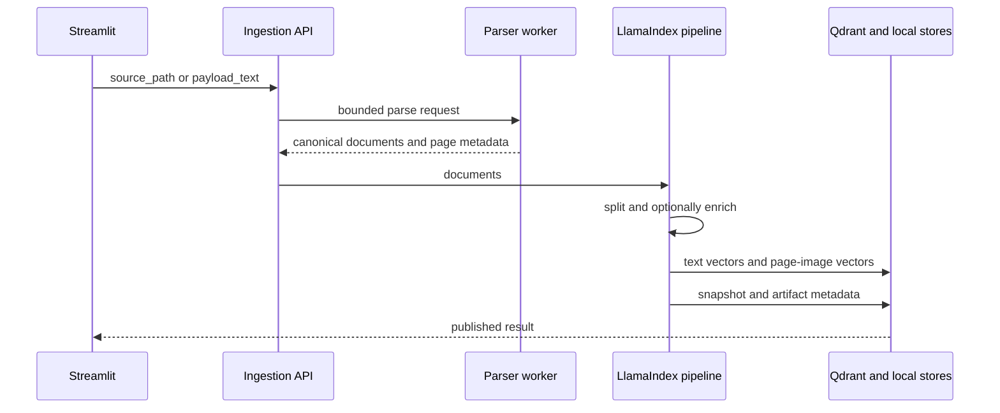
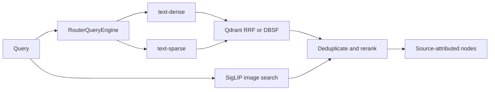

# Trace the DocMind system architecture

This guide maps DocMind’s runtime components to their implementation owners. Use it when changing a boundary, following data through the system, or deciding which contract needs an update.

## Map component ownership

Each subsystem has one primary owner:

| Subsystem | Owner | Responsibility |
| --- | --- | --- |
| Application shell | Streamlit pages under `src/pages/` | Uploads, settings, chat, analytics, and diagnostics |
| Configuration | `src/config/settings.py` | Typed defaults, environment mapping, and validation |
| Integration wiring | `src/config/integrations.py` | Lazy initialization of external libraries and clients |
| Parser boundary | `src/processing/parsing/` | Format routing, bounded conversion, OCR, and canonical output |
| Ingestion | `src/processing/ingestion_pipeline.py` | Chunking, enrichment, indexing, exports, and publication |
| Retrieval | `src/retrieval/` | Hybrid search, image search, fusion, deduplication, and reranking |
| Agent graph | `src/agents/supervisor_graph.py` | Role routing, deadlines, fallbacks, and checkpoints |
| Persistence | `src/persistence/` | Chat, snapshots, locks, and content-addressed artifacts |
| Telemetry | `src/telemetry/` and `src/utils/telemetry.py` | Metadata-only local events and optional OpenTelemetry export |

The source files and active specifications are authoritative. `pyproject.toml` and `uv.lock` are the dependency authorities.

The documentation CI checks this source-package manifest against the top-level directories under `src/`:

```json
{
  "canonical_src": [
    "agents",
    "analysis",
    "config",
    "core",
    "eval",
    "models",
    "nlp",
    "pages",
    "persistence",
    "processing",
    "prompting",
    "retrieval",
    "telemetry",
    "ui",
    "utils"
  ]
}
```

## Trace document ingestion

Ingestion accepts a normalized source path for binary documents or `payload_text` for explicit in-memory text.


```mermaid
sequenceDiagram
    participant UI as Streamlit
    participant API as Ingestion API
    participant Parser as Parser worker
    participant Pipeline as LlamaIndex pipeline
    participant Store as Qdrant and local stores

    UI->>API: source_path or payload_text
    API->>Parser: bounded parse request
    Parser-->>API: canonical documents and page metadata
    API->>Pipeline: documents
    Pipeline->>Pipeline: split and optionally enrich
    Pipeline->>Store: text vectors and page-image vectors
    Pipeline->>Store: snapshot and artifact metadata
    Store-->>UI: published result
```

The parser must finish before ingestion publishes documents, nodes, image artifacts, or snapshots. Binary failures raise `DocumentParseError`. Direct UTF-8 fallback applies only to `.txt`, `.md`, `.markdown`, and `.rst`.

PDF parsing follows one path:

1. Validate the Docling layout manifest and RapidOCR package availability
2. Inspect the PDF with pypdfium2
3. Convert content with Docling
4. Run RapidOCR when page routing requires optical character recognition (OCR)
5. Return canonical documents and page metadata

The parser worker owns a private process group on Portable Operating System Interface (POSIX) systems. Timeout and cancellation terminate and reap the group. The optional OCRmyPDF exporter uses its own process group and remains outside the parser worker.

## Trace text and image retrieval

Text retrieval combines BGE-M3 dense vectors and direct FastEmbed sparse vectors in Qdrant.


```mermaid
flowchart LR
    QUERY["Query"] --> ROUTER["RouterQueryEngine"]
    ROUTER --> DENSE["text-dense"]
    ROUTER --> SPARSE["text-sparse"]
    DENSE --> FUSION["Qdrant RRF or DBSF"]
    SPARSE --> FUSION
    QUERY --> IMAGE["SigLIP image search"]
    FUSION --> MERGE["Deduplicate and rerank"]
    IMAGE --> MERGE
    MERGE --> RESULT["Source-attributed nodes"]
```

Normal startup creates a missing collection and accepts a compatible one. It refuses an incompatible existing schema. Only `scripts/qdrant_schema.py rebuild-empty` can rebuild an empty collection, and the operator must stop every writer first.

SigLIP owns image embedding and visual scoring. No alternate image embedding or visual reranking path remains.

## Trace agent execution

The repository-owned LangGraph `StateGraph` supervisor coordinates four workers:

1. Plan retrieval work
2. Execute retrieval tools through the native LlamaIndex router
3. Synthesize source-grounded output
4. Validate the result

LangChain’s `create_agent` builds role agents inside the graph. The supervisor propagates deadlines and caps per-call timeouts. Optional stages fail open only where their owning contract permits it.

The router factory builds the canonical retrieval surface. Semantic search is
required; hybrid, keyword, multimodal, and knowledge-graph tools are added only
when their configuration and indexes are ready.

## Trace persistence

DocMind separates durable state by data type:

- SQLite stores chat sessions and LangGraph checkpoints
- DuckDB stores the ingestion cache and optional local analytics
- Qdrant stores named text vectors and SigLIP image vectors
- Snapshot directories store manifests and restorable files
- The artifact store stores content-addressed page images and thumbnails

Snapshot creation uses a temporary workspace and an atomic finalization step. Each manifest records corpus, configuration, version, vector-store, graph-store, and optional graph-export identity.

Durable payloads exclude raw document text, prompt text, model output, secrets, absolute host paths, and base64 image blobs. Artifact payloads use `ArtifactRef` identifiers.

## Resolve configuration once

Pydantic Settings owns application configuration. Environment variables use the `DOCMIND_` prefix and `__` for nested fields.

```python
from src.config import settings

qdrant_url = settings.database.qdrant_url
top_k = settings.retrieval.top_k
```

The Streamlit entrypoint loads `.env` during startup. Importing `src.config.settings` does not perform dotenv file input or output.

The parser framework, parser profile, and OCR engine are fixed validation literals. Do not expose them as backend selectors. Operators can configure resource limits, rendering, OCR forcing, model cache location, and searchable-PDF export.

## Enforce the local trust boundary

The default configuration blocks unapproved remote endpoints. Loopback endpoints remain available for local language model servers and Qdrant.

An allowlisted non-loopback hostname must resolve to public addresses when remote endpoints remain disabled. Enable remote endpoints explicitly for approved private services or hosted providers. That choice sends language model requests beyond the local machine.

Model prefetch commands access their configured upstream sources. After all artifacts are present, offline environment flags prevent Hugging Face and Transformers downloads. These controls do not measure total process egress.

## Run supported deployment profiles

The default uv and Docker profiles use official CPU-only PyTorch wheels. The uv `gpu` extra replaces the CPU group with locked CUDA 12.8 Torch and torchvision wheels.

The application does not install vLLM or llama.cpp. Run either as an external OpenAI-compatible server. The Compose `gpu` profile can run Ollama on the internal network.

The canonical container health command is:

```bash
python scripts/container_health.py
```

The command only opens a TCP connection to `127.0.0.1:8501`. The container
entrypoint runs parser dependency and Docling-manifest readiness once before
starting Streamlit; the image build separately proves offline RapidOCR inference.

## Validate architecture changes

Run the narrowest relevant checks while developing, then use the full release gates before shipping:

```bash
uv run ruff format --check .
uv run ruff check .
uv run pyright --threads 4
uv run pytest tests/unit tests/integration -q --no-cov
```

Run the local Qdrant system test and live Docker build when a change crosses those boundaries. Regenerate the schema 3 repeat-three parser benchmark only after the working tree is frozen.

Performance results depend on the model, context length, hardware, corpus, and enabled extras. Retain the command, fixture set, hardware profile, and generated artifact for any performance claim.

## Update the owning contract

Update the matching specification or architecture decision when behavior changes:

- Parser and ingestion: `docs/specs/spec-002-ingestion-pipeline.md`
- Embeddings and retrieval: `docs/specs/spec-003-embeddings.md`
- Security and privacy: `docs/specs/spec-011-security-privacy.md`
- Containers: `docs/specs/spec-023-containerization-hardening.md`
- Runtime baseline: `docs/specs/spec-044-runtime-toolchain-baseline.md`
- Architecture decisions: `docs/developers/adrs/`
