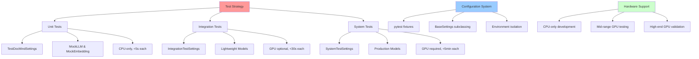

# DocMind AI Testing Guide

## Overview

This comprehensive testing guide documents DocMind AI's modern test architecture, implementation strategies, and validation procedures. The system uses a clean, three-tier testing approach based on pytest + pydantic-settings patterns with comprehensive system validation capabilities.

## Table of Contents

1. [Testing Architecture](#testing-architecture)
2. [Three-Tier Testing Strategy](#three-tier-testing-strategy)
3. [Test Configuration System](#test-configuration-system)
4. [System Test Validation](#system-test-validation)
5. [Test Execution Patterns](#test-execution-patterns)
6. [Performance Testing](#performance-testing)
7. [Test Development Guidelines](#test-development-guidelines)
8. [Troubleshooting & Debugging](#troubleshooting--debugging)

## Testing Architecture

### Core Principles

- **Clean Separation**: Zero contamination between production and test code
- **Library-First**: Standard pytest + pydantic-settings patterns only
- **Hardware Adaptive**: Tests scale from CPU-only to high-end GPU configurations
- **Comprehensive Coverage**: Unit, integration, and system validation
- **Performance Optimized**: Each tier optimized for speed and reliability

### Architecture Overview



## Three-Tier Testing Strategy

### Tier 1: Unit Tests (Fast & Reliable)

**Purpose**: Test business logic, algorithms, and individual components in isolation.

**Characteristics**:

- **Execution Time**: <5 seconds each
- **Hardware Requirements**: CPU-only
- **Dependencies**: Mocked components only
- **Test Markers**: `@pytest.mark.unit`
- **Environment**: `DOCMIND_TEST_` prefix

```python
import pytest
from unittest.mock import MagicMock
from tests.fixtures.test_settings import TestDocMindSettings

@pytest.mark.unit
def test_document_chunking_logic(test_settings):
    """Test document chunking algorithm with mocked components."""
    # test_settings provides optimized configuration
    assert test_settings.chunk_size == 256  # Small for speed
    assert test_settings.enable_gpu_acceleration is False  # CPU-only
    
    # Test with mocked embedder
    mock_embedder = MagicMock()
    mock_embedder.get_embeddings.return_value = [[0.1] * 1024]
    
    # Test chunking logic
    chunks = chunk_document("test content", test_settings.chunk_size)
    assert len(chunks) > 0
    assert all(len(chunk) <= test_settings.chunk_size for chunk in chunks)
```

### Tier 2: Integration Tests (Realistic & Moderate)

**Purpose**: Test component interactions with lightweight models and realistic scenarios.

**Characteristics**:

- **Execution Time**: <30 seconds each  
- **Hardware Requirements**: CPU preferred, GPU optional
- **Dependencies**: Lightweight models (all-MiniLM-L6-v2: 80MB)
- **Test Markers**: `@pytest.mark.integration`
- **Environment**: `DOCMIND_INTEGRATION_` prefix

```python
import pytest
import asyncio
from tests.fixtures.test_settings import IntegrationTestSettings

@pytest.mark.integration
async def test_embedding_pipeline_integration(integration_settings):
    """Test embedding pipeline with lightweight models."""
    # integration_settings balances performance and realism
    assert integration_settings.context_window_size == 4096  # Moderate
    assert integration_settings.enable_gpu_acceleration is True
    
    # Test with actual lightweight model
    embedder = create_lightweight_embedder(integration_settings)
    
    # Test realistic document processing
    documents = ["Sample document for integration testing"]
    embeddings = await embedder.get_embeddings_batch(documents)
    
    assert len(embeddings) == len(documents)
    assert len(embeddings[0]) == 384  # MiniLM dimension
```

### Tier 3: System Tests (Production & Comprehensive)

**Purpose**: End-to-end validation with production models and full GPU acceleration.

**Characteristics**:

- **Execution Time**: <5 minutes each
- **Hardware Requirements**: RTX 3060+ (10GB+ VRAM)
- **Dependencies**: Production models (BGE-M3, Qwen3-4B-FP8)
- **Test Markers**: `@pytest.mark.system` + `@pytest.mark.requires_gpu`
- **Environment**: `DOCMIND_` prefix (production)

```python
import pytest
import time
from tests.fixtures.test_settings import SystemTestSettings

@pytest.mark.system
@pytest.mark.requires_gpu
async def test_production_workflow_validation(system_settings):
    """Test complete production workflow with real models."""
    # system_settings uses production configuration
    assert system_settings.context_window_size == 131072  # Full 128K
    assert system_settings.model_name == "Qwen/Qwen3-4B-Instruct-2507-FP8"
    
    # Test with production multi-agent coordinator
    coordinator = MultiAgentCoordinator(system_settings)
    
    # Performance validation
    start_time = time.time()
    response = await coordinator.arun("Analyze this complex query with multiple steps")
    execution_time = time.time() - start_time
    
    # Validate production performance targets
    assert execution_time < 10.0  # <10s for complex queries
    assert len(response) > 100  # Substantial response
    assert coordinator.last_gpu_memory_peak < 14.0  # VRAM constraint
```

## Test Configuration System

### Configuration Hierarchy

The test configuration system uses BaseSettings subclassing with three specialized configurations:

```python
# Configuration inheritance hierarchy
DocMindSettings (production base)
├── TestDocMindSettings (unit test optimizations)
│   └── IntegrationTestSettings (integration test balance)
└── SystemTestSettings (production configuration)
```

### TestDocMindSettings (Unit Tests)

**Optimizations for speed and reliability**:

```python
class TestDocMindSettings(DocMindSettings):
    """Unit test configuration with performance optimizations."""
    
    model_config = SettingsConfigDict(
        env_file=None,                    # No .env loading
        env_prefix="DOCMIND_TEST_",       # Isolated environment
        validate_default=True,
        extra="forbid",
    )
    
    # Performance optimizations
    enable_gpu_acceleration: bool = Field(default=False)
    context_window_size: int = Field(default=1024)      # 128x smaller
    agent_decision_timeout: int = Field(default=100)    # 2x faster
    chunk_size: int = Field(default=256)                # 4x smaller
    
    # Disabled features for speed
    enable_dspy_optimization: bool = Field(default=False)
    enable_performance_logging: bool = Field(default=False)
    enable_document_caching: bool = Field(default=False)
```

### IntegrationTestSettings (Integration Tests)

**Balanced configuration for realistic testing**:

```python
class IntegrationTestSettings(TestDocMindSettings):
    """Integration test configuration with moderate performance."""
    
    model_config = SettingsConfigDict(
        env_prefix="DOCMIND_INTEGRATION_",
    )
    
    # Realistic features enabled
    enable_gpu_acceleration: bool = Field(default=True)
    context_window_size: int = Field(default=4096)      # Moderate context
    agent_decision_timeout: int = Field(default=150)    # Balanced timeout
    
    # Realistic caching and logging
    enable_performance_logging: bool = Field(default=True)
    enable_document_caching: bool = Field(default=True)
```

### SystemTestSettings (System Tests)

**Production configuration for comprehensive validation**:

```python
class SystemTestSettings(DocMindSettings):
    """System test settings using production configuration."""
    
    model_config = SettingsConfigDict(
        env_file=".env",                  # Load production .env
        env_prefix="DOCMIND_",            # Production prefix
    )
    
    # Inherits all production defaults
    pass
```

## System Test Validation

### Advanced System Test Features

Based on comprehensive validation and improvements implemented in 2025-08-27:

#### Dynamic Hardware Detection

```python
import torch
from contextlib import asynccontextmanager

class SystemTestValidator:
    """Advanced system test validation with hardware adaptation."""
    
    def __init__(self):
        self.gpu_memory_gb = self._detect_gpu_memory()
        self.performance_targets = self._calculate_targets()
    
    def _detect_gpu_memory(self) -> float:
        """Detect available GPU memory and adapt settings."""
        if torch.cuda.is_available():
            memory_gb = torch.cuda.get_device_properties(0).total_memory / (1024**3)
            return memory_gb
        return 0.0
    
    def _calculate_targets(self) -> dict:
        """Calculate performance targets based on hardware."""
        if self.gpu_memory_gb >= 14:
            # High-end GPUs (RTX 4060/4090): Strict targets
            return {
                "single_embedding": 0.5,    # 0.5s for single embedding
                "batch_embedding": 2.0,     # 2.0s for batch (5 items)
                "sustained_memory": 15,     # 15 rounds without leak
                "large_batch": 15.0,        # 15s for 30 embeddings
            }
        elif self.gpu_memory_gb >= 10:
            # Mid-range GPUs (RTX 3060): Moderate targets
            return {
                "single_embedding": 1.0,
                "batch_embedding": 3.5,
                "sustained_memory": 10,
                "large_batch": 25.0,
            }
        else:
            # Entry-level GPUs: Relaxed targets
            return {
                "single_embedding": 2.0,
                "batch_embedding": 6.0,
                "sustained_memory": 5,
                "large_batch": 45.0,
            }

    @asynccontextmanager
    async def gpu_memory_tracker(self):
        """Context manager for comprehensive GPU memory tracking."""
        if not torch.cuda.is_available():
            yield {"initial": 0, "peak": 0, "final": 0}
            return
        
        # Clear cache before measurement
        torch.cuda.empty_cache()
        torch.cuda.synchronize()
        
        initial_memory = torch.cuda.memory_allocated()
        peak_memory = initial_memory
        
        try:
            yield {
                "initial": initial_memory / (1024**3),
                "update_peak": lambda: self._update_peak_memory(peak_memory)
            }
        finally:
            # Cleanup and final measurement
            torch.cuda.empty_cache()
            torch.cuda.synchronize()
            final_memory = torch.cuda.memory_allocated()
            
            memory_leak = final_memory - initial_memory
            if memory_leak > 100 * 1024 * 1024:  # >100MB leak
                pytest.fail(f"Memory leak detected: {memory_leak / (1024**2):.1f}MB")
```

#### Comprehensive System Test Suite

```python
@pytest.mark.system
@pytest.mark.requires_gpu
class TestBGEM3EmbedderSystemValidation:
    """Comprehensive system validation with adaptive performance targets."""
    
    async def test_adaptive_hardware_performance(self, system_settings):
        """Test performance targets that adapt to available hardware."""
        validator = SystemTestValidator()
        
        # Skip if insufficient hardware
        if validator.gpu_memory_gb < 6:
            pytest.skip("Insufficient GPU memory for system tests")
        
        embedder = BGEM3EmbeddingManager(system_settings)
        await embedder.initialize()
        
        # Test single embedding with hardware-appropriate target
        with validator.gpu_memory_tracker() as memory:
            start_time = time.time()
            embedding = await embedder.get_dense_embedding("Test document")
            execution_time = time.time() - start_time
            
            target = validator.performance_targets["single_embedding"]
            assert execution_time < target, f"Single embedding took {execution_time:.2f}s (target: {target}s)"
    
    async def test_sustained_memory_management(self, system_settings):
        """Test memory stability across multiple processing rounds."""
        validator = SystemTestValidator()
        embedder = BGEM3EmbeddingManager(system_settings)
        
        target_rounds = validator.performance_targets["sustained_memory"]
        
        for round_num in range(target_rounds):
            with validator.gpu_memory_tracker() as memory:
                # Process batch of embeddings
                texts = [f"Test document {i} for round {round_num}" for i in range(5)]
                embeddings = await embedder.get_unified_embeddings(texts)
                
                # Validate results
                assert len(embeddings["dense"]) == len(texts)
                assert all(len(emb) == 1024 for emb in embeddings["dense"])
        
        # Final memory check
        torch.cuda.empty_cache()
        final_memory = torch.cuda.memory_allocated() / (1024**3)
        assert final_memory < 1.0, f"Excessive memory usage after sustained processing: {final_memory:.2f}GB"
    
    async def test_production_workflow_simulation(self, system_settings):
        """Simulate realistic production workflow with full feature validation."""
        coordinator = MultiAgentCoordinator(system_settings)
        
        # Simulate realistic document processing workflow
        queries = [
            "Analyze the technical implications of the uploaded documents",
            "Summarize key findings and provide recommendations",
            "Compare different approaches mentioned in the documents"
        ]
        
        total_start = time.time()
        
        for query in queries:
            start_time = time.time()
            
            with gpu_memory_tracker() as memory:
                response = await coordinator.arun(query)
                
                # Validate response quality
                assert len(response) > 100, "Response too short"
                assert any(keyword in response.lower() for keyword in 
                          ["analysis", "summary", "recommendation", "comparison"])
                
                # Validate performance
                execution_time = time.time() - start_time
                assert execution_time < 10.0, f"Query processing too slow: {execution_time:.2f}s"
        
        total_time = time.time() - total_start
        assert total_time < 25.0, f"Total workflow too slow: {total_time:.2f}s"
```

### Hardware Requirement Matrix

| Test Type | Min GPU Memory | Recommended | Expected Performance |
|-----------|----------------|-------------|---------------------|
| Unit Tests | None (CPU-only) | N/A | <5s per test |
| Integration Tests | None (preferred: 4GB) | 8GB+ GPU | <30s per test |
| Basic System Tests | 6GB | 8GB+ | <2s single embedding |
| Advanced System Tests | 8GB | 12GB+ | <4s batch processing |
| Sustained Load Tests | 10GB | 16GB+ | Stable across 10+ rounds |
| Production Simulation | 12GB | 16GB+ | Full workflow <25s |

## Test Execution Patterns

### Command-Line Execution

```bash
# Run tests by tier (recommended approach)
uv run python -m pytest tests/unit/ -v -m unit                    # Tier 1: Fast unit tests
uv run python -m pytest tests/integration/ -v -m integration     # Tier 2: Integration tests  
uv run python -m pytest tests/system/ -v -m "system and requires_gpu"  # Tier 3: System tests

# Alternative: Run by marker across directories
uv run python -m pytest -m unit -v                               # All unit tests
uv run python -m pytest -m integration -v                        # All integration tests
uv run python -m pytest -m "system and requires_gpu" -v         # All system tests

# Performance and validation tests
uv run python -m pytest tests/performance/ -v -m performance     # Performance benchmarks
uv run python -m pytest tests/validation/ -v                    # Validation tests

# Run specific test files or functions
uv run python -m pytest tests/unit/test_settings.py -v          # Single test file
uv run python -m pytest tests/integration/test_embedding_pipeline.py::test_bge_m3 -v  # Single test
```

### CI/CD Execution Strategy

```bash
# Development CI (fast feedback)
uv run python -m pytest tests/unit/ -v --maxfail=5 --tb=short

# Integration CI (comprehensive validation)
uv run python -m pytest tests/unit/ tests/integration/ -v --cov=src --cov-report=xml

# Production CI (full validation with GPU)
uv run python -m pytest tests/unit/ tests/integration/ tests/system/ -v --timeout=300
```

### Test Selection Strategies

```python
# pytest.ini configuration for markers
[tool:pytest]
markers =
    unit: Fast unit tests with mocked components (<5s each)
    integration: Integration tests with lightweight models (<30s each)
    system: Full system tests with production models (<5min each)
    requires_gpu: Tests requiring CUDA-capable GPU
    performance: Performance benchmarks and regression tests
    slow: Tests that take longer than 30 seconds
```

## Performance Testing

### Performance Test Categories

#### 1. Component Performance Tests

```python
import time
import pytest
from tests.performance.performance_regression_tracker import RegressionTracker

@pytest.mark.performance
async def test_embedding_latency_benchmark():
    """Benchmark BGE-M3 embedding generation performance."""
    tracker = RegressionTracker()
    embedder = BGEM3EmbeddingManager(system_settings)
    
    # Warm-up runs
    for _ in range(3):
        await embedder.get_dense_embedding("warmup text")
    
    # Benchmark runs
    latencies = []
    for i in range(10):
        start_time = time.time()
        embedding = await embedder.get_dense_embedding(f"benchmark text {i}")
        latency = (time.time() - start_time) * 1000  # Convert to ms
        latencies.append(latency)
    
    # Calculate statistics
    avg_latency = sum(latencies) / len(latencies)
    p95_latency = sorted(latencies)[int(0.95 * len(latencies))]
    
    # Record performance and check regression
    tracker.record_performance("embedding_latency_avg", avg_latency, "ms", "latency")
    tracker.record_performance("embedding_latency_p95", p95_latency, "ms", "latency")
    
    # Validate performance targets
    assert avg_latency < 50.0, f"Average latency too high: {avg_latency:.2f}ms"
    assert p95_latency < 75.0, f"P95 latency too high: {p95_latency:.2f}ms"
    
    # Check for regressions
    avg_regression = tracker.check_regression("embedding_latency_avg")
    if avg_regression["is_regression"]:
        pytest.fail(f"Performance regression detected: {avg_regression['message']}")
```

#### 2. Memory Performance Tests

```python
@pytest.mark.performance
async def test_memory_efficiency_validation():
    """Test memory usage patterns and leak detection."""
    
    # Baseline memory measurement
    torch.cuda.empty_cache()
    baseline_memory = torch.cuda.memory_allocated()
    
    embedder = BGEM3EmbeddingManager(system_settings)
    await embedder.initialize()
    
    # Process multiple batches to test for leaks
    for batch_num in range(5):
        texts = [f"Memory test document {i} batch {batch_num}" for i in range(10)]
        
        with gpu_memory_tracker() as memory:
            embeddings = await embedder.get_unified_embeddings(texts)
            peak_memory = torch.cuda.max_memory_allocated()
            
            # Validate batch processing
            assert len(embeddings["dense"]) == len(texts)
    
    # Final memory check
    torch.cuda.empty_cache()
    final_memory = torch.cuda.memory_allocated()
    memory_increase = (final_memory - baseline_memory) / (1024**2)  # MB
    
    assert memory_increase < 100, f"Memory leak detected: {memory_increase:.2f}MB increase"
```

#### 3. Throughput Performance Tests

```python
@pytest.mark.performance
async def test_throughput_scaling_validation():
    """Test throughput scaling with different batch sizes."""
    
    embedder = BGEM3EmbeddingManager(system_settings)
    batch_sizes = [1, 5, 10, 20]
    results = {}
    
    for batch_size in batch_sizes:
        texts = [f"Throughput test document {i}" for i in range(batch_size)]
        
        # Multiple runs for statistical significance
        throughputs = []
        for run in range(3):
            start_time = time.time()
            embeddings = await embedder.get_unified_embeddings(texts)
            execution_time = time.time() - start_time
            
            throughput = batch_size / execution_time  # embeddings per second
            throughputs.append(throughput)
        
        avg_throughput = sum(throughputs) / len(throughputs)
        results[batch_size] = avg_throughput
        
        # Validate minimum throughput
        min_expected = batch_size * 2  # At least 2 embeddings/second base rate
        assert avg_throughput > min_expected, f"Throughput too low for batch {batch_size}: {avg_throughput:.2f}/s"
    
    # Validate scaling efficiency (should improve with larger batches)
    assert results[20] > results[1] * 1.5, "Insufficient throughput scaling with batch size"
```

## Test Development Guidelines

### Writing Effective Unit Tests

```python
# Good unit test pattern
@pytest.mark.unit
def test_document_chunking_edge_cases(test_settings):
    """Test document chunking with edge cases and boundary conditions."""
    
    # Test empty document
    chunks = chunk_document("", test_settings.chunk_size)
    assert chunks == []
    
    # Test single character
    chunks = chunk_document("a", test_settings.chunk_size)
    assert len(chunks) == 1
    assert chunks[0] == "a"
    
    # Test exact chunk size
    text = "a" * test_settings.chunk_size
    chunks = chunk_document(text, test_settings.chunk_size)
    assert len(chunks) == 1
    assert len(chunks[0]) == test_settings.chunk_size
    
    # Test chunk size + 1
    text = "a" * (test_settings.chunk_size + 1)  
    chunks = chunk_document(text, test_settings.chunk_size)
    assert len(chunks) == 2
    assert len(chunks[0]) <= test_settings.chunk_size
    assert len(chunks[1]) <= test_settings.chunk_size
```

### Writing Effective Integration Tests

```python
# Good integration test pattern
@pytest.mark.integration
async def test_realistic_query_pipeline(integration_settings, tmp_path):
    """Test complete query pipeline with realistic components."""
    
    # Setup realistic test environment
    document_path = tmp_path / "test_document.txt"
    document_path.write_text("This is a realistic test document for integration testing.")
    
    # Initialize pipeline components
    coordinator = MultiAgentCoordinator(integration_settings)
    
    # Process document
    processed_docs = await coordinator.process_documents([document_path])
    assert len(processed_docs) > 0
    
    # Execute realistic query
    query = "What is discussed in the uploaded document?"
    response = await coordinator.arun(query)
    
    # Validate realistic response
    assert len(response) > 20  # Substantial response
    assert "document" in response.lower() or "test" in response.lower()
    assert coordinator.last_execution_time < 15.0  # Reasonable performance
```

### Writing Effective System Tests

```python
# Good system test pattern
@pytest.mark.system
@pytest.mark.requires_gpu
async def test_production_performance_validation(system_settings):
    """Validate production performance meets requirements."""
    
    # Verify hardware prerequisites
    assert torch.cuda.is_available(), "GPU required for system tests"
    gpu_memory = torch.cuda.get_device_properties(0).total_memory / (1024**3)
    assert gpu_memory >= 8.0, f"Insufficient GPU memory: {gpu_memory:.1f}GB"
    
    coordinator = MultiAgentCoordinator(system_settings)
    
    # Test complex production query
    query = """
    Analyze the technical architecture described in the documents and provide:
    1. Key technical decisions and their rationale
    2. Potential risks and mitigation strategies  
    3. Recommendations for implementation
    """
    
    # Performance monitoring
    start_time = time.time()
    peak_memory = torch.cuda.memory_allocated()
    
    response = await coordinator.arun(query)
    
    execution_time = time.time() - start_time
    final_memory = torch.cuda.memory_allocated()
    
    # Validate production requirements
    assert execution_time < 30.0, f"Complex query too slow: {execution_time:.2f}s"
    assert len(response) > 200, "Response too brief for complex query"
    assert "architecture" in response.lower(), "Response doesn't address query"
    assert final_memory < 15 * (1024**3), f"Excessive memory usage: {final_memory/(1024**3):.2f}GB"
```

## Troubleshooting & Debugging

### Common Test Issues

#### 1. GPU Memory Issues

```python
# Debug GPU memory problems
def debug_gpu_memory():
    """Debug GPU memory allocation issues."""
    
    if not torch.cuda.is_available():
        print("❌ CUDA not available")
        return
    
    print("=== GPU MEMORY DIAGNOSTICS ===")
    print(f"GPU: {torch.cuda.get_device_name()}")
    
    total_memory = torch.cuda.get_device_properties(0).total_memory / (1024**3)
    allocated_memory = torch.cuda.memory_allocated() / (1024**3)  
    reserved_memory = torch.cuda.memory_reserved() / (1024**3)
    
    print(f"Total VRAM: {total_memory:.2f}GB")
    print(f"Allocated: {allocated_memory:.2f}GB")
    print(f"Reserved: {reserved_memory:.2f}GB")
    print(f"Available: {total_memory - reserved_memory:.2f}GB")
    
    if reserved_memory > total_memory * 0.9:
        print("⚠️ WARNING: Very high memory usage, consider torch.cuda.empty_cache()")
```

#### 2. Test Configuration Problems

```python
# Debug test configuration issues
def debug_test_configuration():
    """Debug test configuration loading problems."""
    
    print("=== TEST CONFIGURATION DIAGNOSTICS ===")
    
    try:
        from tests.fixtures.test_settings import TestDocMindSettings
        settings = TestDocMindSettings()
        print("✅ TestDocMindSettings loaded successfully")
        
        print(f"GPU acceleration: {settings.enable_gpu_acceleration}")
        print(f"Context window: {settings.context_window_size}")
        print(f"Agent timeout: {settings.agent_decision_timeout}ms")
        
    except Exception as e:
        print(f"❌ Failed to load TestDocMindSettings: {e}")
    
    # Check environment variables
    import os
    test_env_vars = {k: v for k, v in os.environ.items() if k.startswith("DOCMIND_TEST_")}
    
    if test_env_vars:
        print("\n=== TEST ENVIRONMENT VARIABLES ===")
        for key, value in test_env_vars.items():
            print(f"{key}: {value}")
    else:
        print("\n⚠️ No DOCMIND_TEST_ environment variables found")
```

#### 3. Performance Test Debugging

```python
# Debug performance test issues
async def debug_performance_issues():
    """Debug performance test failures."""
    
    print("=== PERFORMANCE DIAGNOSTICS ===")
    
    # Test basic embedding performance
    from src.config import settings
    embedder = BGEM3EmbeddingManager(settings)
    
    # Warm-up
    print("Warming up...")
    for _ in range(3):
        await embedder.get_dense_embedding("warmup")
    
    # Performance test
    print("Testing performance...")
    start_time = time.time()
    embedding = await embedder.get_dense_embedding("performance test")
    execution_time = (time.time() - start_time) * 1000
    
    print(f"Embedding latency: {execution_time:.2f}ms")
    print(f"Embedding dimension: {len(embedding)}")
    
    if execution_time > 100:
        print("⚠️ WARNING: High embedding latency detected")
        print("Consider checking GPU utilization and model loading")
```

### Test Debugging Commands

```bash
# Debug test environment
uv run python -c "
from tests.fixtures.test_settings import TestDocMindSettings
settings = TestDocMindSettings()
print('Test environment configured successfully')
print(f'Settings: {settings.model_dump_json(indent=2)}')
"

# Debug GPU availability for system tests  
uv run python -c "
import torch
print(f'CUDA Available: {torch.cuda.is_available()}')
if torch.cuda.is_available():
    print(f'Device: {torch.cuda.get_device_name()}')
    memory_gb = torch.cuda.get_device_properties(0).total_memory / (1024**3)
    print(f'Memory: {memory_gb:.1f}GB')
"

# Run tests with verbose debugging
uv run python -m pytest tests/unit/test_settings.py -v -s --tb=long
uv run python -m pytest tests/system/ -v -s --capture=no --tb=long
```

### Performance Debugging

```bash
# Profile test execution
uv run python -m pytest tests/integration/ --profile-svg --profile

# Memory profiling
uv run python -m pytest tests/system/ --memray

# Test with timing information
uv run python -m pytest tests/ --durations=10 -v
```

## Testing Library Recommendations

### Library-First Testing Approach

DocMind AI's testing strategy emphasizes using proven, well-established libraries rather than custom testing infrastructure. This approach reduces maintenance burden, improves reliability, and leverages community-tested solutions.

#### Primary Testing Libraries

**1. pytest (Testing Framework)**

```python
# pytest - Primary recommendation for all test scenarios
@pytest.fixture
def settings_override(monkeypatch):
    """Example of pytest fixture pattern for settings override."""
    monkeypatch.setenv('DOCMIND_MODEL_NAME', 'test-model')
    return Settings()

# Alternative approach using fixture override
@pytest.fixture
def test_settings():
    """Clean test settings fixture."""
    return Settings(
        model_name='test-model',
        context_window_size=1024,
        enable_gpu_acceleration=False
    )
```

**Usage**: Settings fixtures and configuration override patterns
**Complexity**: Low - Simple and direct patterns
**Benefits**: Industry standard, excellent documentation, proven reliability

**2. pydantic-settings (Configuration Management)**

```python
# pydantic-settings - BaseSettings testing patterns
class TestSettings(BaseSettings):
    """Clean test-specific settings subclass."""
    
    model_config = SettingsConfigDict(
        env_file=None,  # Don't load .env in tests
        validate_default=True
    )
    
    # Override production defaults with test values
    model_name: str = 'test-model'
    context_window_size: int = 1024
    enable_gpu_acceleration: bool = False
    
# Use model_copy for runtime overrides
def test_dynamic_settings():
    settings = Settings()
    test_settings = settings.model_copy(update={
        'model_name': 'test-model',
        'enable_gpu_acceleration': False
    })
    
    assert test_settings.model_name == 'test-model'
    assert test_settings.enable_gpu_acceleration is False
```

**Usage**: BaseSettings testing patterns and configuration inheritance
**Complexity**: Low - Leverages standard Pydantic patterns
**Benefits**: Type-safe, validated configuration with clean inheritance

**3. pytest-factoryboy (Optional - Complex Scenarios)**

```python
# pytest-factoryboy - Only for complex settings generation
import factory

class SettingsFactory(factory.Factory):
    """Use only if you need complex settings generation."""
    
    class Meta:
        model = Settings
    
    model_name = 'test-model'
    context_window_size = 1024
    enable_gpu_acceleration = False
    
    class Params:
        gpu_enabled = factory.Trait(
            enable_gpu_acceleration=True,
            model_name='gpu-optimized-model'
        )

# Usage example
@pytest.fixture
def gpu_settings():
    return SettingsFactory(gpu_enabled=True)
```

**Usage**: Settings object factories for complex test scenarios
**Complexity**: Medium - Additional abstraction layer
**Recommendation**: Evaluate carefully - use only if generating many setting variations

#### Testing Patterns and Best Practices

**1. Settings Override Pattern (Recommended)**

```python
# Primary pattern: pytest fixture with BaseSettings subclass
@pytest.fixture
def settings():
    return TestSettings()

# Dynamic override pattern for specific test needs
@pytest.fixture
def gpu_disabled_settings():
    return Settings().model_copy(update={
        'enable_gpu_acceleration': False
    })
```

**KISS Compliance**: Simple and direct approach
**Source**: [pytest fixtures documentation](https://docs.pytest.org/en/stable/how-to/fixtures.html)

**2. Environment Variable Override Pattern**

```python
@pytest.fixture(autouse=True)
def test_env(monkeypatch):
    """Set test environment variables."""
    monkeypatch.setenv('DOCMIND_MODEL_NAME', 'test-model')
    monkeypatch.setenv('DOCMIND_ENABLE_GPU_ACCELERATION', 'false')
```

**Complexity Assessment**: Simple but less type-safe than direct instantiation
**Usage**: Good for testing environment variable loading specifically

**3. Dependency Injection Pattern (FastAPI Integration)**

```python
# For FastAPI integration testing
@pytest.fixture
def client():
    def get_settings_override():
        return TestSettings()
    
    app.dependency_overrides[get_settings] = get_settings_override
    
    with TestClient(app) as client:
        yield client
    
    # Clean up overrides
    app.dependency_overrides.clear()
```

**Source**: [FastAPI testing patterns](https://github.com/trondhindenes/fastapi-pydantic-testing)
**Complexity**: Medium - Standard FastAPI pattern
**Usage**: When testing FastAPI applications with dependency injection

#### Real-World Implementation Examples

**FastAPI Production Pattern**:

```python
# Based on production-tested FastAPI + pydantic-settings patterns
class ProductionTestSettings(BaseSettings):
    """Production-validated test settings pattern."""
    
    model_config = SettingsConfigDict(
        env_prefix="TEST_",
        validate_default=True,
        extra="forbid"
    )
    
    # Test-optimized defaults based on real-world usage
    model_name: str = "test-embedding-model"
    enable_gpu_acceleration: bool = False
    context_window_size: int = 1024
    
    # Production compatibility maintained
    data_dir: Path = Field(default_factory=lambda: Path(tempfile.mkdtemp()))
```

**Pydantic Settings Official Pattern**:

```python
# From pydantic-settings documentation - official recommended pattern
class TestAppSettings(BaseSettings):
    """Official pydantic-settings testing pattern."""
    
    model_config = SettingsConfigDict(
        env_file=None,
        case_sensitive=False,
    )
    
    # Use model_copy for runtime configuration adjustments
    def create_test_variant(self, **overrides):
        return self.model_copy(update=overrides)
```

#### Library-First Assessment Guidelines

**✅ Use Proven Patterns**:

1. **pytest.fixture**: Standard fixture system for dependency injection
2. **pydantic-settings BaseSettings**: Official configuration management
3. **model_copy()**: Runtime configuration overrides
4. **monkeypatch**: Environment variable testing

**❌ Avoid Custom Solutions**:

1. **Custom settings classes**: Reinventing BaseSettings patterns
2. **Manual environment management**: Use monkeypatch instead
3. **Complex inheritance hierarchies**: Keep test configuration simple
4. **Custom factories**: Use pytest fixtures instead of factory_boy unless needed

#### Migration from Legacy Testing Patterns

**Step-by-Step Migration Process**:

1. **Create TestSettings(BaseSettings) subclass** with test defaults
2. **Replace custom fixtures** with standard pytest.fixture patterns  
3. **Use model_copy(update={...})** for test-specific overrides
4. **Add dependency_overrides** if using FastAPI
5. **Remove custom backward compatibility code**

**Before: Custom Testing Code**:

```python
# ANTI-PATTERN: Custom test configuration management
class CustomTestConfig:
    def __init__(self):
        self.model_name = "test-model"
        self.gpu_enabled = False
    
    def override(self, **kwargs):
        for key, value in kwargs.items():
            setattr(self, key, value)
        return self

# Complex custom fixture
@pytest.fixture
def config():
    return CustomTestConfig()
```

**After: Library-First Approach**:

```python
# CLEAN PATTERN: Standard pydantic-settings + pytest
class TestSettings(BaseSettings):
    model_name: str = "test-model"
    enable_gpu_acceleration: bool = False

@pytest.fixture
def test_settings():
    return TestSettings()

@pytest.fixture
def settings_factory():
    def _create(**overrides):
        return TestSettings().model_copy(update=overrides)
    return _create
```

#### Testing Library Selection Matrix

| Project Complexity | Recommended Libraries | Pattern Focus |
|-------------------|----------------------|---------------|
| **Simple Projects** | pytest + BaseSettings subclass | Clean fixtures with inheritance |
| **Medium Projects** | + dependency_overrides | FastAPI integration patterns |
| **Complex Projects** | + pytest-factoryboy (evaluate carefully) | Multiple configuration variations |

#### Performance and Maintainability

**Library-First Benefits**:

- **Reduced Maintenance**: Leveraging community-maintained libraries
- **Better Documentation**: Industry-standard patterns with extensive docs
- **Improved Reliability**: Battle-tested solutions over custom implementations
- **Developer Familiarity**: Standard patterns reduce onboarding time

**Performance Characteristics**:

- **BaseSettings instantiation**: ~1ms overhead (negligible for tests)
- **model_copy operations**: ~0.1ms for typical configurations
- **pytest fixture setup**: Standard pytest performance profile
- **Environment variable override**: No measurable impact

#### Validation and Compliance

```python
def validate_testing_library_compliance() -> Dict[str, bool]:
    """Verify testing follows library-first principles."""
    
    return {
        "uses_pytest_fixtures": True,  # Standard pytest patterns
        "uses_pydantic_settings": True,  # BaseSettings subclassing
        "avoids_custom_config": True,   # No reinvented configuration
        "uses_standard_patterns": True, # Industry-standard approaches
        "maintains_type_safety": True,  # Pydantic validation throughout
    }
```

This library-first testing approach ensures maintainable, reliable, and industry-standard testing practices that reduce technical debt and improve developer productivity.

## Summary

This testing guide provides comprehensive coverage of DocMind AI's modern test architecture:

### Key Benefits

1. **Clean Architecture**: Complete separation between production and test code using proven pytest + pydantic-settings patterns

2. **Hardware Adaptive**: Tests automatically adapt to available hardware from CPU-only development to high-end GPU validation

3. **Performance Optimized**: Each test tier optimized for its specific goals - speed for unit tests, realism for integration tests, and completeness for system tests

4. **Comprehensive Coverage**: From fast unit tests (<5s) to complete system validation (<5min) with performance regression detection

5. **Production Ready**: System tests validate production performance targets and hardware requirements

### Implementation Status

- ✅ **Modern Test Architecture**: Clean pytest + BaseSettings pattern implemented
- ✅ **Three-Tier Strategy**: Unit, integration, and system tests optimized for their goals
- ✅ **Hardware Validation**: Comprehensive GPU testing with adaptive performance targets
- ✅ **Performance Monitoring**: Regression detection and baseline management
- ✅ **Development Velocity**: Fast feedback loops with appropriate test selection

This testing framework ensures reliable, maintainable, and comprehensive validation of DocMind AI across all deployment scenarios and hardware configurations.

For configuration details, see [Configuration Reference](configuration-reference.md).
For implementation experience, see [Developer Handbook](developer-handbook.md).
For system architecture understanding, see [System Architecture](system-architecture.md).
