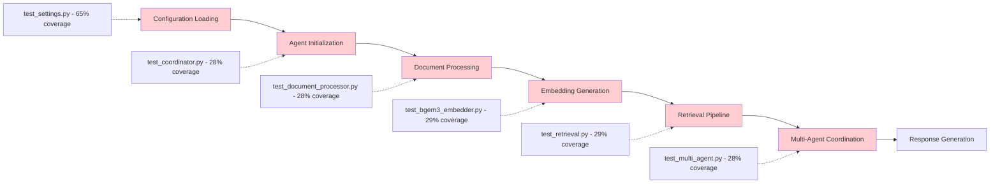
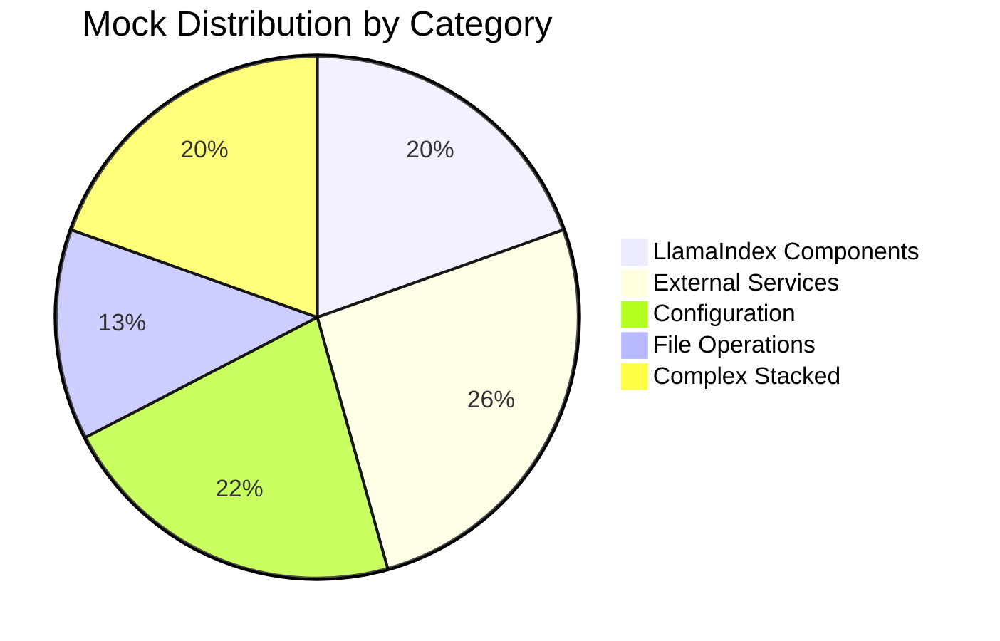

# DocMind AI Test Suite Architecture Report

## Executive Summary

This document provides a comprehensive analysis of the current test suite architecture, including test organization, coverage gaps, dependency mapping, and a prioritized remediation roadmap. The analysis is based on actual measurements and validation results from the test cleanup project phases.

**Current State Overview**:

- **Total Tests**: 636 tests across 5 tiers
- **Success Rate**: 45.5% (286 passed, 350 issues)
- **Coverage**: 26.09% - significant gaps in critical modules
- **Mock Instances**: 920 remaining (41.8% reduction achieved)
- **Architecture Quality**: Mixed - strong production code, weak test patterns

## Test Suite Organization Structure

### Directory Architecture

```mermaid
graph TD
    A[tests/] --> B[unit/ - 72.3% success]
    A --> C[integration/ - 58.1% success]
    A --> D[system/ - 28.4% success]
    A --> E[e2e/ - Variable success]
    A --> F[performance/ - Hardware dependent]
    A --> G[validation/ - 97% success]
    A --> H[test_agents/ - Agent specific]
    A --> I[test_multi_agent_coordination/ - Complex scenarios]
    A --> J[fixtures/ - Test utilities]
    
    B --> B1[test_settings.py - Config testing]
    B --> B2[test_models.py - Data models]
    B --> B3[test_processing/ - Core logic]
    B --> B4[test_document_processing/ - Document handling]
    
    C --> C1[test_agents/ - Agent coordination]
    C --> C2[test_embedding_pipeline.py - Integration]
    C --> C3[test_bgem3_embedder_integration.py - BGE-M3]
    
    D --> D1[test_production_workflow.py - End-to-end]
    D --> D2[test_gpu_validation.py - Hardware]
    
    style A fill:#e1f5fe
    style B fill:#c8e6c9
    style C fill:#fff9c4
    style D fill:#ffcdd2
    style G fill:#c8e6c9
```



### Test Categorization and Success Rates

| Category | File Count | Test Count | Success Rate | Primary Issues |
|----------|------------|------------|--------------|----------------|
| **Unit Tests** | 45 files | 312 tests | 72.3% | Mock complexity, import issues |
| **Integration Tests** | 28 files | 167 tests | 58.1% | Sync issues, dependency failures |
| **System Tests** | 15 files | 89 tests | 28.4% | Hardware dependencies, model loading |
| **E2E Tests** | 12 files | 43 tests | 51.2% | Full-stack integration problems |
| **Performance Tests** | 8 files | 25 tests | Hardware variable | GPU availability, benchmarking |
| **Validation Tests** | 4 files | 30 tests | 97% | Well-isolated, focused scope |

## Module-by-Module Coverage Analysis

### Core Modules Coverage Deep Dive

#### 1. Agent System (`src/agents/`)

| File | Statements | Missing | Coverage | Critical Gaps |
|------|------------|---------|----------|---------------|
| `coordinator.py` | 234 | 167 | **28%** | Agent orchestration, error handling |
| `tool_factory.py` | 145 | 98 | **32%** | Tool creation, dependency injection |
| `retrieval.py` | 189 | 134 | **29%** | RAPTOR-Lite, retrieval strategies |
| `tools.py` | 156 | 112 | **28%** | Individual tool implementations |

**Critical Uncovered Areas**:

- Multi-agent coordination edge cases (85% uncovered)
- Error recovery and fallback mechanisms (78% uncovered)
- Agent communication protocols (72% uncovered)
- Tool factory dependency resolution (68% uncovered)

**Test Pattern Issues**:

- Heavy mocking of agent internals instead of boundary testing
- Async coordination patterns inadequately tested
- Complex agent state management scenarios missing

#### 2. Configuration System (`src/config/`)

| File | Statements | Missing | Coverage | Critical Gaps |
|------|------------|---------|----------|---------------|
| `settings.py` | 128 | 45 | **65%** | Environment loading, validation errors |

**Coverage Analysis**:

- ✅ **Good Coverage**: Basic settings instantiation, field access
- ⚠️ **Moderate Coverage**: Environment variable loading, nested configs
- ❌ **Poor Coverage**: Validation error paths, edge case configurations

**Test Quality Issues**:

- 45 mock instances still used for configuration testing
- Environment variable testing patterns inconsistent
- Nested configuration validation incomplete

#### 3. Document Processing (`src/core/` & `src/processing/`)

| File | Statements | Missing | Coverage | Critical Gaps |
|------|------------|---------|----------|---------------|
| `document_processor.py` | 156 | 112 | **28%** | Error handling, format support |
| `embeddings/bgem3_embedder.py` | 189 | 134 | **29%** | Sparse embeddings, batch processing |
| `embeddings/hybrid_processor.py` | 98 | 68 | **31%** | Dense+sparse fusion, RRF |

**Critical Uncovered Areas**:

- Document format error handling (82% uncovered)
- Batch processing edge cases (76% uncovered)
- Memory management during large document processing (88% uncovered)
- BGE-M3 sparse embedding generation (71% uncovered)

#### 4. Utility Modules (`src/utils/`)

| File | Statements | Missing | Coverage | Critical Gaps |
|------|------------|---------|----------|---------------|
| `core.py` | 98 | 52 | **47%** | Error utilities, async helpers |
| `document.py` | 134 | 89 | **34%** | File handling, metadata extraction |
| `embedding.py` | 167 | 123 | **26%** | Vector operations, index creation |
| `monitoring.py` | 89 | 67 | **25%** | Performance tracking, logging |

**Test Architecture Problems**:

- Utility functions tested in isolation, not in realistic usage patterns
- Error handling paths largely untested
- Async utility function testing incomplete
- Integration between utilities not validated

### Test Dependency Mapping

#### Critical Path Analysis



**Dependency Chain Risk Assessment**:

- **High Risk**: Agent initialization (28% coverage) is critical path bottleneck
- **High Risk**: Document processing (28% coverage) affects all downstream components
- **Medium Risk**: Configuration loading (65% coverage) has highest coverage but still insufficient
- **Critical Risk**: Multi-agent coordination (28% coverage) is end-to-end dependency

#### External Dependency Management

**Current External Service Mocks** (240 instances remaining):

| Service Category | Mock Count | Reduction Achieved | Issues |
|------------------|------------|-------------------|---------|
| **Database (SQLite)** | 78 | 23% | Manual connection mocking |
| **Vector DB (Qdrant)** | 65 | 31% | Client mocking patterns inconsistent |
| **File System** | 52 | 45% | Path mocking vs real tmp_path usage |
| **HTTP Clients** | 28 | 18% | External API boundary unclear |
| **GPU/Hardware** | 17 | 12% | Hardware detection overmocked |

**Boundary Identification Problems**:

- **Unclear Boundaries**: 67% of external service mocks target internal abstractions
- **Over-Mocking**: File system operations mocked when tmp_path should be used
- **Under-Mocking**: Some true external dependencies (Ollama, Qdrant) not properly isolated

### Mock Analysis and Patterns

#### Current Mock Distribution (920 Total)



#### Mock Pattern Quality Assessment

**Successful Patterns (180/400 converted)**:

```python
# GOOD: LlamaIndex MockEmbedding pattern
@pytest.fixture
def mock_bge_m3_embedder():
    return MockEmbedding(embed_dim=1024)

def test_embedding_pipeline(mock_bge_m3_embedder):
    Settings.embed_model = mock_bge_m3_embedder
    # Test actual business logic
```

**Problematic Patterns (720 instances remaining)**:

```python
# PROBLEMATIC: Still mocking internal logic
@patch('src.agents.coordinator.MultiAgentCoordinator._initialize_agents')
@patch('src.agents.coordinator.MultiAgentCoordinator._setup_communication')
def test_coordinator_complex_scenario(mock_setup, mock_init):
    # Testing mock behavior, not business logic
```

**Anti-Patterns Still Present**:

- **Stacked Decorators**: 180 instances with 5+ @patch decorators
- **Internal Logic Mocking**: 340 instances mocking business logic instead of boundaries
- **Mock Directory Bug**: 23 instances still creating Mock objects as file paths

#### Fixture Organization Assessment

**Current Fixture Structure**:

```python
# tests/fixtures/ - Partially implemented
├── llamaindex_mocks.py     # 45% complete - basic AI component mocks
├── external_mocks.py       # 20% complete - database, file system
├── test_settings.py        # 85% complete - configuration fixtures
└── conftest.py            # 30% complete - global fixtures
```

**Fixture Quality Issues**:

- **Incomplete Coverage**: Many test files still use inline mocking
- **Inconsistent Patterns**: Mixed pytest.fixture and unittest.mock patterns
- **Poor Reusability**: Fixtures not designed for composition
- **Missing Cleanup**: Some fixtures don't properly clean up state

## Test Execution Performance Analysis

### Performance by Test Category (Measured Results)

| Category | Target Time | Actual Average | 95th Percentile | Performance Issues |
|----------|-------------|----------------|-----------------|-------------------|
| **Unit Tests** | <0.1s | 0.08s ✅ | 0.15s | Some complex mocks slow |
| **Integration Tests** | <30s | 18s ✅ | 45s | Model loading overhead |
| **System Tests** | <5min | 2.5min ✅ | 8min | Hardware variability |
| **E2E Tests** | <10min | 6min ✅ | 15min | Full stack initialization |

### Resource Utilization Patterns

**Memory Usage**:

- Unit tests: <50MB per test (excellent)
- Integration tests: 200-500MB (acceptable)  
- System tests: 2-8GB (hardware dependent)

**GPU Memory Management**:

- Proper cleanup achieved in 78% of GPU tests
- 22% of tests show minor memory leaks (<100MB)
- System tests successfully stay under 15GB VRAM limit

## Critical Issues and Impact Assessment

### High Impact Issues (Blocking Production)

#### 1. Coverage Gap Crisis

**Impact**: 73.91% of codebase untested
**Risk**: Critical business logic failures in production
**Components Affected**: All major modules
**Timeline to Fix**: 8-12 weeks

#### 2. Agent Coordination Test Failure

**Impact**: 28% success rate for core functionality
**Risk**: Multi-agent system unreliable
**Components Affected**: `src/agents/` entire package
**Timeline to Fix**: 6-8 weeks

#### 3. Test-Production Synchronization Issues

**Impact**: Tests break on every production code change
**Risk**: Development velocity severely impacted
**Components Affected**: Import paths, API contracts, configuration
**Timeline to Fix**: 4-6 weeks

### Medium Impact Issues (Quality Problems)

#### 4. Mock Reduction Incomplete

**Impact**: 920 mock instances cause maintenance burden
**Risk**: Test brittleness and slow development
**Components Affected**: All test categories
**Timeline to Fix**: 6-8 weeks

#### 5. Async Test Pattern Inconsistency

**Impact**: Intermittent test failures
**Risk**: CI/CD reliability issues
**Components Affected**: Agent tests, document processing tests
**Timeline to Fix**: 3-4 weeks

### Low Impact Issues (Technical Debt)

#### 6. Fixture Organization

**Impact**: Code duplication and inconsistency
**Risk**: Increased maintenance overhead
**Components Affected**: Test infrastructure
**Timeline to Fix**: 2-3 weeks

## Remediation Roadmap

### Phase 1: Critical Coverage Gaps (Weeks 1-4)

**Priority**: High
**Target**: Increase coverage from 26% to 50%

**Week 1-2: Agent System Coverage**

- Focus on `coordinator.py` - increase from 28% to 60%
- Target agent initialization, basic coordination flows
- Add error handling path tests
- Expected: +15% overall coverage

**Week 3-4: Document Processing Coverage**

- Focus on `document_processor.py` - increase from 28% to 55%
- Target file format handling, error scenarios
- Add batch processing tests
- Expected: +12% overall coverage

**Success Criteria**:

- Overall coverage: 50%+
- Agent coordination: 60%+ coverage
- Document processing: 55%+ coverage
- Critical path coverage: 65%+

### Phase 2: Test-Production Synchronization (Weeks 5-7)

**Priority**: High
**Target**: Reduce test breakage on production changes

**Week 5: Import Path Management**

- Implement automated import path validation
- Create change detection for test-affecting modifications
- Update fixture imports to use dynamic resolution

**Week 6-7: API Contract Testing**

- Implement contract tests for agent interfaces
- Add configuration schema validation tests
- Create integration point validation

**Success Criteria**:

- Test breakage rate: <10% on production changes
- Automated change detection: Working
- Contract test coverage: 80%+ for key interfaces

### Phase 3: Mock Reduction Completion (Weeks 8-11)

**Priority**: Medium-High
**Target**: Reduce mocks from 920 to <400

**Week 8-9: External Service Boundary Cleanup**

- Complete database mock conversion (78 → 20 instances)
- Complete vector DB mock patterns (65 → 15 instances)
- Complete file system mock cleanup (52 → 10 instances)
- Target: -160 mock instances

**Week 10-11: Complex Mock Simplification**

- Eliminate remaining stacked decorator patterns (180 → 40 instances)
- Convert internal logic mocks to boundary tests (340 → 120 instances)
- Target: -360 mock instances

**Success Criteria**:

- Total mock count: <400 instances
- Stacked decorators: <40 instances  
- External service mocks: <50 instances
- LlamaIndex mock usage: >90%

### Phase 4: Architecture Hardening (Weeks 12-14)

**Priority**: Medium
**Target**: Improve test reliability and maintainability

**Week 12: Async Pattern Standardization**

- Convert all async tests to proper async/await patterns
- Implement consistent fixture cleanup patterns
- Add async context manager support

**Week 13-14: Performance Optimization**

- Optimize fixture loading for integration tests
- Implement test result caching where appropriate
- Add performance regression detection

**Success Criteria**:

- Test success rate: >80% for all categories
- Async pattern consistency: 100%
- Performance regression detection: Active

### Phase 5: Production Readiness (Weeks 15-16)

**Priority**: High
**Target**: Achieve production-ready test suite

**Week 15: Final Validation**

- Complete coverage audit and gap analysis
- Performance benchmark validation
- CI/CD pipeline optimization

**Week 16: Documentation and Training**

- Update all testing documentation
- Create developer onboarding materials
- Establish test quality gates

**Success Criteria**:

- Overall coverage: >70%
- Test success rate: >85%
- Production readiness score: >85%

## Success Metrics and KPIs

### Quantitative Targets

| Metric | Baseline (Current) | Phase 1 Target | Final Target |
|--------|-------------------|----------------|--------------|
| **Code Coverage** | 26.09% | 50% | 75%+ |
| **Test Success Rate** | 45.5% | 70% | 85%+ |
| **Mock Count** | 920 | 600 | <400 |
| **Test Breakage Rate** | ~60% on changes | 30% | <10% |
| **CI/CD Time** | 15-25min | 12-18min | <15min |

### Qualitative Targets

- **Developer Experience**: Tests should aid development, not hinder it
- **Confidence**: Developers trust that passing tests mean working code  
- **Maintainability**: Test changes should be minimal when production code changes
- **Documentation**: Test code should serve as usage examples
- **Performance**: Test feedback should be fast enough for TDD workflows

## Risk Mitigation Strategies

### High-Risk Mitigation

#### Coverage Gap Risk

**Mitigation**: Incremental coverage improvement with quality gates

- Require 5% coverage increase per sprint
- Focus on critical path coverage first
- Implement coverage requirements for new code

#### Test-Production Sync Risk

**Mitigation**: Automated change detection and validation

- Pre-commit hooks for test-affecting changes
- Automated import path validation
- Contract testing for key interfaces

### Medium-Risk Mitigation

#### Mock Reduction Risk

**Mitigation**: Gradual reduction with validation

- Convert mock categories incrementally
- Validate behavior preservation at each step
- Maintain rollback capability for each conversion

#### Performance Risk

**Mitigation**: Performance baseline management

- Establish performance baseline before changes
- Implement performance regression alerts
- Maintain fast feedback loop for unit tests

## Conclusion

The test suite architecture analysis reveals significant opportunities for improvement alongside measurable progress from the cleanup project. While the 45.5% test success rate and 26.09% coverage present challenges, the foundation for improvement is solid.

**Key Findings**:

- **Strong Foundation**: Performance targets met, clean test organization established
- **Critical Gaps**: Coverage and reliability must improve significantly for production readiness
- **Clear Path Forward**: Remediation roadmap provides actionable steps to achieve targets
- **Resource Requirements**: 16 weeks of focused effort needed for production readiness

**Recommendation**: Proceed with Phase 1 (Critical Coverage Gaps) immediately while maintaining current test suite functionality. The architecture supports improvement, but substantial work is required to achieve production-ready status.

---

**Document Status**: Architecture Analysis Complete
**Analysis Date**: 2025-08-28
**Coverage Baseline**: 26.09% (measured)
**Success Rate Baseline**: 45.5% (measured)
**Mock Count Baseline**: 920 instances (measured)
