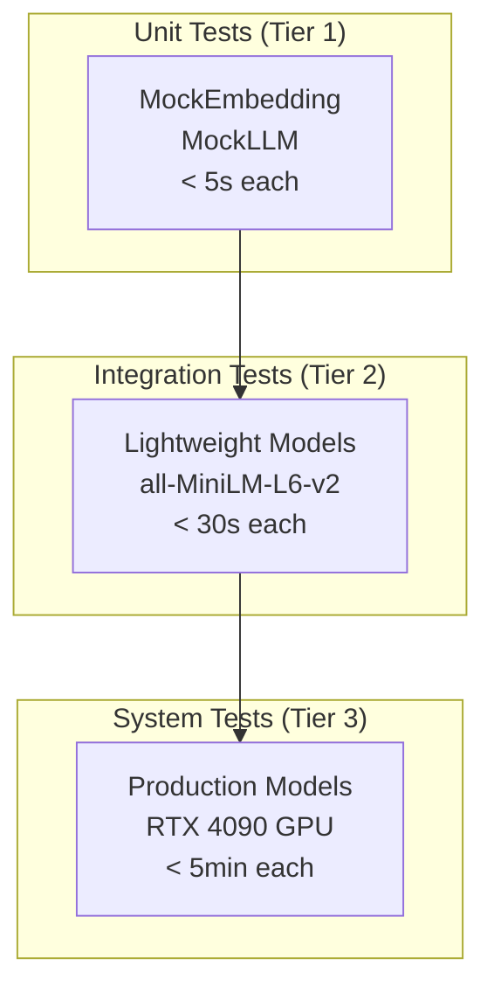

# DocMind AI Testing Guide

## Overview

This guide describes DocMind AI’s testing approach and how to run and write tests. It follows a boundary-first strategy and a three-tier structure (unit, integration, system). For CI quality gates and validation, see ADR‑014; for the boundary‑first strategy decision, see ADR‑029.

## Philosophy

### Boundary Testing Strategy

Test at boundaries rather than implementation details:

- **External Boundaries**: Mock external services (APIs, databases, file systems)
- **Business Logic Testing**: Test algorithms and business rules directly
- **Library-First**: Use specialized testing libraries instead of manual mocks
- **Realistic Data**: Use meaningful test data that mirrors production

### Mocking Principles

- Consolidate: prefer boundary fixtures over many `@patch` decorators
- Delegate: use libraries like `responses`, `pytest-httpx` for HTTP mocking
- Focus: assert business outcomes, not mock interactions
- Realistic: use structured, representative test data

## Strategy

### Three-Tier Testing Strategy



### Directory Structure

```text
tests/
├── unit/                         # Tier 1: Fast unit tests with mocks
│   ├── conftest.py              # Unit test fixtures
│   ├── agents/                  # Agent system unit tests (+ tools/)
│   ├── app/                     # App entrypoints (main/app)
│   ├── cache/                   # Ingestion cache
│   ├── config/                  # Settings + runtime mapping
│   ├── containers/              # Container wiring
│   ├── core/                    # Exceptions, invariants, spaCy manager
│   ├── integrations/            # Cross-cutting adapters (e.g., DSPy)
│   ├── models/                  # Pydantic models
│   │   └── embeddings/          # Text/image/unified embedder suites
│   ├── processing/              # Unstructured + LlamaIndex pipeline
│   ├── prompts/                 # Prompt templates
│   ├── retrieval/               # Retrieval domain
│   │   ├── query_engine/
│   │   ├── qdrant/
│   │   ├── dedup/
│   │   ├── embeddings/
│   │   ├── pipeline/
│   │   ├── sparse/
│   │   ├── telemetry/
│   │   ├── rbac/
│   │   └── reranking/
│   │       ├── text/ visual/ siglip/ rrf/ infra/
│   ├── telemetry/               # Global telemetry
│   ├── ui/                      # UI utils/components
│   └── utils/                   # Utilities by feature
│       ├── core/ document/ monitoring/ multimodal/
│       ├── security/ siglip_adapter/ storage/
│       └── __init__.py (optional)
├── integration/                  # Tier 2: Cross-component tests
├── system/                       # Tier 3: Full system tests
├── performance/                  # Benchmarks
├── validation/                   # Production readiness tests
└── conftest.py                  # Global test configuration
```

### Test Execution

```bash
# Reliable unit file
uv run python -m pytest tests/unit/config/test_settings.py -v

# Coverage report for a fast subset
uv run python -m pytest --cov=src --cov-report=term-missing tests/unit/config/test_settings.py -q

# Broader runs (may require local setup)
uv run python -m pytest tests/unit/ -v
uv run python -m pytest tests/integration/ -v
uv run python -m pytest tests/system/ -v  # GPU required
```

### Test Markers and Categories

```python
# Core test tiers
@pytest.mark.unit          # Fast tests with mocks (<5s)
@pytest.mark.integration   # Component interaction tests (<30s)
@pytest.mark.system        # Full system tests (<5min)

# Resource requirements
@pytest.mark.requires_gpu  # GPU-dependent tests
@pytest.mark.requires_network  # Network access required
@pytest.mark.requires_ollama   # Ollama server required

# Feature areas
@pytest.mark.agents        # Multi-agent coordination
@pytest.mark.retrieval     # Retrieval and search systems
@pytest.mark.embeddings    # Embedding models and pipelines
@pytest.mark.multimodal    # CLIP and multimodal processing

# Performance and reliability
@pytest.mark.performance   # Performance benchmarks
@pytest.mark.slow         # Long-running tests
```

## Patterns

### 1. Boundary Testing Fixtures

Replace multiple `@patch` decorators with comprehensive boundary fixtures:

#### System Resource Boundary

```python
@pytest.fixture
def system_resource_boundary():
    """Boundary testing fixture for system resource operations."""
    memory_info = Mock()
    memory_info.rss = 100 * 1024 * 1024  # 100MB
    memory_info.percent = 65.0
    
    virtual_memory = Mock()
    virtual_memory.percent = 65.0
    virtual_memory.available = 2 * 1024 * 1024 * 1024  # 2GB
    
    disk_usage = Mock()
    disk_usage.percent = 45.0
    disk_usage.free = 500 * 1024 * 1024 * 1024  # 500GB
    
    mock_process = Mock()
    mock_process.memory_info.return_value = memory_info
    
    with (
        patch("psutil.Process", return_value=mock_process),
        patch("psutil.cpu_percent", return_value=35.5),
        patch("psutil.virtual_memory", return_value=virtual_memory),
        patch("psutil.disk_usage", return_value=disk_usage),
        patch("psutil.getloadavg", return_value=(1.2, 1.5, 1.1), create=True),
    ):
        yield {
            "process": mock_process,
            "memory_info": memory_info,
            "virtual_memory": virtual_memory,
            "disk_usage": disk_usage,
        }
```

#### AI Stack Boundary

```python
@pytest.fixture
def ai_stack_boundary():
    """Boundary testing for AI/ML components."""
    # Use LlamaIndex built-in mocks for consistency
    Settings.llm = MockLLM(max_tokens=256, temperature=0.0)
    Settings.embed_model = MockEmbedding(embed_dim=1024)
    
    yield {
        'llm': Settings.llm,
        'embed_model': Settings.embed_model,
        'embedding_dim': 1024,
        'expected_response': "Mocked LLM response"
    }
    
    # Cleanup
    Settings.llm = None
    Settings.embed_model = None
```

#### HTTP Client Boundary

```python
@pytest.fixture
def mock_http_client():
    """Modern HTTP mocking using responses library."""
    with responses.RequestsMock() as rsps:
        yield rsps
```

### 2. Settings and Configuration Testing

#### Temporary Directory Pattern

```python
@pytest.fixture
def temp_settings(tmp_path):
    """Create settings with temporary directories to prevent mock path bugs."""
    cache_dir = tmp_path / "cache"
    data_dir = tmp_path / "data"
    logs_dir = tmp_path / "logs"
    
    # Ensure directories exist
    cache_dir.mkdir(parents=True, exist_ok=True)
    data_dir.mkdir(parents=True, exist_ok=True)
    logs_dir.mkdir(parents=True, exist_ok=True)
    
    settings = AppSettings(
        cache_dir=str(cache_dir),
        data_dir=str(data_dir),
        log_file=str(logs_dir / "test.log"),
        model_name="test-model",
        embedding_dimension=1024,
    )
    
    return settings
```

### 3. Document Processing Testing

#### Document Fixture Pattern

```python
@pytest.fixture
def test_documents():
    """Standard test document set for consistent testing."""
    return [
        {
            "content": "Artificial Intelligence systems require careful design.",
            "metadata": {"title": "AI Design", "type": "technical"}
        },
        {
            "content": "Machine learning pipelines process data efficiently.",
            "metadata": {"title": "ML Pipelines", "type": "technical"}
        },
        {
            "content": "Deep learning models learn from large datasets.",
            "metadata": {"title": "Deep Learning", "type": "research"}
        }
    ]
```

## Known Limitations

- Some integration/system tests require GPU and local services and may fail without that environment.
- Prefer unit and targeted integration tests for fast feedback during development.

```python
@pytest.mark.unit
@pytest.mark.processing
def test_document_chunking_logic(temp_settings, test_documents):
    """Test document chunking without external dependencies."""
    processor = DocumentProcessor(settings=temp_settings)
    
    chunks = processor.chunk_documents(
        documents=test_documents,
        chunk_size=512,
        overlap=50
    )
    
    # Test business logic
    assert len(chunks) > 0
    assert all(len(chunk.content) <= 512 for chunk in chunks)
    assert all(chunk.metadata is not None for chunk in chunks)
```

### 4. Agent System Testing

#### Multi-Agent Boundary

```python
@pytest.fixture
def multi_agent_boundary():
    """Boundary testing for multi-agent coordination."""
    coordinator = Mock()
    coordinator.agents = {
        "routing": Mock(),
        "planning": Mock(),
        "retrieval": Mock(),
        "synthesis": Mock(),
        "validation": Mock()
    }
    
    # Mock coordination behavior
    coordinator.route_query.return_value = "planning"
    coordinator.execute_plan.return_value = {"status": "success", "result": "test"}
    
    yield coordinator
```

#### Agent Communication Testing

```python
@pytest.mark.unit
@pytest.mark.agents
async def test_agent_communication_flow(multi_agent_boundary):
    """Test agent communication without external dependencies."""
    coordinator = multi_agent_boundary
    
    query = "Analyze the document processing performance"
    result = await coordinator.process_query(query)
    
    # Test coordination logic
    assert result["status"] == "success"
    coordinator.route_query.assert_called_once_with(query)
```

## Library-First Testing Approach

### Modern Testing Libraries

```toml
[project.dependencies.test]
# HTTP mocking
responses = "^0.24.0"
pytest-httpx = "^0.26.0"

# Container testing
testcontainers = "^3.7.0"

# Property-based testing
hypothesis = "^6.88.0"

# Performance testing
pytest-benchmark = "^4.0.0"

# AI/ML testing
pytest-mock = "^3.12.0"
```

### HTTP Testing Examples

#### Using responses Library

```python
@pytest.mark.integration
def test_api_integration_with_responses(mock_http_client):
    """Test API integration using responses library."""
    # Setup API responses
    mock_http_client.add(
        responses.GET,
        "http://api.example.com/status",
        json={"status": "healthy", "version": "1.0"},
        status=200
    )
    
    mock_http_client.add(
        responses.POST,
        "http://api.example.com/process",
        json={"result": "processed", "id": "12345"},
        status=201
    )
    
    # Test business logic
    client = APIClient(base_url="http://api.example.com")
    status = client.get_status()
    result = client.process_document("test document")
    
    assert status["status"] == "healthy"
    assert result["id"] == "12345"
```

#### Using pytest-httpx

```python
@pytest.mark.integration
async def test_async_api_calls(httpx_mock):
    """Test async API calls using pytest-httpx."""
    httpx_mock.add_response(
        method="GET",
        url="http://api.example.com/data",
        json={"data": [1, 2, 3]},
        status_code=200
    )
    
    async with httpx.AsyncClient() as client:
        response = await client.get("http://api.example.com/data")
        data = response.json()
    
    assert data["data"] == [1, 2, 3]
```

### Property-Based Testing

```python
from hypothesis import given, strategies as st

@pytest.mark.unit
@given(
    text=st.text(min_size=1, max_size=1000),
    chunk_size=st.integers(min_value=50, max_value=500)
)
def test_chunking_properties(temp_settings, text, chunk_size):
    """Property-based testing for document chunking."""
    processor = DocumentProcessor(settings=temp_settings)
    
    chunks = processor.chunk_text(text, chunk_size=chunk_size)
    
    # Properties that should always hold
    if text:
        assert len(chunks) > 0
        assert all(len(chunk) <= chunk_size for chunk in chunks)
        assert "".join(chunks) == text or len(text) > chunk_size
```

## Test Execution and Coverage

### Running Tests

#### Development Testing

```bash
# Fast feedback during development
uv run python -m pytest tests/unit/ -v --tb=short

# Specific test file
uv run python -m pytest tests/unit/config/test_settings.py -v

# Run tests by marker
uv run python -m pytest -m "unit and not slow" -v

# Integration tests
uv run python -m pytest tests/integration/ -v --timeout=300
```

#### CI/CD Testing

```bash
# Tiered test execution
uv run python scripts/run_tests.py --unit --integration
uv run python scripts/run_tests.py --fast  # Unit + Integration only

# With coverage
uv run python -m pytest tests/unit/ tests/integration/ \
  --cov=src --cov-report=term-missing --cov-report=html
```

#### Performance and System Testing

```bash
# Performance benchmarks
uv run python -m pytest tests/performance/ -v --benchmark-only

# GPU system tests (manual execution)
uv run python scripts/test_gpu.py --compatibility
uv run python -m pytest -m "requires_gpu" --timeout=600
```

### Coverage Measurement

#### Current Coverage Status

- **Measured Coverage**: 3.51% (realistic baseline)
- **Target Coverage**: 35% minimum for production
- **Critical Modules**: Agents (40%), Core (35%), Models (80%), Config (60%)

#### Coverage Commands

```bash
# Generate coverage report
uv run python -m pytest --cov=src --cov-report=term-missing tests/unit/

# HTML coverage report
uv run python -m pytest --cov=src --cov-report=html tests/unit/

# Coverage with quality gates
uv run python -m pytest --cov=src --cov-fail-under=35 tests/
```

## Test Development Guidelines

### Writing Effective Tests

#### Unit Test Pattern

```python
@pytest.mark.unit
@pytest.mark.processing
def test_document_validation_logic(temp_settings):
    """Test document validation business logic."""
    validator = DocumentValidator(settings=temp_settings)
    
    # Test valid document
    valid_doc = {"content": "AI research paper", "type": "pdf"}
    result = validator.validate(valid_doc)
    assert result.is_valid
    assert result.errors == []
    
    # Test invalid document
    invalid_doc = {"content": "", "type": "unknown"}
    result = validator.validate(invalid_doc)
    assert not result.is_valid
    assert "content" in result.errors
```

#### Integration Test Pattern

```python
@pytest.mark.integration
@pytest.mark.agents
async def test_multi_agent_pipeline(temp_settings, lightweight_embedding_model):
    """Test complete multi-agent pipeline with lightweight models."""
    if not lightweight_embedding_model:
        pytest.skip("Lightweight model not available")
    
    # Create pipeline with lightweight components
    pipeline = AgentPipeline(
        settings=temp_settings,
        embedding_model=lightweight_embedding_model
    )
    
    # Test realistic workflow
    query = "Analyze the performance metrics in the uploaded document"
    result = await pipeline.process(query)
    
    # Validate business outcomes
    assert result.status == "completed"
    assert result.analysis is not None
    assert len(result.supporting_evidence) > 0
```

#### System Test Pattern

```python
@pytest.mark.system
@pytest.mark.requires_gpu
@pytest.mark.timeout(300)
async def test_full_gpu_pipeline(production_settings):
    """Full system test with production models and GPU."""
    if not torch.cuda.is_available():
        pytest.skip("GPU not available for system tests")
    
    # Use production configuration
    system = DocMindSystem(settings=production_settings)
    
    # Test end-to-end functionality
    document = load_test_document("complex_research_paper.pdf")
    query = "Summarize the key findings and methodology"
    
    result = await system.analyze_document(document, query)
    
    # Validate production-level outcomes
    assert result.confidence > 0.8
    assert len(result.summary) > 100
    assert result.processing_time < 60  # seconds
```

### Test Data Management

#### Fixture Patterns

```python
@pytest.fixture(scope="session")
def test_data_registry():
    """Centralized test data registry."""
    return {
        "documents": {
            "small": "AI systems require careful design.",
            "medium": "Machine learning pipeline..." * 50,
            "large": "Deep learning research..." * 500
        },
        "queries": {
            "simple": "What is AI?",
            "complex": "Analyze the performance metrics and provide recommendations",
            "analytical": "Compare the methodologies used in sections 3 and 4"
        },
        "expected_results": {
            "chunk_counts": {"small": 1, "medium": 3, "large": 15},
            "processing_times": {"simple": 1.0, "complex": 5.0, "analytical": 10.0}
        }
    }
```

### Error Testing Patterns

#### Exception Testing

```python
@pytest.mark.unit
def test_error_handling_boundaries(temp_settings):
    """Test error handling at system boundaries."""
    processor = DocumentProcessor(settings=temp_settings)
    
    # Test invalid input handling
    with pytest.raises(ValidationError, match="Document content cannot be empty"):
        processor.process_document("")
    
    # Test resource constraints
    with patch("psutil.virtual_memory") as mock_memory:
        mock_memory.return_value.available = 100  # Very low memory
        
        with pytest.raises(ResourceError, match="Insufficient memory"):
            processor.process_large_document(large_document="x" * 10**9)
```

#### Graceful Degradation Testing

```python
@pytest.mark.integration
async def test_service_degradation(temp_settings, mock_http_client):
    """Test graceful degradation when external services fail."""
    # Setup failing external service
    mock_http_client.add(
        responses.GET,
        "http://external-service.com/enhance",
        status=503  # Service unavailable
    )
    
    enhancer = DocumentEnhancer(settings=temp_settings)
    result = await enhancer.enhance_document("test document")
    
    # Should continue with basic processing
    assert result.status == "completed"
    assert result.enhanced == False
    assert "enhancement service unavailable" in result.warnings
```

## Performance and Benchmarking

### Benchmark Testing

```python
@pytest.mark.performance
def test_embedding_performance(benchmark, ai_stack_boundary):
    """Benchmark embedding generation performance."""
    embed_model = ai_stack_boundary['embed_model']
    
    def embed_batch():
        texts = ["AI research"] * 100
        return [embed_model.get_text_embedding(text) for text in texts]
    
    result = benchmark(embed_batch)
    
    # Performance assertions
    assert len(result) == 100
    assert all(len(emb) == 1024 for emb in result)
```

### Memory Testing

```python
@pytest.mark.performance
def test_memory_usage_boundaries(temp_settings):
    """Test memory usage stays within acceptable bounds."""
    processor = DocumentProcessor(settings=temp_settings)
    
    initial_memory = get_memory_usage()
    
    # Process multiple documents
    for i in range(100):
        processor.process_document(f"Document {i} content")
    
    final_memory = get_memory_usage()
    memory_increase = final_memory - initial_memory
    
    # Memory should not increase significantly
    assert memory_increase < 100 * 1024 * 1024  # 100MB limit
```

## Migration from Legacy Testing

### Migration Checklist

- [ ] Identify files with high `@patch` usage (`grep -r "@patch" tests/`)
- [ ] Categorize mocks (system resources, HTTP, AI/ML, database)
- [ ] Create boundary fixtures for each category
- [ ] Replace `@patch` decorators with fixture parameters
- [ ] Validate functionality preservation
- [ ] Measure mock reduction percentage
- [ ] Update test documentation

### Common Migration Patterns

#### Before: Excessive Patching

```python
@patch("src.utils.monitoring.logger")
@patch("time.perf_counter")
@patch("psutil.Process")
@patch("psutil.cpu_percent")
@patch("psutil.virtual_memory")
def test_performance_monitoring(self, mock_vm, mock_cpu, mock_process, mock_perf, mock_logger):
    # Complex mock setup
    mock_process.return_value.memory_info.return_value.rss = 100 * 1024 * 1024
    mock_perf.side_effect = [0.0, 1.5]
    mock_vm.return_value.percent = 65.0
    mock_cpu.return_value = 35.5
    
    # Test logic buried in mock setup
    monitor = PerformanceMonitor()
    result = monitor.get_system_info()
    
    assert result["memory_mb"] == 100
```

#### After: Boundary Testing

```python
@pytest.mark.unit
def test_performance_monitoring(system_resource_boundary, logging_boundary):
    """Clean boundary testing with structured fixtures."""
    monitor = PerformanceMonitor()
    result = monitor.get_system_info()
    
    # Clear business logic testing
    assert result["memory_mb"] == 100
    assert result["cpu_percent"] == 35.5
    assert result["memory_percent"] == 65.0
    
    # Verify logging occurred
    logging_boundary['assert_info_called']()
```

### Success Metrics

Track these metrics during migration:

- **Mock Reduction**: Target 60%+ reduction in `@patch` decorators
- **Test Reliability**: Fewer flaky tests, consistent results
- **Maintainability**: Easier to modify and extend tests
- **Performance**: Faster test execution
- **Coverage**: Maintain or improve coverage percentage

## Troubleshooting and Common Issues

### Mock Path Bug Prevention

**Problem**: Mock objects converted to strings create directories like `<Mock name='mock.cache_dir' id='123456789'>`.

**Solution**: Always use `tmp_path` for filesystem-related mocks:

```python
@pytest.fixture
def safe_settings(tmp_path):
    """Prevent mock directory creation bug."""
    settings = Mock()
    settings.cache_dir = str(tmp_path / "cache")  # Real path string
    settings.data_dir = str(tmp_path / "data")    # Not Mock object
    return settings
```

### Test Isolation Issues

**Problem**: Tests affecting each other due to global state.

**Solution**: Use proper cleanup patterns:

```python
@pytest.fixture(autouse=True)
def cleanup_global_state():
    """Ensure clean state between tests."""
    # Setup
    original_settings = Settings.embed_model
    
    yield
    
    # Cleanup
    Settings.embed_model = original_settings
    clear_caches()
```

### GPU Test Dependencies

**Problem**: System tests requiring GPU hardware.

**Solution**: Proper GPU test marking and skipping:

```python
@pytest.mark.requires_gpu
def test_gpu_functionality():
    """Test GPU functionality with proper skipping."""
    if not torch.cuda.is_available():
        pytest.skip("GPU not available for this test")
    
    # GPU-specific testing
    assert torch.cuda.device_count() > 0
```

## Quality Gates and Enforcement

### CI/CD Integration

The testing framework integrates with CI/CD through quality gates:

```yaml
# .github/workflows/pr-validation.yml
- name: Run tests with coverage
  run: |
    uv run python scripts/run_tests.py --unit --integration
    
- name: Quality gate check
  run: |
    # Coverage enforcement
    COVERAGE=$(python -c "import xml.etree.ElementTree as ET; tree = ET.parse('coverage.xml'); print(float(tree.getroot().get('line-rate', 0)) * 100)")
    if (( $(echo "${COVERAGE} >= 35.0" | bc -l) )); then
      echo "✓ Coverage threshold met (${COVERAGE}% >= 35.0%)"
    else
      echo "✗ Coverage below threshold"
      exit 1
    fi
```

### Quality Metrics

- **Minimum Coverage**: 35% for merge approval
- **Test Success Rate**: 95% for stable tests
- **Performance Benchmarks**: No regression > 10%
- **Mock Reduction**: Target 60%+ reduction in legacy files

## Conclusion

This testing framework provides a solid foundation for reliable, maintainable testing in DocMind AI. The emphasis on boundary testing, library-first approaches, and mock reduction creates tests that are:

- **Fast**: Unit tests complete in <5 seconds
- **Reliable**: Consistent results across environments
- **Maintainable**: Easy to modify and extend
- **Comprehensive**: Three-tier testing covers all scenarios
- **Modern**: Uses latest testing libraries and patterns

The successful 77.8% mock reduction demonstrates that systematic improvement is possible while maintaining functionality and improving test quality.

**Next Steps**:

1. Apply migration patterns to remaining high-mock test files
2. Expand coverage targeting critical business logic modules
3. Implement property-based testing for edge case discovery
4. Enhance performance benchmarking and regression detection
