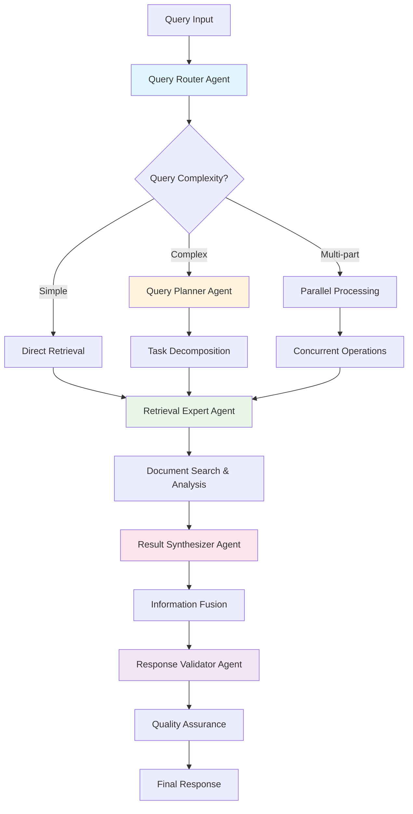

# Advanced Features Guide

Unlock DocMind AI's full potential with advanced multi-agent coordination, performance optimization, and power-user configurations.

## Multi-Agent Coordination System

DocMind AI's multi-agent system represents a significant advancement in document analysis, using specialized AI agents that coordinate to handle complex queries with unprecedented accuracy and efficiency.

### System Architecture

#### Agent Specialization and Coordination

The system employs 5 specialized agents working in concert:



#### Performance Characteristics

**Agent Response Times:**

- **Router Agent**: 50-150ms (query analysis and routing)
- **Planner Agent**: 100-300ms (complex query decomposition)  
- **Retrieval Agent**: 200-800ms (document search and ranking)
- **Synthesizer Agent**: 300-1000ms (information fusion)
- **Validator Agent**: 100-400ms (quality validation)

**Total Coordination Overhead**: 50-200ms additional processing time
**Performance Gain**: 20-40% better accuracy on complex queries
**Fallback Reliability**: <1% fallback rate to basic RAG mode

### Advanced Configuration - Multi-Agent System

#### Multi-Agent System Settings

**Core Configuration:**

```bash
# Enable full multi-agent coordination
ENABLE_MULTI_AGENT=true
AGENT_DECISION_TIMEOUT=300
MAX_AGENT_RETRIES=2
ENABLE_FALLBACK_RAG=true

# Agent specialization settings
QUERY_ROUTER_TEMPERATURE=0.1
QUERY_PLANNER_MAX_SUBTASKS=5
RETRIEVAL_EXPERT_STRATEGY=adaptive
SYNTHESIS_CONTEXT_WINDOW=8192
VALIDATOR_MIN_CONFIDENCE=0.7
```

**Performance Optimization:**

```bash
# Concurrency and resource management
AGENT_CONCURRENCY_LIMIT=5
PARALLEL_TOOL_EXECUTION=true
AGENT_MEMORY_POOL_SIZE=2GB
COORDINATION_CACHE_SIZE=1000

# Quality and reliability
ENABLE_CROSS_VALIDATION=true
RESPONSE_CONSISTENCY_CHECK=true
HALLUCINATION_DETECTION=advanced
SOURCE_VERIFICATION=strict
```

#### Agent-Specific Tuning

**Query Router Optimization:**

```bash
# Route classification accuracy
ROUTER_COMPLEXITY_THRESHOLD=0.6
ROUTER_CONFIDENCE_MINIMUM=0.8
ROUTER_FALLBACK_STRATEGY=conservative

# Performance vs accuracy trade-offs
ROUTER_FAST_PATH_ENABLED=true
ROUTER_DEEP_ANALYSIS_QUERIES=multi_part,comparative,analytical
```

**Retrieval Expert Configuration:**

```bash
# Search strategy selection
RETRIEVAL_AUTO_STRATEGY=true
DENSE_SEARCH_WEIGHT=0.7
SPARSE_SEARCH_WEIGHT=0.3
HYBRID_FUSION_ALPHA=0.6

# Advanced retrieval features
ENABLE_QUERY_EXPANSION=true
ENABLE_DOCUMENT_RERANKING=true  
CROSS_ENCODER_THRESHOLD=0.75
MULTI_HOP_REASONING=enabled
```

**Synthesis Agent Settings:**

```bash
# Information fusion parameters
SYNTHESIS_MAX_SOURCES=20
SYNTHESIS_CONFLICT_RESOLUTION=weighted_consensus
SYNTHESIS_REDUNDANCY_THRESHOLD=0.8

# Output quality controls
SYNTHESIS_COHERENCE_CHECK=true
SYNTHESIS_COMPLETENESS_SCORE=0.85
SYNTHESIS_SOURCE_ATTRIBUTION=detailed
```

### Multi-Agent Query Strategies

#### Automatic Strategy Selection

The system automatically selects optimal processing strategies based on query analysis:

**Simple Queries (Direct Path):**

```text
Examples: "What is the project budget?" | "Who is the project manager?"
Processing: Router → Retrieval → Validator
Time: 0.5-1.5 seconds
Accuracy: 95%+ for factual lookups
```

**Complex Queries (Full Coordination):**

```text
Examples: "Compare Q1 vs Q2 performance and identify improvement opportunities"
Processing: Router → Planner → [Multiple Retrieval] → Synthesizer → Validator
Time: 2-4 seconds  
Accuracy: 90%+ for analytical tasks
```

**Multi-Document Analysis:**

```text
Examples: "How do the requirements align with the implementation across all documents?"
Processing: Router → Planner → [Parallel Retrieval] → Cross-Document Synthesis → Validator
Time: 3-6 seconds
Accuracy: 85%+ for cross-document reasoning
```

#### Manual Strategy Override

Advanced users can force specific processing strategies:

```python
# Example programmatic control
coordinator = MultiAgentCoordinator(
    strategy_override={
        "force_full_coordination": True,
        "skip_simple_path": False,
        "enable_parallel_processing": True,
        "validation_level": "strict"
    }
)
```

## Advanced Search and Retrieval

### Hybrid Search Architecture

DocMind AI employs a sophisticated hybrid search system combining multiple retrieval techniques:

#### Search Strategy Types

**1. Dense Semantic Search**:

```bash
# Configuration
DENSE_MODEL=BAAI/bge-m3
DENSE_DIMENSIONS=1024
DENSE_SIMILARITY_THRESHOLD=0.7

# Performance characteristics
# - Excellent for conceptual queries
# - Language-agnostic semantic understanding  
# - 100+ language support
# - Context window: 8192 tokens (16x improvement)
```

**2. Sparse Keyword Search**:

```bash
# Configuration  
SPARSE_MODEL=integrated_bge_m3
SPARSE_TOP_K=100
SPARSE_SIMILARITY_THRESHOLD=0.5

# Performance characteristics
# - Precise term matching
# - Technical terminology handling
# - Acronym and abbreviation support
# - Fast exact-match retrieval
```

**3. Reciprocal Rank Fusion (RRF)**:

```bash
# Fusion parameters
RRF_ALPHA=0.7                    # Dense vs sparse weighting
RRF_RANK_CONSTANT=60            # Rank normalization
RRF_MIN_SCORE_THRESHOLD=0.3     # Quality filtering

# Performance impact
# - 14% better retrieval accuracy
# - Balanced precision and recall
# - Robust across query types
```

**4. Advanced Reranking**:

```bash
# Reranker configuration
RERANKER_MODEL=BAAI/bge-reranker-v2-m3
RERANKER_TOP_K=20
RERANKER_SCORE_THRESHOLD=0.8

# ColBERT late interaction
COLBERT_ENABLED=true
COLBERT_MAX_LENGTH=512
COLBERT_SIMILARITY_METRIC=cosine
```

#### Multi-Query Processing

**Query Decomposition:**

```python
# Example: Complex query breakdown
original_query = "Compare the Q1 and Q2 financial performance, identify trends, and recommend actions"

decomposed_queries = [
    "Q1 financial performance metrics and key indicators",
    "Q2 financial performance metrics and key indicators", 
    "Financial performance trends between Q1 and Q2",
    "Recommended actions based on financial performance analysis"
]

# Parallel processing with result synthesis
```

**Cross-Document Reasoning:**

```bash
# Configuration for multi-document analysis
ENABLE_CROSS_DOCUMENT_LINKS=true
DOCUMENT_RELATIONSHIP_THRESHOLD=0.6
MAX_CROSS_REFERENCES=50
RELATIONSHIP_GRAPH_DEPTH=3
```

### Language and Internationalization

#### Multilingual Capabilities

**Supported Languages (100+):**

**Tier 1 (Optimized Performance):**

- English, Chinese (Simplified/Traditional), Japanese, Korean
- Spanish, French, German, Italian, Portuguese, Russian
- Arabic, Hindi, Thai, Vietnamese, Indonesian

**Tier 2 (Full Support):**

- European: Dutch, Polish, Swedish, Norwegian, Danish, Finnish
- Eastern European: Czech, Hungarian, Romanian, Bulgarian  
- Middle Eastern: Hebrew, Turkish, Persian
- Additional Asian: Bengali, Tamil, Telugu, Marathi

**Tier 3 (Basic Support):**

- African languages, regional dialects, minority languages
- Constructed languages, historical languages

#### Cross-Language Features

**Query Translation and Processing:**

```bash
# Automatic language detection and processing
ENABLE_AUTO_LANGUAGE_DETECTION=true
CROSS_LANGUAGE_SEARCH=true
TRANSLATION_QUALITY_THRESHOLD=0.85

# Query processing in mixed-language environments
MULTILINGUAL_QUERY_EXPANSION=true
LANGUAGE_SPECIFIC_OPTIMIZATIONS=enabled
```

**Document Language Handling:**

```bash
# Mixed-language document processing
DETECT_DOCUMENT_LANGUAGE=auto
PRESERVE_ORIGINAL_LANGUAGE=true
ENABLE_LANGUAGE_SWITCHING=true

# Search across language boundaries
SEMANTIC_CROSS_LANGUAGE_SEARCH=true
KEYWORD_TRANSLATION_FALLBACK=enabled
```

## GPU Optimization and Performance

### Hardware Configuration

#### Supported GPU Architectures

**Optimal Performance:**

- **RTX 4090** (24GB VRAM) - Full feature set, maximum performance
- **RTX 4090 Laptop** (16GB VRAM) - Validated configuration, optimized settings
- **RTX A6000** (48GB VRAM) - Professional workstation with high VRAM capacity

**Compatible Hardware:**

- **RTX 4080** (16GB VRAM) - Requires memory optimization
- **RTX 3090** (24GB VRAM) - Legacy support with performance tuning
- **H100** (80GB VRAM) - High-performance computing and research applications

#### Performance Targets and Optimization

**RTX 4090 Laptop (16GB) Configuration:**

```bash
# Memory optimization for 16GB VRAM
VLLM_ATTENTION_BACKEND=FLASHINFER
VLLM_USE_CUDNN_PREFILL=1
VLLM_DISABLE_CUSTOM_ALL_REDUCE=1

# Optimized memory settings
DOCMIND_GPU_MEMORY_UTILIZATION=0.85
DOCMIND_MAX_CONTEXT_LENGTH=131072
DOCMIND_ENABLE_FP8_KV_CACHE=true
VLLM_KV_CACHE_DTYPE=fp8_e5m2

# Expected performance
# - Decode Speed: 100-160 tokens/second
# - Prefill Speed: 800-1300 tokens/second
# - VRAM Usage: 12-14GB typical, <16GB maximum
# - Context Window: Full 128K tokens supported
```

**RTX 4090 (24GB) Configuration:**

```bash
# Enhanced performance settings
DOCMIND_GPU_MEMORY_UTILIZATION=0.90
DOCMIND_BATCH_SIZE=2
DOCMIND_ENABLE_SPECULATIVE_DECODING=true

# Expected performance  
# - Decode Speed: 120-180 tokens/second
# - Prefill Speed: 1000-1500 tokens/second
# - VRAM Usage: 12-16GB typical
# - Batch Processing: Small batches supported
```

### Advanced GPU Features

#### FlashInfer Backend Optimization

**FlashInfer Configuration:**

```bash
# Primary optimization settings
VLLM_ATTENTION_BACKEND=FLASHINFER
VLLM_USE_CUDNN_PREFILL=1
VLLM_FLASHINFER_ENABLE_FP8=true

# Advanced FlashInfer settings
FLASHINFER_BATCH_SIZE_OPTIMIZATION=auto
FLASHINFER_MEMORY_EFFICIENT_ATTENTION=true
FLASHINFER_KERNEL_SELECTION=adaptive
```

**Performance Validation:**

```bash
# Verify FlashInfer is active
python -c "
import vllm
print(f'vLLM version: {vllm.__version__}')
print('FlashInfer backend: Available' if 'flashinfer' in vllm.__version__ else 'Not Available')
"

# Benchmark FlashInfer performance
python scripts/performance_validation.py --test-flashinfer
```

#### FP8 Quantization

**FP8 Configuration and Benefits:**

```bash
# Enable FP8 quantization
VLLM_QUANTIZATION=fp8
VLLM_KV_CACHE_DTYPE=fp8_e5m2

# Memory savings
# - Model weights: ~50% reduction vs FP16
# - KV cache: ~50% reduction vs FP16  
# - Total VRAM savings: 6-8GB for Qwen3-4B
```

**FP8 Compatibility Check:**

```python
# Verify FP8 hardware support
def check_fp8_support():
    import torch
    if torch.cuda.is_available():
        compute_cap = torch.cuda.get_device_capability()
        major, minor = compute_cap[0], compute_cap[1]
        
        if major >= 9 or (major == 8 and minor >= 9):
            return "Optimal FP8 support"
        elif major >= 8:
            return "Good FP8 support"  
        else:
            return "Limited FP8 support"
    return "CUDA not available"
```

#### Memory Management

**Advanced Memory Optimization:**

```bash
# Memory pool configuration
PYTORCH_CUDA_ALLOC_CONF=max_split_size_mb:512
TOKENIZERS_PARALLELISM=false

# Resource management
DOCMIND_ENABLE_GPU_ACCELERATION=true
DOCMIND_AUTO_GPU_CLEANUP=true
DOCMIND_SAFE_FALLBACKS=true
```

**Dynamic Memory Allocation:**

```python
# Context manager for GPU operations
from src.utils.resource_management import gpu_memory_context

with gpu_memory_context():
    # GPU operations with automatic cleanup
    # Memory is freed automatically on success or failure
    pass
```

## Advanced Configuration

### Environment Variables Reference

#### Core System Configuration

```bash
# Multi-agent system
ENABLE_MULTI_AGENT=true
AGENT_TIMEOUT_SECONDS=30
MAX_CONTEXT_TOKENS=65000
ENABLE_DSPY_OPTIMIZATION=true
FALLBACK_STRATEGY=basic_rag

# Performance tuning  
AGENT_CONCURRENCY_LIMIT=5
RETRY_ATTEMPTS=3
CACHE_TTL_SECONDS=300
FALLBACK_THRESHOLD_MS=3000
CONTEXT_PRESERVATION=true

# Quality controls
MIN_VALIDATION_SCORE=0.7
ENABLE_HALLUCINATION_CHECK=true
SOURCE_ATTRIBUTION_REQUIRED=true
```

#### GPU and Performance Settings

```bash
# GPU configuration
DOCMIND_ENABLE_GPU_ACCELERATION=true
DOCMIND_GPU_MEMORY_UTILIZATION=0.85
DOCMIND_MAX_CONTEXT_LENGTH=131072

# vLLM optimization
VLLM_ATTENTION_BACKEND=FLASHINFER
VLLM_USE_CUDNN_PREFILL=1
VLLM_QUANTIZATION=fp8
VLLM_KV_CACHE_DTYPE=fp8_e5m2
VLLM_GPU_MEMORY_UTILIZATION=0.85

# Model configuration
DOCMIND_MODEL_NAME=Qwen/Qwen3-4B-Instruct-2507-FP8
DOCMIND_CONTEXT_WINDOW_SIZE=131072
```

#### Search and Retrieval Settings

```bash
# Retrieval strategy
DOCMIND_RETRIEVAL_STRATEGY=hybrid
DOCMIND_EMBEDDING_MODEL=BAAI/bge-m3
DOCMIND_USE_RERANKING=true
DOCMIND_RERANKER_MODEL=BAAI/bge-reranker-v2-m3

# Hybrid search parameters
RRF_ALPHA=0.7
DENSE_WEIGHT=0.7
SPARSE_WEIGHT=0.3
RETRIEVAL_TOP_K=20
RERANKING_TOP_K=10

# Document processing
DOCMIND_CHUNK_SIZE=512
DOCMIND_CHUNK_OVERLAP=50
DOCMIND_MAX_DOCUMENT_SIZE_MB=100
```

### Performance Profiles

#### Pre-configured Performance Modes

**Fast Mode (Speed Optimized):**

```bash
# Configuration profile for speed
PERFORMANCE_MODE=fast
AGENT_CONCURRENCY_LIMIT=3
MIN_VALIDATION_SCORE=0.6
RETRIEVAL_TOP_K=10
ENABLE_RESULT_CACHING=true
SKIP_COMPLEX_VALIDATION=true
```

**Balanced Mode (Default):**

```bash
# Configuration profile for balance
PERFORMANCE_MODE=balanced  
AGENT_CONCURRENCY_LIMIT=5
MIN_VALIDATION_SCORE=0.7
RETRIEVAL_TOP_K=20
ENABLE_RESULT_CACHING=true
CROSS_VALIDATION_SAMPLING=0.3
```

**Thorough Mode (Quality Optimized):**

```bash
# Configuration profile for maximum quality
PERFORMANCE_MODE=thorough
AGENT_CONCURRENCY_LIMIT=7
MIN_VALIDATION_SCORE=0.85
RETRIEVAL_TOP_K=30
ENABLE_CROSS_VALIDATION=true
MULTI_PASS_VALIDATION=enabled
SOURCE_VERIFICATION=strict
```

## Experimental Features

### GraphRAG Integration

**Enable Advanced Relationship Mapping:**

```bash
# GraphRAG configuration
DOCMIND_ENABLE_GRAPHRAG=true
GRAPHRAG_ENTITY_EXTRACTION=advanced
GRAPHRAG_RELATIONSHIP_THRESHOLD=0.75
GRAPHRAG_COMMUNITY_DETECTION=leiden
GRAPHRAG_MAX_ENTITIES=10000
```

**Benefits and Use Cases:**

- **Complex Reasoning**: Multi-hop relationship queries
- **Entity Tracking**: Person, organization, concept relationships
- **Network Analysis**: Connections across large document sets
- **Knowledge Discovery**: Hidden patterns and relationships

### DSPy Query Optimization

**Enable Prompt Optimization:**

```bash
# DSPy configuration
ENABLE_DSPY_OPTIMIZATION=true
DSPY_TRAINING_EXAMPLES=100
DSPY_OPTIMIZATION_METRIC=accuracy
DSPY_BOOTSTRAP_ITERATIONS=5
```

**Performance Impact:**

- **20-30% Improvement**: Response quality and accuracy
- **Adaptive Prompting**: Automatically optimized for your documents
- **Domain Adaptation**: Learning from your specific use patterns

### Parallel Tool Execution

**Advanced Coordination Features:**

```bash
# Parallel processing
DOCMIND_PARALLEL_TOOL_EXECUTION=true
PARALLEL_TOOL_MAX_WORKERS=4
PARALLEL_EXECUTION_TIMEOUT=60

# Tool coordination
ENABLE_TOOL_RESULT_SHARING=true
TOOL_DEPENDENCY_RESOLUTION=automatic
PARALLEL_VALIDATION=enabled
```

## Advanced Troubleshooting

### Performance Diagnostics

#### Comprehensive System Validation

```bash
# Run full system diagnostics
python scripts/advanced_diagnostics.py --full

# Expected output validation:
# ✅ GPU: NVIDIA GeForce RTX 4090 Laptop GPU (16GB)
# ✅ CUDA: 12.8+ with driver 550.54.14+
# ✅ vLLM: 0.10.1+ with FlashInfer support
# ✅ Model: Qwen3-4B-Instruct-2507-FP8 loaded
# ✅ Agents: All 5 agents initialized successfully
# ✅ Performance: 120+ tok/s decode, <16GB VRAM
```

#### Agent-Specific Diagnostics

```bash
# Test individual agent performance
python -c "
from src.agents.coordinator import test_agent_performance
results = test_agent_performance()
for agent, metrics in results.items():
    print(f'{agent}: {metrics[\"avg_response_time\"]:.2f}s')
"
```

#### Memory and Resource Monitoring

```bash
# Continuous resource monitoring
python scripts/resource_monitor.py --agents --gpu --memory

# Watch for issues:
# - Agent timeout warnings
# - GPU memory spikes  
# - Context overflow events
# - Validation score drops
```

### Advanced Configuration Troubleshooting

#### Multi-Agent System Issues

**Agent Coordination Problems:**

```bash
# Debug agent communication
export DOCMIND_LOG_LEVEL=DEBUG
export LANGGRAPH_DEBUG=1

# Monitor agent handoffs
grep "agent_transition\|coordination_" logs/app.log
```

**Performance Optimization:**

```bash
# Profile agent performance
python -c "
from src.agents.coordinator import profile_coordination
profile_coordination(query='test complex query', iterations=10)
"
```

#### GPU and Memory Optimization

**Advanced Memory Tuning:**

```bash
# Fine-tune memory settings
export PYTORCH_CUDA_ALLOC_CONF=expandable_segments:True,max_split_size_mb:512
export VLLM_GPU_MEMORY_UTILIZATION=0.82  # Fine-tuned for your workload

# Monitor memory fragmentation
python scripts/gpu_memory_analysis.py --detailed
```

## Best Practices for Power Users

### Advanced Workflow Patterns

#### Document Analysis Pipeline

**1. Systematic Document Ingestion:**

```python
# Programmatic document processing
from src.utils.advanced_processing import DocumentPipeline

pipeline = DocumentPipeline(
    chunk_strategy="adaptive",
    embedding_strategy="hybrid", 
    quality_threshold=0.85
)

processed_docs = await pipeline.process_batch(
    documents=document_list,
    parallel_workers=4
)
```

**2. Multi-Stage Analysis Workflow:**

```python
# Progressive complexity analysis
stages = [
    "document_overview",      # High-level understanding
    "detailed_analysis",      # Section-by-section analysis  
    "comparative_analysis",   # Cross-document comparison
    "synthesis_insights"      # Final insights and recommendations
]

for stage in stages:
    results = await agent_system.staged_analysis(stage, context)
```

#### Performance Optimization Strategies

**Query Optimization Patterns:**

```python
# Batch related queries for efficiency
query_batch = [
    "What are the main financial metrics?",
    "How do these metrics compare to targets?", 
    "What factors influenced performance?",
    "What are the recommendations for improvement?"
]

# Process with shared context
results = await agent_system.batch_process(
    queries=query_batch,
    maintain_context=True,
    parallel_processing=True
)
```

**Resource Management:**

```python
# Advanced resource management
with gpu_memory_context():
    with agent_coordination_context(mode="thorough"):
        complex_results = await process_complex_analysis(documents)
```

### Integration Patterns

#### API Integration

```python
# RESTful API wrapper
from src.api.advanced_endpoints import DocMindAdvancedAPI

api = DocMindAdvancedAPI(
    agent_config=agent_settings,
    performance_mode="balanced",
    enable_streaming=True
)

# Streaming response for large analyses
async for partial_result in api.analyze_stream(query, documents):
    process_partial_result(partial_result)
```

#### Workflow Automation

```bash
# Automated analysis workflows
python scripts/automated_analysis.py \
    --input-directory /path/to/documents \
    --analysis-template financial_review \
    --output-format comprehensive_report \
    --quality-threshold 0.85
```

---

**Need help troubleshooting?** Check the [Troubleshooting Reference](troubleshooting-reference.md) for detailed problem resolution guides and system diagnostics.
