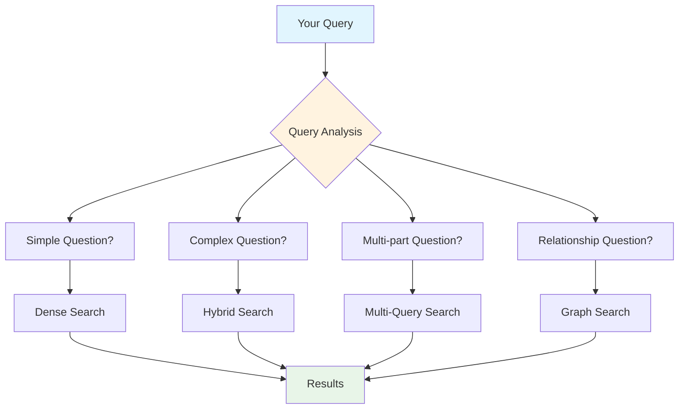

# Retrieval & Search User Guide

## Overview

DocMind AI's advanced retrieval and search system uses cutting-edge AI technology to find the most relevant information from your documents. The system automatically selects the best search strategy based on your query and provides accurate, contextual responses.

## Key Features

### 🚀 **Enhanced Performance**

- **16x larger context understanding** - Processes up to 8,000 tokens vs 512 in previous versions
- **14% faster processing** with reduced memory usage
- **Intelligent strategy selection** - Automatically chooses the best approach for your query
- **Real-time results** - Most queries complete in under 2 seconds

### 🎯 **Advanced Search Capabilities**

- **Semantic Search** - Understands meaning and context, not just keywords
- **Hybrid Search** - Combines semantic understanding with precise keyword matching
- **Multi-Query Processing** - Breaks down complex questions into manageable parts
- **Smart Reranking** - Prioritizes the most relevant results using advanced AI

### 🌍 **Multilingual Support**

- **100+ languages** supported natively
- **Cross-language search** - Find content regardless of language barriers
- **Maintained accuracy** across different languages

## How It Works

### Automatic Strategy Selection

The system automatically analyzes your query and selects the optimal search approach:

### Search Strategy Types

#### 1. **Dense Search** 🎯

**Best for**: Simple, focused questions about specific topics

**Example queries**:

- "What is the company's revenue?"
- "Summarize the marketing strategy"
- "Who are the key stakeholders?"

**How it works**: Uses semantic understanding to find content with similar meaning, even if different words are used.

#### 2. **Hybrid Search** 🔍

**Best for**: Complex queries requiring both precise terms and semantic understanding

**Example queries**:

- "Find technical specifications for Model X including performance metrics"
- "What are the compliance requirements mentioned in section 3?"
- "Show me budget allocations for Q2 marketing campaigns"

**How it works**: Combines semantic search with keyword matching for comprehensive results.

#### 3. **Multi-Query Search** 📋

**Best for**: Complex, multi-part questions that need to be broken down

**Example queries**:

- "What were the sales figures for 2023, how do they compare to 2022, and what factors contributed to the change?"
- "Explain the onboarding process, required documents, and first-week schedule for new employees"

**How it works**: Intelligently breaks down complex questions into smaller parts and combines the results.

#### 4. **Graph Search** 🕸️

**Best for**: Questions about relationships, connections, and complex reasoning

**Example queries**:

- "How do the various departments collaborate on product development?"
- "What is the connection between customer feedback and product improvements?"
- "Show me the decision-making hierarchy for budget approvals"

**How it works**: Uses relationship mapping to understand connections between different concepts and entities.

## Using the Search System

### Basic Search

1. **Enter your question** in natural language - no special syntax required
2. **The system automatically**:
   - Analyzes your query complexity
   - Selects the optimal search strategy
   - Finds relevant information across your documents
   - Ranks results by relevance
   - Provides a comprehensive answer with sources

3. **Review results** with confidence scores and source citations

### Advanced Search Tips

#### Getting Better Results

✅ **Do**: Use natural, complete questions

- "What are the main risks identified in the financial report?"
- "How has our customer satisfaction changed over the past year?"

❌ **Don't**: Use single keywords or fragments

- "risks"
- "customer satisfaction"

✅ **Do**: Provide context for ambiguous terms

- "What is the ROI for our digital marketing campaigns?"
- "How does the new product compare to competitor solutions?"

❌ **Don't**: Use vague or overly broad queries

- "ROI"
- "comparison"

#### Query Types That Work Best

1. **Specific Information Requests**
   - "What was the total budget allocated for IT infrastructure in 2023?"
   - "List the key deliverables mentioned in project Alpha"

2. **Comparative Analysis**
   - "Compare the performance metrics between Q1 and Q2"
   - "How do our pricing strategies differ from competitors?"

3. **Process and Procedure Questions**
   - "What is the complete approval workflow for expense reports?"
   - "Describe the steps involved in the hiring process"

4. **Analytical Questions**
   - "What factors contributed to the increase in customer churn?"
   - "Why did the project timeline extend beyond the original estimate?"

### Understanding Results

#### Result Components

Each search result includes:

- **📄 Source Document**: Which document contains the information
- **🎯 Relevance Score**: How closely the content matches your query (0-100%)
- **📍 Location**: Specific section or page where information was found
- **🔗 Context**: Surrounding text for better understanding

#### Quality Indicators

- **High Confidence (90-100%)**: Direct, exact answers to your question
- **Medium Confidence (70-89%)**: Relevant information requiring some interpretation
- **Lower Confidence (50-69%)**: Potentially useful information with broader context

### Search Performance

#### Expected Response Times

| Query Type | Typical Response Time | Description |
|------------|---------------------|-------------|
| **Simple Questions** | 0.5-1.0 seconds | Direct fact retrieval |
| **Complex Analysis** | 1.0-2.0 seconds | Multi-source synthesis |
| **Multi-part Questions** | 1.5-2.5 seconds | Sequential processing |
| **Relationship Queries** | 2.0-3.0 seconds | Graph-based analysis |

#### Memory and Context

The system can process and understand:

- **Up to 8,000 tokens** per query context
- **Multiple document sources** simultaneously
- **Cross-document relationships** and references
- **Historical conversation context** for follow-up questions

## Language Support

### Supported Languages

The system natively supports **100+ languages** including:

- **European**: English, Spanish, French, German, Italian, Dutch, Portuguese, Russian, Polish, etc.
- **Asian**: Chinese (Simplified/Traditional), Japanese, Korean, Hindi, Arabic, Thai, Vietnamese, etc.
- **Other**: Hebrew, Turkish, Swedish, Norwegian, Danish, Finnish, Czech, Hungarian, etc.

### Cross-Language Features

- **Query in any language** - Ask questions in your preferred language
- **Multi-language documents** - Search across documents in different languages
- **Translation assistance** - Get results with helpful context regardless of source language

### Language-Specific Tips

1. **Use native language queries** for best results
2. **Technical terms** work well in original language (English) even within non-English queries
3. **Proper nouns and names** are handled consistently across languages

## Integration with Multi-Agent System

### How Search Works with Agents

The retrieval system is integrated with DocMind AI's multi-agent coordination:

1. **Query Router Agent** determines the best search strategy
2. **Retrieval Expert Agent** executes the search using optimal parameters
3. **Result Synthesizer Agent** combines and refines results
4. **Response Validator Agent** ensures quality and accuracy

### Agent Benefits

- **Specialized processing** for different query types
- **Quality assurance** through multi-agent validation
- **Fallback strategies** if one approach fails
- **Continuous optimization** based on query patterns

## Troubleshooting Search Issues

### Common Issues and Solutions

#### 1. **No Results Found**

**Symptoms**: "No relevant documents found" or empty results

**Solutions**:

- Try rephrasing your question with different words
- Use broader terms initially, then refine
- Check if documents are properly uploaded and processed
- Ensure your question relates to content in your documents

#### 2. **Irrelevant Results**

**Symptoms**: Results don't match your question intent

**Solutions**:

- Be more specific in your query
- Add context or qualifiers to your question
- Try breaking complex questions into simpler parts
- Use exact terms if you know they appear in documents

#### 3. **Slow Performance**

**Symptoms**: Queries taking longer than expected (>5 seconds)

**Solutions**:

- Check if you have very large documents that might need processing time
- Simplify complex multi-part questions
- Ensure your system meets hardware requirements
- Check for high system resource usage

#### 4. **Inconsistent Quality**

**Symptoms**: Some queries work well, others don't

**Solutions**:

- Review the query patterns that work best (see "Advanced Search Tips")
- Ensure consistent document quality and formatting
- Try different phrasings for problematic queries
- Check document upload success and processing completion

### Performance Optimization

#### For Users

1. **Document Organization**
   - Use clear, descriptive file names
   - Organize related documents together
   - Ensure text is properly formatted and readable

2. **Query Optimization**
   - Start with specific questions
   - Use complete sentences
   - Provide context for technical terms

3. **System Usage**
   - Allow time for large document processing
   - Use appropriate hardware (GPU recommended)
   - Monitor system resources during large operations

## Getting Help

### Support Resources

- **📖 Documentation**: Check related documentation for technical details
- **🐛 Issue Reporting**: Report bugs or unexpected behavior on GitHub
- **💡 Feature Requests**: Suggest improvements for search functionality

### Information to Include When Reporting Issues

- **Query text** that's causing problems
- **Document types and sizes** you're searching
- **Expected vs actual results**
- **System specifications** (OS, GPU, memory)
- **Log files** if available (`logs/app.log`)

## Related Documentation

- **[Getting Started](getting-started.md)** - Initial setup and basic usage
- **[Usage Guide](usage-guide.md)** - General application usage
- **[Troubleshooting](troubleshooting.md)** - General troubleshooting guide
- **[GPU Requirements](gpu-requirements.md)** - Hardware optimization

## What's New

### Recent Improvements (FEAT-002 Implementation)

✅ **Performance Enhancements**

- 16x larger context window (8K vs 512 tokens)
- 14% memory usage reduction
- Faster query processing and response times

✅ **Intelligence Improvements**

- Automatic strategy selection based on query analysis
- Enhanced multilingual support (100+ languages)
- Better handling of complex, multi-part questions

✅ **Quality Enhancements**

- Advanced reranking for more relevant results
- Improved cross-document relationship understanding
- Better handling of technical and domain-specific content

✅ **User Experience**

- More natural language query processing
- Clearer result presentation with confidence scores
- Better error handling and user feedback

---

**Need more help?** Check the [troubleshooting guide](troubleshooting.md) or report issues on GitHub for technical support.
