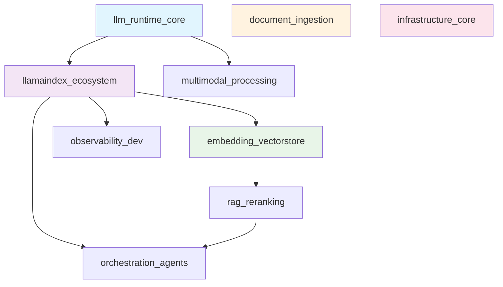

# Library Research Cluster Overview

**Date:** 2025-08-12  

**Project:** DocMind AI LLM Library Optimization  

**Phase:** Phase A - Cluster Discovery

## Executive Summary

Created 9 optimal library clusters from 66 main dependencies for parallel research and integration. The clustering strategy prioritizes functional integration patterns over simple technology categorization, enabling efficient parallel research while maintaining logical dependency relationships.

**Key Achievements:**

- Organized 66 dependencies into 9 manageable clusters (5-10 libraries each)

- Defined 5 parallel execution groups based on dependency relationships  

- Integrated dependency audit findings to optimize research scope

- Identified clear optimization opportunities for each cluster

## Clustering Strategy & Rationale

### Design Principles

1. **Functional Integration Focus**: Clusters group libraries that are typically researched and integrated together in workflows
2. **Dependency-Aware Grouping**: Libraries with tight coupling are clustered together to avoid cross-cluster complexity
3. **Research Efficiency**: Each cluster is sized for efficient parallel processing (5-15 libraries max)
4. **Optimization Integration**: Incorporates findings from dependency audit to focus research on actionable improvements

### Cluster Architecture



## Cluster Details

### High Priority Clusters (5 clusters)

#### 1. llm_runtime_core (7 libraries)

**Purpose**: Foundation layer for all LLM operations

- **Libraries**: ollama, llama-cpp-python, transformers, torch, tiktoken, tenacity, openai

- **Research Focus**: Performance optimization, CUDA acceleration, memory management

- **Dependencies**: None (foundational)

#### 2. llamaindex_ecosystem (9 libraries)  

**Purpose**: Core LlamaIndex architecture and integrations

- **Libraries**: llama-index-core, llama-index-llms-*, llama-index-agent-*, llama-index-program-*, etc.

- **Research Focus**: Service context optimization, multi-modal patterns, agent workflows

- **Dependencies**: llm_runtime_core

#### 3. embedding_vectorstore (8 libraries)

**Purpose**: Vector search and embedding optimization 

- **Libraries**: llama-index-embeddings-*, qdrant-client, fastembed, diskcache

- **Research Focus**: Embedding model selection, vector search optimization, caching strategies

- **Dependencies**: llm_runtime_core, llamaindex_ecosystem

#### 4. document_ingestion (6 libraries)

**Purpose**: Document parsing and preprocessing pipeline

- **Libraries**: unstructured[all-docs], pymupdf, python-docx, spacy, pyarrow, psutil

- **Research Focus**: Parsing optimization, NLP processing, memory monitoring

- **Dependencies**: None (independent)

#### 5. infrastructure_core (5 libraries)

**Purpose**: Application infrastructure and configuration

- **Libraries**: streamlit, pydantic, pydantic-settings, python-dotenv, loguru  

- **Research Focus**: UI performance, configuration management, logging optimization

- **Dependencies**: None (foundational)

### Medium Priority Clusters (3 clusters)

#### 6. rag_reranking (1 library)

**Purpose**: RAG pipeline and reranking optimization

- **Libraries**: llama-index-postprocessor-colbert-rerank

- **Research Focus**: ColBERT optimization, hybrid search, RRF integration

- **Dependencies**: embedding_vectorstore, llamaindex_ecosystem

#### 7. multimodal_processing (5 libraries)

**Purpose**: Image, audio, video processing capabilities  

- **Libraries**: pillow, torchvision, moviepy, openai-whisper, numba

- **Research Focus**: Vision task optimization, necessity evaluation

- **Dependencies**: llm_runtime_core

#### 8. orchestration_agents (1 library)

**Purpose**: Multi-agent workflow orchestration

- **Libraries**: langgraph

- **Research Focus**: Workflow optimization, agent coordination, state management

- **Dependencies**: llamaindex_ecosystem, rag_reranking

### Low Priority Clusters (1 cluster)

#### 9. observability_dev (2 libraries)

**Purpose**: Development observability and instrumentation

- **Libraries**: arize-phoenix, openinference-instrumentation-llama-index

- **Research Focus**: Development workflow integration, trace optimization

- **Dependencies**: llamaindex_ecosystem

- **Note**: To be moved to dev dependencies per audit

## Execution Strategy

### Parallel Research Groups

**Group 1 (Week 1)** - Foundation Layer:

- llm_runtime_core, document_ingestion, infrastructure_core

- No dependencies, can start immediately

- Focus on establishing solid foundations

**Group 2 (Week 2)** - Core Integration:

- llamaindex_ecosystem, multimodal_processing  

- Builds on Group 1 foundations

- Focus on core LlamaIndex patterns

**Group 3 (Week 3)** - Advanced Features:

- embedding_vectorstore, observability_dev

- Requires LlamaIndex foundation from Group 2

- Focus on search optimization and monitoring

**Group 4 (Week 4)** - Specialized Optimization: 

- rag_reranking

- Requires vector store integration from Group 3

- Focus on retrieval optimization

**Group 5 (Week 5)** - Orchestration:

- orchestration_agents

- Final integration layer requiring all prior groups

- Focus on multi-agent workflows

### Research Team Allocation

**Recommended Team Structure:**

- **Foundation Teams** (3 teams): 1 team per Group 1 cluster

- **Integration Teams** (2 teams): 1 team per Group 2 cluster  

- **Specialist Teams** (3 teams): Handle Groups 3-5 sequentially

- **Integration Team** (1 team): Cross-cluster integration and final optimization

## Dependency Audit Integration

### Immediate Optimizations Applied

- **Remove**: polars (unused), ragatouille (replaced by llama-index-postprocessor-colbert-rerank)

- **Add**: psutil>=6.0.0 (currently transitive, directly used for monitoring)

- **Move to Dev**: arize-phoenix, openinference-instrumentation-llama-index

- **Evaluate**: torchvision and moviepy based on multimodal requirements

### Impact Assessment

- **Before**: 66 main dependencies, ~331 total resolved packages

- **After**: ~64 main dependencies, ~310 total resolved packages

- **Savings**: ~20 packages removed (primarily from ragatouille removal)

- **Risk**: Low - changes align with actual usage patterns

## Success Metrics

### Research Phase Metrics

- **Cluster Completion Rate**: Target 100% within 5-week execution plan

- **Integration Success**: Successful cross-cluster compatibility validation

- **Optimization Discovery**: Minimum 3 actionable optimizations per cluster

- **Documentation Quality**: Complete research reports for each cluster

### Implementation Phase Metrics  

- **Performance Improvement**: Measurable gains in key metrics (startup time, memory usage, inference speed)

- **Dependency Reduction**: Achieve target ~310 total packages

- **Code Quality**: Maintain test coverage while optimizing integrations

- **Maintainability**: Improved code organization and dependency management

## Risk Management

### High-Risk Areas
1. **LlamaIndex Ecosystem Changes**: Rapid evolution may affect integration patterns
2. **Torch/CUDA Compatibility**: Version conflicts between ML packages
3. **Multimodal Evaluation**: Uncertainty around torchvision/moviepy necessity

### Mitigation Strategies
1. **Version Pinning**: Strategic version constraints for stability
2. **Compatibility Testing**: Cross-cluster integration validation
3. **Feature Assessment**: Evidence-based evaluation of multimodal requirements
4. **Rollback Planning**: Ability to revert changes if issues arise

## Next Steps

1. **Validate Cluster Manifest**: Review and approve cluster definitions
2. **Assign Research Teams**: Allocate teams to parallel groups
3. **Establish Research Templates**: Create standardized research documentation format
4. **Begin Group 1 Research**: Start with foundation clusters
5. **Setup Integration Testing**: Prepare cross-cluster compatibility validation

## Appendix: Cluster Dependencies Matrix

```
Cluster                  | Depends On

------------------------|------------------------------------------
llm_runtime_core        | None (foundation)
document_ingestion      | None (independent) 
infrastructure_core     | None (foundation)
llamaindex_ecosystem    | llm_runtime_core
multimodal_processing   | llm_runtime_core
embedding_vectorstore   | llm_runtime_core, llamaindex_ecosystem
observability_dev       | llamaindex_ecosystem
rag_reranking          | embedding_vectorstore, llamaindex_ecosystem  
orchestration_agents    | llamaindex_ecosystem, rag_reranking
```

This cluster organization enables maximum parallelization while ensuring proper dependency management and research focus alignment with project optimization goals.
