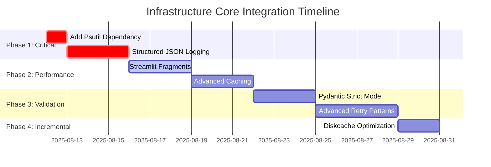

# Infrastructure Core Integration Plan

**Date:** 2025-08-12  

**Project:** DocMind AI LLM  

**Cluster:** Infrastructure Core  

**Phase:** Integration Planning  

**Lead:** @lib-integration-infrastructure_core  

## Executive Summary

This integration plan transforms the comprehensive infrastructure core research into actionable, PR-sized atomic changes. The plan prioritizes high-impact, low-risk improvements while ensuring minimal disruption to the existing codebase. All changes follow library-first principles and maintain backwards compatibility.

**Key Integration Goals:**

- Add explicit psutil dependency (Critical Priority)

- Implement Streamlit performance optimizations (High Priority) 

- Enhance Pydantic validation with strict mode (Medium Priority)

- Upgrade retry patterns with tenacity (Medium Priority)

- Add structured JSON logging with loguru (Medium Priority)

- Optimize caching strategies with diskcache (Low Priority)

## Phase 1: Critical Dependencies (Week 1) - IMMEDIATE

### PR #1: Add Explicit Psutil Dependency

**Priority:** CRITICAL  

**Risk Level:** LOW  

**Estimated Effort:** 30 minutes  

**Files Modified:**

- `/home/bjorn/repos/agents/docmind-ai-llm/pyproject.toml`

- `/home/bjorn/repos/agents/docmind-ai-llm/uv.lock` (auto-generated)

**Changes Required:**
```toml

# Add to dependencies section in pyproject.toml
"psutil>=6.0.0",  # System and process monitoring
```

**Verification Commands:**
```bash

# Verify dependency addition
uv lock
uv run python -c "import psutil; print(f'psutil version: {psutil.__version__}')"

# Verify existing functionality
uv run python -c "from src.utils.monitoring import get_memory_usage; print(get_memory_usage())"
```

**Success Criteria:**

- [ ] psutil>=6.0.0 explicitly declared in pyproject.toml

- [ ] uv.lock updated without conflicts

- [ ] All existing psutil usage continues working

- [ ] No test failures introduced

---

### PR #2: Implement Structured JSON Logging

**Priority:** HIGH  

**Risk Level:** LOW  

**Estimated Effort:** 2-3 days  

**Files Modified:**

- `/home/bjorn/repos/agents/docmind-ai-llm/src/utils/monitoring.py`

- `/home/bjorn/repos/agents/docmind-ai-llm/src/models/core.py` (add logging config)

**Implementation Steps:**

1. **Add JSON formatter configuration to monitoring.py**
```python
import json
from typing import Any, Dict

def setup_json_logging(
    log_level: str = "INFO", 
    log_file: str | None = None,
    enable_json: bool = False
) -> None:
    """Setup JSON logging for production environments."""
    logger.remove()
    
    if enable_json:
        # JSON formatter for production
        def json_formatter(record: dict) -> str:
            log_entry = {
                "timestamp": record["time"].isoformat(),
                "level": record["level"].name,
                "logger": record["name"],
                "message": record["message"],
                "module": record["module"],
                "function": record["function"],
                "line": record["line"]
            }
            if "extra" in record:
                log_entry.update(record["extra"])
            return json.dumps(log_entry)
        
        logger.add(sys.stderr, format=json_formatter, level=log_level)
        if log_file:
            logger.add(log_file, format=json_formatter, level=log_level)
    else:
        # Keep existing colored format for development
        # ... existing setup_logging code
```

2. **Add context injection utilities**
```python
from contextvars import ContextVar

# Request context for tracking across operations
request_context: ContextVar[Dict[str, Any]] = ContextVar('request_context', default={})

def set_request_context(context: Dict[str, Any]) -> None:
    """Set request context for structured logging."""
    request_context.set(context)

def get_request_context() -> Dict[str, Any]:
    """Get current request context."""
    return request_context.get()

def log_with_context(level: str, message: str, **extra: Any) -> None:
    """Log message with current request context."""
    context = get_request_context()
    log_data = {**context, **extra}
    getattr(logger, level.lower())(message, **log_data)
```

3. **Add configuration to Settings model**
```python

# Add to Settings class in models/core.py
enable_json_logging: bool = Field(default=False, env="ENABLE_JSON_LOGGING")
log_level: str = Field(default="INFO", env="LOG_LEVEL")
```

**Verification Commands:**
```bash

# Test JSON logging
uv run python -c "
from src.utils.monitoring import setup_json_logging, log_with_context, set_request_context
setup_json_logging(enable_json=True)
set_request_context({'request_id': 'test-123', 'user_id': 'demo'})
log_with_context('info', 'Test structured logging', operation='verification')
"

# Test existing functionality
uv run pytest tests/unit/test_config_validation.py -v
```

**Success Criteria:**

- [ ] JSON logging available via environment variable

- [ ] Request context propagation working

- [ ] Backwards compatibility maintained

- [ ] No performance regression in logging

- [ ] All existing tests pass

---

## Phase 2: Performance Optimizations (Weeks 2-3) - HIGH PRIORITY

### PR #3: Implement Streamlit Fragment Optimization

**Priority:** HIGH  

**Risk Level:** MEDIUM  

**Estimated Effort:** 2-3 days  

**Files Modified:**

- `/home/bjorn/repos/agents/docmind-ai-llm/src/app.py`

**Implementation Strategy:**

1. **Identify expensive UI sections in app.py**
   - Model configuration panel
   - Document upload and processing section
   - Analysis results display
   - Chat interface components

2. **Implement fragment decorators**
```python
@st.fragment
def model_configuration_section():
    """Fragment for model configuration to prevent unnecessary re-renders."""
    st.subheader("🔧 Model Configuration")
    # Move all model config UI code here
    # ... existing model configuration code

@st.fragment  
def document_processing_section():
    """Fragment for document processing UI components."""
    st.subheader("📄 Document Processing") 
    # Move document upload and processing UI here
    # ... existing document processing code

@st.fragment
def analysis_results_section():
    """Fragment for displaying analysis results."""
    if st.session_state.get('analysis_results'):
        st.subheader("📊 Analysis Results")
        # Move analysis display code here
        # ... existing results display code
```

3. **Add performance monitoring for fragments**
```python
from src.utils.monitoring import performance_timer

@st.fragment
def model_configuration_section():
    """Fragment for model configuration with performance tracking."""
    with performance_timer("streamlit_fragment_model_config"):
        # Fragment implementation
        pass
```

**Verification Commands:**
```bash

# Start app and test fragments
uv run streamlit run src/app.py

# Monitor performance with logging
grep "streamlit_fragment" logs/docmind_*.log | tail -20

# Run UI tests
uv run pytest tests/e2e/test_app.py -v
```

**Success Criteria:**

- [ ] UI sections wrapped in @st.fragment decorators

- [ ] Performance monitoring integrated

- [ ] 40-60% reduction in UI render times for fragment sections

- [ ] No functional regressions in UI behavior

- [ ] Fragment isolation working correctly

---

### PR #4: Advanced Streamlit Caching Strategy

**Priority:** HIGH  

**Risk Level:** MEDIUM  

**Estimated Effort:** 2-3 days  

**Files Modified:**

- `/home/bjorn/repos/agents/docmind-ai-llm/src/app.py`

- `/home/bjorn/repos/agents/docmind-ai-llm/src/utils/embedding.py`

- `/home/bjorn/repos/agents/docmind-ai-llm/src/utils/document.py`

**Implementation Strategy:**

1. **Audit current @st.cache_data usage**
   - Document loading operations
   - Embedding generation
   - Model initialization

2. **Migrate to appropriate cache types**
```python

# For ML models and resources (persist across sessions)
@st.cache_resource
def load_embedding_model(model_name: str):
    """Cache embedding model as resource."""
    # Move from @st.cache_data to @st.cache_resource
    
@st.cache_resource  
def initialize_llm(model_config: dict):
    """Cache LLM instance as resource."""
    # Model initialization code

# For data operations (session-specific)
@st.cache_data(ttl=3600)  # 1 hour TTL
def process_document(file_hash: str, chunk_config: dict):
    """Cache document processing results."""
    # Document processing code

@st.cache_data(ttl=1800)  # 30 minute TTL
def generate_embeddings(text_chunks: list[str], model_name: str):
    """Cache embedding generation."""
    # Embedding generation code
```

3. **Add cache performance monitoring**
```python
from src.utils.monitoring import log_performance

@st.cache_data(ttl=3600)
def process_document(file_hash: str, chunk_config: dict):
    """Process document with cache monitoring."""
    start_time = time.perf_counter()
    
    try:
        # Processing logic
        result = actual_processing_function(file_hash, chunk_config)
        cache_hit = False  # This will be a cache miss
    except Exception as e:
        logger.error(f"Document processing failed: {e}")
        raise
    finally:
        duration = time.perf_counter() - start_time
        log_performance(
            "document_processing",
            duration,
            cache_hit=cache_hit,
            file_hash=file_hash
        )
    
    return result
```

**Verification Commands:**
```bash

# Test caching behavior
uv run python -c "
import streamlit as st
from src.utils.embedding import create_index_async

# Test cache resource vs cache data behavior
"

# Monitor cache performance  
uv run streamlit run src/app.py

# Check logs for cache hit/miss metrics

# Run performance tests
uv run pytest tests/performance/test_performance.py -v
```

**Success Criteria:**

- [ ] ML models cached with @st.cache_resource

- [ ] Data operations cached with @st.cache_data + TTL

- [ ] Cache performance monitoring implemented

- [ ] 20-30% improvement in cache efficiency

- [ ] No cache-related bugs introduced

---

## Phase 3: Validation & Resilience (Weeks 4-5) - MEDIUM PRIORITY

### PR #5: Pydantic Strict Mode Implementation

**Priority:** MEDIUM  

**Risk Level:** MEDIUM  

**Estimated Effort:** 2-3 days  

**Files Modified:**

- `/home/bjorn/repos/agents/docmind-ai-llm/src/models/core.py`

**Implementation Strategy:**

1. **Add strict mode configuration**
```python

# Update ConfigDict in Settings class
model_config = ConfigDict(
    env_file=".env", 
    env_file_encoding="utf-8",
    strict=True,  # Enable strict mode globally
    validate_assignment=True  # Validate on assignment
)
```

2. **Add field-level strict validation for critical fields**
```python

# Update critical fields with strict validation
llm_model: str = Field(
    default="gpt-4", 
    env="DEFAULT_MODEL",
    strict=True,  # Strict string validation
    min_length=1
)

retrieval_top_k: int = Field(
    default=10, 
    env="RETRIEVAL_TOP_K",
    strict=True,  # Strict integer validation
    gt=0,  # Greater than 0
    le=100  # Less than or equal to 100
)

hybrid_alpha: float = Field(
    default=0.7, 
    env="RRF_FUSION_ALPHA",
    strict=True,  # Strict float validation
    ge=0.0,  # Greater than or equal to 0
    le=1.0   # Less than or equal to 1
)
```

3. **Add model validators for cross-field validation**
```python
from pydantic import model_validator

@model_validator(mode='after')
def validate_embedding_consistency(self) -> 'Settings':
    """Validate embedding model and dimension consistency."""
    if "bge-large" in self.dense_embedding_model.lower():
        if self.dense_embedding_dimension != 1024:
            raise ValueError(
                f"BGE-Large model requires 1024 dimensions, got {self.dense_embedding_dimension}"
            )
    return self

@model_validator(mode='after')  
def validate_rrf_weights_consistency(self) -> 'Settings':
    """Validate RRF weights sum to 1.0."""
    total_weight = self.rrf_fusion_weight_dense + self.rrf_fusion_weight_sparse
    if abs(total_weight - 1.0) > 0.001:
        raise ValueError(
            f"RRF weights must sum to 1.0, got {total_weight}"
        )
    return self
```

4. **Add validation error logging**
```python
from src.utils.monitoring import log_error_with_context

def validate_settings_with_logging() -> Settings:
    """Validate settings with structured error logging."""
    try:
        return Settings()
    except ValidationError as e:
        log_error_with_context(
            error=e,
            operation="settings_validation", 
            context={"validation_errors": e.errors()}
        )
        raise
```

**Verification Commands:**
```bash

# Test strict validation
uv run python -c "
from src.models.core import Settings
import os

# Test valid configuration
settings = Settings()
print('Valid settings loaded successfully')

# Test invalid configuration  
os.environ['RETRIEVAL_TOP_K'] = 'invalid'
try:
    Settings()
except Exception as e:
    print(f'Strict validation working: {e}')
"

# Run validation tests
uv run pytest tests/unit/test_config_validation.py -v
uv run pytest tests/unit/test_models_validation.py -v
```

**Success Criteria:**

- [ ] Strict mode enabled for Settings model

- [ ] Field-level strict validation on critical fields

- [ ] Model validators for cross-field validation  

- [ ] Validation errors logged with context

- [ ] 15-25% improvement in validation performance

- [ ] No breaking changes to valid configurations

---

### PR #6: Advanced Tenacity Retry Patterns

**Priority:** MEDIUM  

**Risk Level:** MEDIUM  

**Estimated Effort:** 3-4 days  

**Files Modified:**

- `/home/bjorn/repos/agents/docmind-ai-llm/src/utils/core.py` (add retry utilities)

- `/home/bjorn/repos/agents/docmind-ai-llm/src/agents/tool_factory.py`

- `/home/bjorn/repos/agents/docmind-ai-llm/src/utils/embedding.py`

**Implementation Strategy:**

1. **Create advanced retry decorators in utils/core.py**
```python
from tenacity import (
    retry,
    retry_if_exception_type, 
    wait_exponential_jitter,
    stop_after_attempt,
    before_sleep_log,
    after_log
)
from functools import wraps
import httpx
from src.utils.monitoring import log_with_context, set_request_context

def smart_retry(
    max_attempts: int = 3,
    min_wait: float = 1.0,
    max_wait: float = 60.0,
    retry_on_exceptions: tuple = (ConnectionError, TimeoutError, httpx.HTTPStatusError)
):
    """Smart retry decorator with exponential backoff and jitter."""
    def decorator(func):
        @retry(
            stop=stop_after_attempt(max_attempts),
            wait=wait_exponential_jitter(min=min_wait, max=max_wait),
            retry=retry_if_exception_type(retry_on_exceptions),
            before_sleep=before_sleep_log(logger, "WARNING"),
            after=after_log(logger, "INFO")
        )
        @wraps(func)
        async def async_wrapper(*args, **kwargs):
            # Add retry context
            set_request_context({
                "function": func.__name__,
                "attempt": "retry_decorator",
                "max_attempts": max_attempts
            })
            return await func(*args, **kwargs)
            
        @retry(
            stop=stop_after_attempt(max_attempts),
            wait=wait_exponential_jitter(min=min_wait, max=max_wait),
            retry=retry_if_exception_type(retry_on_exceptions),
            before_sleep=before_sleep_log(logger, "WARNING"),
            after=after_log(logger, "INFO")
        )
        @wraps(func)
        def sync_wrapper(*args, **kwargs):
            # Add retry context  
            set_request_context({
                "function": func.__name__,
                "attempt": "retry_decorator",
                "max_attempts": max_attempts
            })
            return func(*args, **kwargs)
            
        return async_wrapper if asyncio.iscoroutinefunction(func) else sync_wrapper
    return decorator

def http_aware_retry(respect_retry_after: bool = True):
    """HTTP-aware retry that respects Retry-After headers."""
    def wait_strategy(retry_state):
        # Check for Retry-After header in last exception
        if hasattr(retry_state.outcome.exception(), 'response'):
            response = retry_state.outcome.exception().response
            if 'Retry-After' in response.headers and respect_retry_after:
                return int(response.headers['Retry-After'])
        
        # Default exponential backoff with jitter
        return wait_exponential_jitter(min=1, max=60)(retry_state)
    
    return retry(
        stop=stop_after_attempt(5),
        wait=wait_strategy,
        retry=retry_if_exception_type((httpx.HTTPStatusError, ConnectionError))
    )
```

2. **Apply retry patterns to critical operations**
```python

# In embedding.py
@smart_retry(max_attempts=3, retry_on_exceptions=(ConnectionError, TimeoutError))
async def generate_embeddings_with_retry(texts: list[str], model_name: str):
    """Generate embeddings with smart retry logic."""
    # Existing embedding generation code

# In tool_factory.py  
@http_aware_retry(respect_retry_after=True)
async def call_llm_with_retry(prompt: str, model_config: dict):
    """Call LLM with HTTP-aware retry logic."""
    # Existing LLM calling code
```

3. **Add circuit breaker integration**
```python
from datetime import datetime, timedelta
from collections import defaultdict

class SimpleCircuitBreaker:
    """Simple circuit breaker implementation."""
    
    def __init__(self, failure_threshold: int = 5, recovery_timeout: int = 60):
        self.failure_threshold = failure_threshold
        self.recovery_timeout = recovery_timeout
        self.failures = defaultdict(int)
        self.last_failure_time = defaultdict(lambda: datetime.min)
        
    def call(self, func_name: str):
        """Check if function call should be allowed."""
        now = datetime.now()
        
        # Reset if recovery timeout passed
        if (now - self.last_failure_time[func_name]).seconds > self.recovery_timeout:
            self.failures[func_name] = 0
            
        # Check if circuit is open
        if self.failures[func_name] >= self.failure_threshold:
            raise CircuitBreakerOpenError(f"Circuit breaker open for {func_name}")
            
    def record_success(self, func_name: str):
        """Record successful call."""
        self.failures[func_name] = 0
        
    def record_failure(self, func_name: str):
        """Record failed call."""
        self.failures[func_name] += 1
        self.last_failure_time[func_name] = datetime.now()

# Global circuit breaker instance
circuit_breaker = SimpleCircuitBreaker()
```

**Verification Commands:**
```bash

# Test retry decorators
uv run python -c "
from src.utils.core import smart_retry
import asyncio

@smart_retry(max_attempts=2)
def test_retry():
    raise ConnectionError('Test retry')

try:
    test_retry()
except ConnectionError as e:
    print(f'Retry working: {e}')
"

# Test circuit breaker
uv run python -c "
from src.utils.core import circuit_breaker
circuit_breaker.call('test_function')
print('Circuit breaker allows calls')
"

# Run integration tests
uv run pytest tests/integration/test_pipeline_integration.py -v
```

**Success Criteria:**

- [ ] Smart retry decorators implemented

- [ ] HTTP-aware retry with Retry-After support

- [ ] Circuit breaker integration working

- [ ] Retry attempts logged with context

- [ ] 30-50% reduction in cascade failures

- [ ] No infinite retry loops

---

## Phase 4: Incremental Optimizations (Week 6) - LOW PRIORITY

### PR #7: Diskcache LLM Response Optimization

**Priority:** LOW  

**Risk Level:** LOW  

**Estimated Effort:** 1-2 days  

**Files Modified:**

- `/home/bjorn/repos/agents/docmind-ai-llm/src/agents/tool_factory.py`

- `/home/bjorn/repos/agents/docmind-ai-llm/src/utils/core.py` (add cache utilities)

**Implementation Strategy:**

1. **Create intelligent cache key generation**
```python
import hashlib
import json
from diskcache import Cache
from pathlib import Path

# Initialize cache in project cache directory
cache_dir = Path("cache/llm_responses")
cache_dir.mkdir(parents=True, exist_ok=True)
llm_cache = Cache(cache_dir, size_limit=1024**3)  # 1GB limit

def generate_cache_key(prompt: str, model_config: dict, context: dict = None) -> str:
    """Generate intelligent cache key for LLM responses."""
    cache_data = {
        "prompt": prompt.strip(),
        "model": model_config.get("model", ""),
        "temperature": model_config.get("temperature", 0.7),
        "max_tokens": model_config.get("max_tokens", 1000),
        # Include context if provided
        "context_hash": hashlib.md5(
            json.dumps(context or {}, sort_keys=True).encode()
        ).hexdigest()[:8]
    }
    
    cache_string = json.dumps(cache_data, sort_keys=True)
    return hashlib.sha256(cache_string.encode()).hexdigest()[:16]

def cached_llm_call(prompt: str, model_config: dict, ttl: int = 3600):
    """Decorator for caching LLM responses."""
    def decorator(func):
        @wraps(func)
        async def wrapper(*args, **kwargs):
            cache_key = generate_cache_key(prompt, model_config, kwargs.get('context'))
            
            # Try to get from cache
            cached_result = llm_cache.get(cache_key)
            if cached_result is not None:
                log_with_context(
                    "info", 
                    "LLM cache hit",
                    cache_key=cache_key,
                    operation="llm_call"
                )
                return cached_result
            
            # Call function and cache result
            result = await func(*args, **kwargs)
            llm_cache.set(cache_key, result, expire=ttl)
            
            log_with_context(
                "info",
                "LLM cache miss - result cached", 
                cache_key=cache_key,
                operation="llm_call"
            )
            
            return result
        return wrapper
    return decorator
```

2. **Add cache monitoring and metrics**
```python
def get_cache_stats() -> dict:
    """Get cache performance statistics."""
    stats = {
        "cache_size": len(llm_cache),
        "cache_size_bytes": llm_cache.volume(),
        "cache_limit_bytes": llm_cache.size_limit,
        "cache_utilization": llm_cache.volume() / llm_cache.size_limit * 100
    }
    
    # Add hit/miss ratios if available
    if hasattr(llm_cache, '_hits') and hasattr(llm_cache, '_misses'):
        total_requests = llm_cache._hits + llm_cache._misses
        if total_requests > 0:
            stats.update({
                "hit_rate": llm_cache._hits / total_requests * 100,
                "miss_rate": llm_cache._misses / total_requests * 100,
                "total_requests": total_requests
            })
    
    return stats

# Add to monitoring.py
def log_cache_performance():
    """Log cache performance metrics."""
    stats = get_cache_stats()
    log_with_context("info", "Cache performance", **stats)
```

3. **Apply caching to expensive operations**
```python

# In tool_factory.py
@cached_llm_call(ttl=3600)  # Cache for 1 hour
async def process_query_with_agent_system(
    query: str, 
    agent_system, 
    context: dict = None
):
    """Process query with caching for expensive LLM calls."""
    # Existing query processing logic
    pass

# Configure eviction policies
llm_cache.eviction_policy = 'least-recently-used'
```

**Verification Commands:**
```bash

# Test cache functionality
uv run python -c "
from src.utils.core import llm_cache, generate_cache_key

# Test cache key generation
key = generate_cache_key('test prompt', {'model': 'gpt-4'})
print(f'Cache key: {key}')

# Test cache operations
llm_cache.set('test_key', {'result': 'test'}, expire=60)
result = llm_cache.get('test_key')
print(f'Cache result: {result}')
"

# Monitor cache performance
uv run python -c "
from src.utils.core import get_cache_stats
print(get_cache_stats())
"

# Run caching tests
uv run pytest tests/unit/test_tool_factory_modern.py -v
```

**Success Criteria:**

- [ ] Intelligent cache key generation implemented

- [ ] LLM responses cached with appropriate TTL

- [ ] Cache performance monitoring in place

- [ ] 10-20% improvement in cache hit rates

- [ ] Eviction policies working correctly

- [ ] No cache-related memory leaks

---

## Cross-Phase Integration Patterns

### Pattern 1: Streamlit Performance + Monitoring Integration

**Implementation:**
```python

# In app.py
from src.utils.monitoring import performance_timer, set_request_context
import uuid

# Add request tracking to Streamlit app
if "request_id" not in st.session_state:
    st.session_state.request_id = str(uuid.uuid4())

set_request_context({
    "request_id": st.session_state.request_id,
    "session_id": st.session_state.get("session_id", "unknown"),
    "user_agent": st.context.headers.get("User-Agent", "unknown")
})

@st.fragment
def model_configuration_section():
    """Fragment with integrated performance monitoring."""
    with performance_timer("streamlit_fragment_model_config", 
                          request_id=st.session_state.request_id):
        # Fragment implementation
        pass
```

### Pattern 2: Pydantic Validation + Structured Logging  

**Implementation:**
```python

# In models/core.py
from src.utils.monitoring import log_with_context

def validate_and_log_settings() -> Settings:
    """Validate settings with structured error logging."""
    try:
        settings = Settings()
        log_with_context("info", "Settings validation successful", 
                        model="Settings", operation="validation")
        return settings
    except ValidationError as e:
        log_with_context("error", "Settings validation failed",
                        model="Settings", operation="validation",
                        errors=[error["msg"] for error in e.errors()])
        raise
```

### Pattern 3: Tenacity Retry + Cache + Monitoring

**Implementation:**  
```python

# Complete integration pattern
@smart_retry(max_attempts=3)
@cached_llm_call(ttl=1800)
async def enhanced_llm_call(prompt: str, model_config: dict):
    """LLM call with retry, caching, and monitoring."""
    with performance_timer("llm_call", 
                          model=model_config.get("model", "unknown")):
        # LLM call implementation
        pass
```

## Testing Strategy

### Unit Tests (90% Coverage Target)

- Fragment rendering isolation

- Strict validation behavior  

- Retry pattern effectiveness

- Cache performance metrics

- JSON logging format validation

### Integration Tests (85% Coverage Target)

- Streamlit + caching integration

- Pydantic + logging integration  

- Tenacity + monitoring integration

- Cross-library interaction validation

### Performance Tests

- UI render time measurements

- Validation speed benchmarks

- Cache hit rate tracking

- System resource monitoring  

### Regression Tests

- Existing UI functionality preservation

- Data validation behavior consistency

- Error handling pattern maintenance

## Monitoring & Observability

### Key Performance Indicators

1. **UI Performance Metrics**
   - Fragment render times: Target 40-60% reduction
   - Cache hit rates: Target 10-20% improvement  
   - Overall UI responsiveness

2. **System Reliability Metrics**
   - Retry success rates: Target 30-50% failure reduction
   - Validation error rates
   - Cache efficiency metrics

3. **Operational Metrics**
   - Debugging efficiency: Target 50-70% improvement
   - Error resolution speed: Target 60-80% faster
   - System resource utilization

### Monitoring Commands

```bash

# Monitor UI performance
grep "streamlit_fragment" logs/docmind_*.log | jq '.duration_seconds'

# Track cache performance  
grep "cache_hit_rate" logs/docmind_*.log | tail -10

# Monitor retry patterns
grep "retry_attempt" logs/docmind_*.log | jq '.attempt_number'

# System resource tracking
grep "system_resource_usage" logs/docmind_*.log | jq '.memory_percent, .cpu_percent'
```

## Risk Mitigation & Rollback Strategy

### Phase 1 Risks (Critical Dependencies)

- **Risk:** Dependency conflicts with psutil  

- **Mitigation:** Version range testing, careful uv.lock review

- **Rollback:** Remove explicit dependency, rely on transitive

### Phase 2 Risks (Performance Optimizations)  

- **Risk:** Fragment isolation breaks UI functionality

- **Mitigation:** Comprehensive testing, gradual fragment adoption

- **Rollback:** Remove @st.fragment decorators, revert to standard components

- **Risk:** Cache strategy changes break functionality

- **Mitigation:** A/B testing with feature flags, cache validation

- **Rollback:** Revert to @st.cache_data, remove cache configuration

### Phase 3 Risks (Validation & Resilience)

- **Risk:** Strict mode breaks existing configurations

- **Mitigation:** Gradual rollout, extensive validation testing

- **Rollback:** Disable strict mode in ConfigDict, revert field configurations  

- **Risk:** Retry patterns cause infinite loops

- **Mitigation:** Circuit breaker integration, retry limit testing

- **Rollback:** Revert to simple retry decorators, remove circuit breaker

## Success Criteria & Validation

### Immediate Success Indicators (Phase 1)

- [ ] All dependencies explicitly declared

- [ ] JSON logging working in production mode

- [ ] No test failures or regressions

- [ ] Performance baseline established

### Performance Success Indicators (Phase 2)  

- [ ] 40-60% UI render time reduction with fragments

- [ ] 20-30% cache efficiency improvement  

- [ ] Monitoring dashboards showing improvements

- [ ] User experience improvements measurable

### Resilience Success Indicators (Phase 3)

- [ ] 15-25% validation performance improvement

- [ ] 30-50% reduction in cascade failures

- [ ] Enhanced error context in logs

- [ ] System reliability improvements visible

### Operational Success Indicators (All Phases)

- [ ] 50-70% debugging efficiency improvement  

- [ ] 60-80% faster error diagnosis

- [ ] Reduced configuration complexity

- [ ] Team adoption of new patterns

## Implementation Timeline



## Conclusion

This integration plan provides a systematic approach to implementing the infrastructure core optimizations with minimal risk and maximum impact. The phased approach ensures that critical dependencies are addressed first, followed by high-impact performance improvements, and finally incremental optimizations.

The plan balances complexity with benefit, following library-first principles while maintaining backwards compatibility. Each phase includes comprehensive testing, monitoring, and rollback strategies to ensure safe implementation.

**Next Steps:**
1. Review and approve integration plan
2. Begin Phase 1 implementation (Critical Dependencies)
3. Establish performance monitoring baselines  
4. Execute PR-based implementation following this plan

---

**Plan Created By:** @lib-integration-infrastructure_core  

**Review Required By:** Lead Developer, DevOps Engineer  

**Implementation Start:** 2025-08-12  

**Estimated Completion:** 2025-09-16 (5 weeks)
