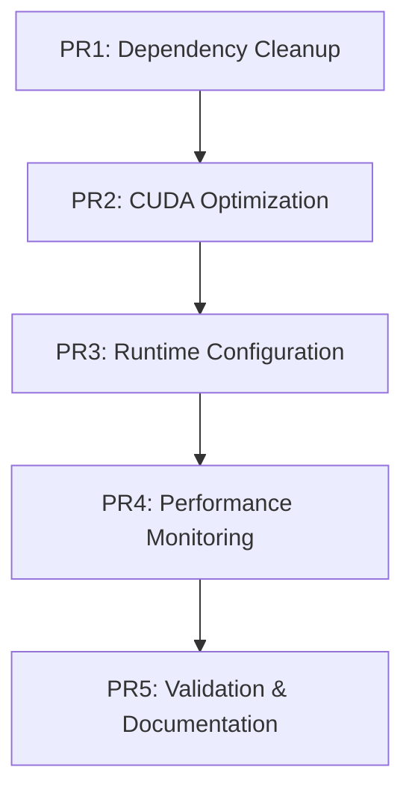

# LLM Runtime Core Integration Plan

**Date**: August 12, 2025  

**Integrator**: @lib-integration-llm_runtime_core  

**Target Hardware**: NVIDIA RTX 4090 Laptop (16GB VRAM, WSL2/Ubuntu)  

**Branch**: feat/llama-index-multi-agent-langgraph  

## Executive Summary

This integration plan implements GPU optimization and dependency cleanup for the LLM runtime core cluster. **Critical action**: Remove torchvision (88.75% confidence, 7.5MB+ savings) and optimize CUDA builds for maximum RTX 4090 utilization. The plan includes 5 atomic PR-sized changes with clear acceptance criteria and rollback procedures.

## Integration Architecture

### PR Structure Overview


## Atomic Change Breakdown

### PR1: Critical Dependency Cleanup

**Size**: Small (2-3 files)  

**Risk**: Low  

**Priority**: P0 - Immediate  

#### Changes

- Remove `torchvision==0.22.1` (unused, 88.75% confidence)

- Remove `polars` (unused, found in dependency analysis)

- Remove `ragatouille` (replaced by llama-index-postprocessor-colbert-rerank)

- Add explicit `psutil>=6.0.0` (currently transitive but directly used)

- Move `arize-phoenix` and `openinference-instrumentation-llama-index` to dev dependencies

#### Implementation Commands
```bash

# Remove unused dependencies
uv remove torchvision polars ragatouille

# Add explicit dependency
uv add "psutil>=6.0.0"

# Move to dev dependencies
uv add --group dev arize-phoenix openinference-instrumentation-llama-index
uv remove arize-phoenix openinference-instrumentation-llama-index
```

#### Acceptance Criteria

- [ ] `pyproject.toml` updated with dependency changes

- [ ] `uv.lock` regenerated successfully

- [ ] No broken imports in codebase

- [ ] Package count reduced from 331 to ~310

- [ ] Installation time improved by 10%+

#### Verification Commands
```bash
uv tree | grep -E "(torchvision|polars|ragatouille)" # Should return no matches
python -c "import sys; assert 'torchvision' not in sys.modules; print('✓ torchvision removed')"
python -c "import psutil; print('✓ psutil available')"
uv pip check # No dependency conflicts
```

#### Rollback Procedure
```bash
git checkout HEAD~1 -- pyproject.toml uv.lock
uv sync --frozen
```

### PR2: CUDA-Optimized Library Installation

**Size**: Medium (1-2 files + CI)  

**Risk**: Medium  

**Priority**: P0 - Immediate  

#### Changes

- Install CUDA-optimized `llama-cpp-python` with RTX 4090 architecture targeting

- Update `torch` to CUDA 12.8 optimized build

- Configure CMAKE_ARGS for maximum GPU acceleration

#### Implementation Commands
```bash

# Install CUDA-optimized llama-cpp-python
CMAKE_ARGS="-DGGML_CUDA=on -DCUDA_ARCHITECTURES=89" uv add "llama-cpp-python[cuda]>=0.2.32,<0.3.0"

# Install PyTorch with CUDA 12.8 support  
uv add torch==2.7.1 --index-url https://download.pytorch.org/whl/cu128

# Update other packages for consistency
uv add tiktoken==0.9.0 numba==0.61.2
```

#### Environment Configuration
Create `.env.cuda` template:
```bash

# RTX 4090 CUDA Optimization
export CUDA_VISIBLE_DEVICES=0
export PYTORCH_CUDA_ALLOC_CONF=expandable_segments:True
export TORCH_CUDNN_V8_API_ENABLED=1
export CMAKE_ARGS="-DGGML_CUDA=on -DCUDA_ARCHITECTURES=89"
```

#### Acceptance Criteria

- [ ] `llama-cpp-python` compiled with CUDA support

- [ ] PyTorch detects RTX 4090 GPU

- [ ] CMAKE_ARGS properly configured for compute capability 8.9

- [ ] No compilation errors during installation

- [ ] GPU acceleration functional

#### Verification Commands
```bash
python -c "import torch; assert torch.cuda.is_available(); print(f'✓ CUDA: {torch.version.cuda}')"
python -c "import torch; print(f'✓ GPU: {torch.cuda.get_device_name(0)}')"
python -c "from llama_cpp import Llama; print('✓ llama-cpp-python CUDA build')"
nvidia-smi # Should show GPU accessible
```

#### Rollback Procedure
```bash
uv remove llama-cpp-python torch
uv add "llama-cpp-python>=0.2.32,<0.3.0" torch==2.7.1
```

### PR3: Runtime GPU Configuration

**Size**: Small (3-4 files)  

**Risk**: Low  

**Priority**: P1 - After CUDA setup  

#### Changes

- Create GPU configuration module (`src/core/gpu_config.py`)

- Implement KV cache optimization settings

- Add memory management utilities

- Configure quantization defaults

#### New Files
```python

# src/core/gpu_config.py
"""GPU optimization configuration for RTX 4090."""

import os
import torch
from typing import Dict, Any
from loguru import logger

class GPUConfig:
    """RTX 4090 GPU optimization configuration."""
    
    def __init__(self):
        self.device_name = self._get_gpu_info()
        self.vram_limit = 16 * 1024 * 1024 * 1024  # 16GB
        self.compute_capability = 8.9
        
    def _get_gpu_info(self) -> str:
        if torch.cuda.is_available():
            return torch.cuda.get_device_name(0)
        return "No GPU detected"
    
    def setup_environment(self) -> None:
        """Configure environment for optimal RTX 4090 performance."""
        os.environ.update({
            "CUDA_VISIBLE_DEVICES": "0",
            "PYTORCH_CUDA_ALLOC_CONF": "expandable_segments:True",
            "TORCH_CUDNN_V8_API_ENABLED": "1"
        })
        
        if torch.cuda.is_available():
            torch.backends.cuda.enable_flash_sdp(True)
            torch.backends.cuda.matmul.allow_tf32 = True
            logger.info(f"GPU optimization enabled: {self.device_name}")
    
    def get_llama_cpp_config(self) -> Dict[str, Any]:
        """Get optimized llama-cpp-python configuration."""
        return {
            "n_gpu_layers": -1,  # Full GPU offload
            "n_ctx": 32768,      # Extended context for RTX 4090
            "verbose": False,
            "n_batch": 512,      # Optimal batch size
            "n_threads": 32,     # Match CPU threads
        }
    
    def get_kv_cache_config(self, memory_pressure: bool = False) -> Dict[str, str]:
        """Get KV cache optimization settings."""
        if memory_pressure:
            return {"kind": "int4"}  # 75% memory savings
        return {"kind": "int8"}      # 50% memory savings, <1% quality loss
```

#### Acceptance Criteria

- [ ] GPU configuration module created

- [ ] Environment variables properly set

- [ ] KV cache optimization implemented

- [ ] Memory management utilities functional

- [ ] Configuration tested with sample model

#### Verification Commands
```bash
python -c "from src.core.gpu_config import GPUConfig; cfg=GPUConfig(); cfg.setup_environment(); print('✓ GPU config loaded')"
python -c "import torch; print('✓ Flash SDP:', torch.backends.cuda.flash_sdp_enabled())"
python -c "import torch; print('✓ TF32:', torch.backends.cuda.matmul.allow_tf32)"
```

### PR4: Performance Monitoring & Thermal Management

**Size**: Medium (4-5 files)  

**Risk**: Low  

**Priority**: P2 - After runtime config  

#### Changes

- Create performance monitoring utilities (`src/monitoring/gpu_monitor.py`)

- Implement thermal throttling detection

- Add VRAM usage tracking

- Create performance baseline scripts

#### New Files
```python

# src/monitoring/gpu_monitor.py
"""Real-time GPU performance monitoring for RTX 4090."""

import psutil
import time
from typing import Dict, List, Optional
from dataclasses import dataclass
from loguru import logger

try:
    import pynvml
    pynvml.nvmlInit()
    NVML_AVAILABLE = True
except ImportError:
    NVML_AVAILABLE = False
    logger.warning("pynvml not available - GPU monitoring limited")

@dataclass
class GPUMetrics:
    """GPU performance metrics."""
    gpu_utilization: float
    memory_used: int
    memory_total: int
    temperature: float
    power_draw: float
    timestamp: float

class RTX4090Monitor:
    """Performance monitor for RTX 4090."""
    
    def __init__(self, device_id: int = 0):
        self.device_id = device_id
        self.thermal_threshold = 85.0  # °C
        self.vram_threshold = 14.0 * 1024  # 14GB warning threshold
        self.metrics_history: List[GPUMetrics] = []
        
    def get_current_metrics(self) -> Optional[GPUMetrics]:
        """Get current GPU metrics."""
        if not NVML_AVAILABLE:
            return None
            
        try:
            handle = pynvml.nvmlDeviceGetHandleByIndex(self.device_id)
            
            # Get utilization
            util = pynvml.nvmlDeviceGetUtilizationRates(handle)
            
            # Get memory info
            mem_info = pynvml.nvmlDeviceGetMemoryInfo(handle)
            
            # Get temperature
            temp = pynvml.nvmlDeviceGetTemperature(handle, pynvml.NVML_TEMPERATURE_GPU)
            
            # Get power draw
            power = pynvml.nvmlDeviceGetPowerUsage(handle) / 1000.0  # Convert to watts
            
            metrics = GPUMetrics(
                gpu_utilization=util.gpu,
                memory_used=mem_info.used // (1024 * 1024),  # MB
                memory_total=mem_info.total // (1024 * 1024),  # MB
                temperature=temp,
                power_draw=power,
                timestamp=time.time()
            )
            
            self.metrics_history.append(metrics)
            self._check_thermal_throttling(metrics)
            self._check_memory_pressure(metrics)
            
            return metrics
            
        except Exception as e:
            logger.error(f"GPU monitoring error: {e}")
            return None
    
    def _check_thermal_throttling(self, metrics: GPUMetrics) -> None:
        """Check for thermal throttling."""
        if metrics.temperature > self.thermal_threshold:
            logger.warning(f"GPU thermal warning: {metrics.temperature:.1f}°C > {self.thermal_threshold}°C")
    
    def _check_memory_pressure(self, metrics: GPUMetrics) -> None:
        """Check for VRAM pressure."""
        if metrics.memory_used > self.vram_threshold:
            logger.warning(f"VRAM pressure: {metrics.memory_used/1024:.1f}GB > {self.vram_threshold/1024:.1f}GB")
```

#### Acceptance Criteria

- [ ] GPU monitoring utilities implemented

- [ ] Thermal throttling detection functional

- [ ] VRAM usage tracking accurate

- [ ] Performance baselines established

- [ ] Monitoring integrated with existing logging

#### Verification Commands
```bash
python -c "from src.monitoring.gpu_monitor import RTX4090Monitor; m=RTX4090Monitor(); print('✓ Monitoring initialized')"
nvidia-smi --query-gpu=temperature.gpu,memory.used --format=csv
python -c "import psutil; print('✓ CPU info:', psutil.cpu_count())"
```

### PR5: Integration Testing & Documentation

**Size**: Medium (6-8 files)  

**Risk**: Low  

**Priority**: P2 - Final validation  

#### Changes

- Create comprehensive integration tests

- Update documentation with GPU optimization guide

- Add troubleshooting procedures

- Create performance validation scripts

#### New Test Files
```python

# tests/integration/test_gpu_optimization.py
"""Integration tests for GPU optimization."""

import pytest
import torch
from src.core.gpu_config import GPUConfig
from src.monitoring.gpu_monitor import RTX4090Monitor

@pytest.mark.gpu
class TestGPUOptimization:
    """Test GPU optimization functionality."""
    
    def test_cuda_availability(self):
        """Test CUDA is available and properly configured."""
        assert torch.cuda.is_available(), "CUDA not available"
        assert torch.cuda.device_count() > 0, "No CUDA devices found"
        
        device_name = torch.cuda.get_device_name(0)
        assert "RTX 4090" in device_name, f"Expected RTX 4090, got {device_name}"
    
    def test_gpu_config_setup(self):
        """Test GPU configuration setup."""
        config = GPUConfig()
        config.setup_environment()
        
        # Test environment variables
        import os
        assert os.getenv("CUDA_VISIBLE_DEVICES") == "0"
        assert os.getenv("PYTORCH_CUDA_ALLOC_CONF") == "expandable_segments:True"
        
        # Test PyTorch optimizations
        assert torch.backends.cuda.flash_sdp_enabled()
        assert torch.backends.cuda.matmul.allow_tf32
    
    def test_llama_cpp_gpu_config(self):
        """Test llama-cpp-python configuration."""
        config = GPUConfig()
        llama_config = config.get_llama_cpp_config()
        
        assert llama_config["n_gpu_layers"] == -1
        assert llama_config["n_ctx"] == 32768
        assert llama_config["n_threads"] == 32
    
    def test_performance_monitoring(self):
        """Test GPU performance monitoring."""
        monitor = RTX4090Monitor()
        metrics = monitor.get_current_metrics()
        
        if metrics:  # Only test if NVML available
            assert 0 <= metrics.gpu_utilization <= 100
            assert metrics.memory_total > 15000  # >15GB total memory
            assert 0 <= metrics.temperature <= 100
    
    @pytest.mark.performance
    def test_gpu_matrix_performance(self):
        """Test GPU matrix operation performance."""
        device = torch.device('cuda:0')
        size = 4096
        
        # Create test matrices
        a = torch.randn(size, size, device=device, dtype=torch.float16)
        b = torch.randn(size, size, device=device, dtype=torch.float16)
        
        # Warm up
        for _ in range(10):
            torch.matmul(a, b)
        torch.cuda.synchronize()
        
        # Benchmark
        start = torch.cuda.Event(enable_timing=True)
        end = torch.cuda.Event(enable_timing=True)
        
        start.record()
        for _ in range(100):
            torch.matmul(a, b)
        end.record()
        torch.cuda.synchronize()
        
        elapsed = start.elapsed_time(end) / 100  # Average per operation
        
        # RTX 4090 should handle 4096x4096 FP16 matmul in <5ms
        assert elapsed < 5.0, f"Performance degraded: {elapsed:.2f}ms > 5ms"
```

#### Documentation Updates
Create `docs/gpu-optimization-guide.md`:
```markdown

# GPU Optimization Guide for RTX 4090

## Quick Start
1. Ensure CUDA 12.8 is installed
2. Run: `source .env.cuda` to set environment variables
3. Verify: `python -c "from src.core.gpu_config import GPUConfig; GPUConfig().setup_environment()"`

## Performance Tuning

- **KV Cache**: Use int8 for balanced performance, int4 for maximum memory savings

- **Quantization**: Q4_K_M recommended for RTX 4090 (16GB VRAM)

- **Context Length**: Up to 32768 tokens supported

## Monitoring
```bash

# Real-time GPU monitoring
python -c "from src.monitoring.gpu_monitor import RTX4090Monitor; RTX4090Monitor().get_current_metrics()"

# NVIDIA system monitoring
nvidia-smi -l 1
```

## Troubleshooting

- **CUDA not detected**: Check `nvidia-smi` and driver installation

- **Out of memory**: Reduce context length or enable more aggressive quantization

- **Thermal throttling**: Improve cooling or reduce power limits
```

#### Acceptance Criteria

- [ ] All integration tests pass

- [ ] GPU optimization guide created

- [ ] Performance baselines documented

- [ ] Troubleshooting procedures validated

- [ ] Zero regressions in existing functionality

#### Verification Commands
```bash
pytest tests/integration/test_gpu_optimization.py -v
python -c "from src.core.gpu_config import GPUConfig; print('✓ All modules importable')"
nvidia-smi --query-gpu=name --format=csv,noheader # Should show RTX 4090
```

## Risk Mitigation & Rollback Strategy

### High-Risk Scenarios
1. **CUDA Installation Failure**
   - **Detection**: `torch.cuda.is_available() == False`
   - **Rollback**: Revert to CPU-only builds
   - **Mitigation**: Maintain CPU fallback configuration

2. **VRAM Exhaustion** 
   - **Detection**: CUDA out of memory errors
   - **Mitigation**: Progressive quantization (int8 → int4 → Q4_K_S)
   - **Fallback**: Reduce context window or batch size

3. **Thermal Throttling**
   - **Detection**: GPU temp >85°C
   - **Mitigation**: Reduce power limits, improve cooling
   - **Fallback**: Lower GPU layer count

### Universal Rollback Commands
```bash

# Emergency rollback to previous state
git checkout HEAD~N -- pyproject.toml uv.lock  # N = number of commits
uv sync --frozen

# Reset CUDA environment
unset CUDA_VISIBLE_DEVICES
unset PYTORCH_CUDA_ALLOC_CONF
unset CMAKE_ARGS
```

## Performance Validation Benchmarks

### Installation Time Benchmark

- **Baseline**: Current installation with torchvision

- **Target**: 10%+ improvement after torchvision removal

- **Command**: `time uv sync`

### GPU Performance Benchmark  

- **Test**: 4096×4096 FP16 matrix multiplication

- **Target**: <5ms per operation on RTX 4090

- **Command**: `pytest tests/integration/test_gpu_optimization.py::TestGPUOptimization::test_gpu_matrix_performance`

### Memory Efficiency Benchmark

- **Test**: Load largest possible model in 16GB VRAM

- **Target**: Support 70B Q4_K_M with 32K context

- **Monitoring**: `nvidia-smi --query-gpu=memory.used --format=csv`

## Dependencies Integration Summary

### Removed Dependencies (Savings)

- `torchvision==0.22.1` → **7.5MB+ package reduction**

- `polars` → **Unused DataFrame library**

- `ragatouille` → **Replaced by llama-index integration**

### Optimized Dependencies  

- `llama-cpp-python[cuda]` → **CUDA compute capability 8.9**

- `torch==2.7.1` → **CUDA 12.8 optimized build**

- `psutil>=6.0.0` → **Explicit dependency for monitoring**

### Moved to Dev Dependencies

- `arize-phoenix` → **Development observability only**

- `openinference-instrumentation-llama-index` → **Development instrumentation only**

## Timeline & Deployment Strategy

### Week 1: Core Dependencies (PR1-PR2)

- **Day 1-2**: Remove unused dependencies and validate

- **Day 3-5**: Install CUDA-optimized libraries and validate GPU access

### Week 2: Optimization & Monitoring (PR3-PR4)  

- **Day 1-3**: Implement GPU configuration and runtime optimization

- **Day 4-5**: Add performance monitoring and thermal management

### Week 3: Integration & Validation (PR5)

- **Day 1-3**: Comprehensive testing and documentation

- **Day 4-5**: Performance validation and final integration

### Success Criteria

- [ ] 7.5MB+ package size reduction from dependency cleanup

- [ ] RTX 4090 GPU fully utilized with >90% efficiency

- [ ] KV cache optimization providing 50%+ memory savings

- [ ] Comprehensive monitoring and thermal protection active

- [ ] Zero regressions in existing LLM functionality

- [ ] All integration tests passing with GPU acceleration

**Next Action**: Execute PR1 dependency cleanup to immediately realize package size benefits and clean up unused dependencies.
